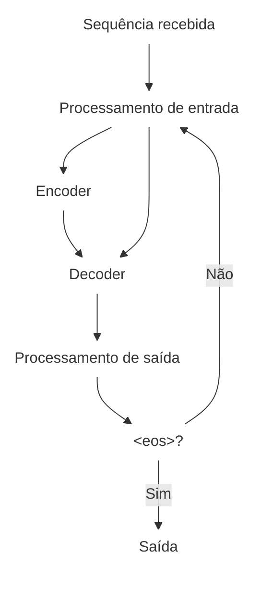
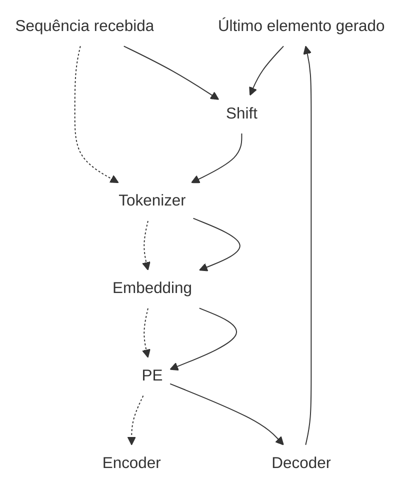
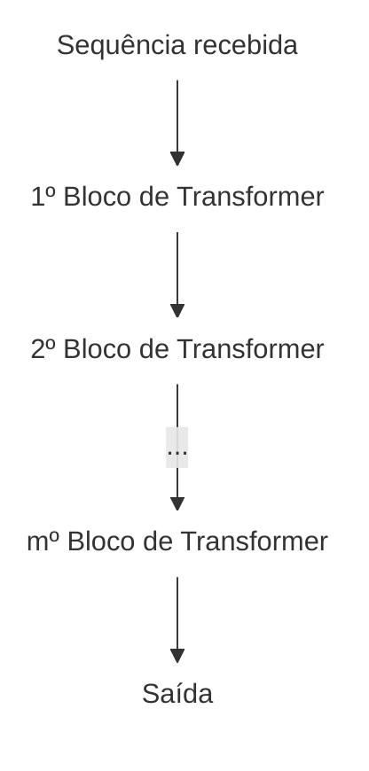
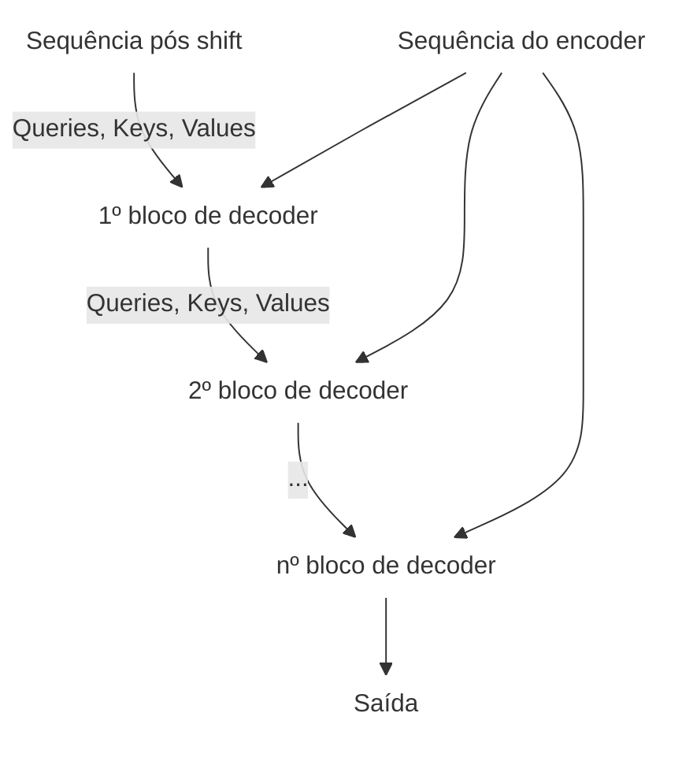
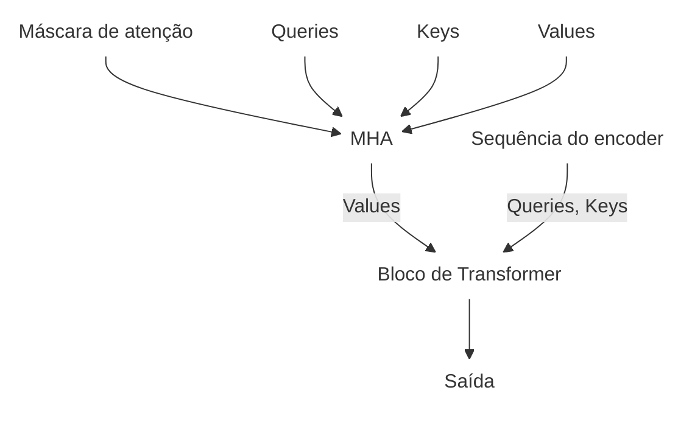
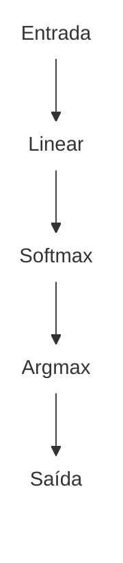

Nesse post, vamos finalmente juntar todas as peças que vimos até agora e criar um modelo seguindo a arquitetura Transformer original, descrita no artigo "Attention is All you Need"! Tudo será acompanhado de exemplos funcionais em PyTorch, então no final, você também será capaz de ter seu próprio modelo se quiser.

## Componentes de um Transformer

A arquitetura Transformer original é formada pelos componentes apresentados até aqui, organizados na seguinte ordem:



Para ilustrar o funcionamento de cada componente da arquitetura, considere que o modelo descrito é um modelo de linguagem. Nesse caso, as sequências de entrada sempre usam o formato `<bos><sequência recebida><eos><bos><sequência gerada><eos>`.

### Processamento de entrada

O processamento de entrada seguirá o processo descrito no fluxograma a seguir:



A partir do texto, duas sequências são geradas. A primeira, usada como entrada do encoder, corresponde à sequência recebida. A segunda, usada como entrada do decoder, corresponde à sequência recebida após o shift.

Usar o resultado do shift é possível porque, na primeira iteração, o resultado do shift sempre pode ser previsto. Nas iterações seguintes, o resultado da última iteração se torna a nova sequência após o shift.

Por exemplo, se o texto de entrada for `cachorro` e o texto a ser gerado for `dog`, na primeira iteração as sequências serão:

* Entrada do encoder: `<bos>cachorro<eos>`
* Entrada do decoder: `cachorro<eos><bos>`

Na segunda iteração, as sequências serão:

* Entrada do encoder: `cachorro<eos><bos>`
* Entrada do decoder: `cachorro<eos><bos>d`

E assim por diante.

```python
@dataclass
class InputProcessorConfig:
    embedder: EmbedderConfig
    positional_encoder: PositionalEncoderConfig
    pad_token_int: int

class InputProcessor(nn.Module):
    def __init__(self: Self, config: InputProcessorConfig) -> None:
        super().__init__()
        self.config = config
        self.embedder = nn.Embedding(
            num_embeddings=self.config.embedder.n_tokens,
            embedding_dim=self.config.embedder.embed_dim,
            padding_idx=self.config.pad_token_int,
        )
        self.positional_encoder = PositionalEncoder(self.config.positional_encoder)

    def forward(self: Self, tokens: torch.Tensor) -> torch.Tensor:
        embeddings = self.embedder(tokens)
        embeddings = self.positional_encoder(embeddings)
        return embeddings

```

### Transformer blocks

O encoder e o decoder usam Transformer blocks para gerar sequências intermediárias de embeddings. Esses componentes funcionam da seguinte forma:

1. O MHA transforma Queries, Keys e Values.
2. O resultado do MHA é somado aos Values.
3. A soma passa por normalização com LayerNorm.
4. Uma rede neural feedforward transforma a sequência normalizada em uma sequência intermediária.
5. A saída da feedforward é somada à sequência normalizada.
6. A segunda soma é normalizada novamente com LayerNorm.

```mermaid
flowchart
    Key@{ shape: text, label: "Keys" }
    Mask@{ shape: text, label: "Máscara de atenção" }
    Query@{ shape: text, label: "Queries" }
    Value@{ shape: text, label: "Values" }
    Sum1@{ shape: text, label: "&#43" }
    Sum2@{ shape: text, label: "&#43" }
    MHA@{ shape: text, label: "MHA" }
    LayerNorm1@{ shape: text, label: "LayerNorm" }
    LayerNorm2@{ shape: text, label: "LayerNorm" }
    Linear1@{ shape: text, label: "Linear" }
    Linear2@{ shape: text, label: "Linear" }
    ReLU@{ shape: text, label: "ReLU" }
    output@{ shape: text, label: "Saída" }
    Mask --> MHA
    Query --> MHA
    Key --> MHA
    Value --> MHA
    MHA --> Sum1
    Sum1 --> LayerNorm1
    LayerNorm1 --> Linear1
    Linear1 --> ReLU
    ReLU --> Linear2
    LayerNorm1 --> Sum2
    Linear2 --> Sum2
    Sum2 --> LayerNorm2
    LayerNorm2 --> output
    Value --> Sum1
```

As etapas 2 e 5, em que o resultado de uma camada é somado à sua entrada, são chamadas de conexões residuais. Essa técnica, apresentada na arquitetura ResNet, tem o objetivo de suavizar a curva da função de perda. Com isso, a função apresenta menos mínimos locais e a perda se aproxima do mínimo global em menos passos durante o treinamento.

As camadas LayerNorm aprendem a normalizar os resultados das camadas ocultas com base na distribuição dos seus valores. Isso ajuda a estabilizar a variância dos gradientes gerados pela camada anterior.

A rede feedforward usada no passo 4 aprende a gerar uma nova sequência de embeddings em um determinado espaço.

Os blocos sempre ficam em componentes intermediários do modelo. Por isso, durante o treinamento, o espaço desses embeddings é ajustado para otimizar o desempenho do modelo, assim como acontece com o espaço dos token embeddings.

A arquitetura das redes feedforward possui as seguintes camadas:

1. Uma camada linear altera a dimensão dos elementos da sequência para $d_{ff}$.
2. Uma função de ativação ReLU é aplicada sobre a nova sequência.
3. Outra camada linear reduz a dimensão dos elementos da sequência de volta para $d$.

O valor de $d_{ff}$ é um hiperparâmetro e geralmente é escolhido para que a dimensão intermediária seja maior que $d$.

#### Transformer blocks em PyTorch

```python
@dataclass
class TransformerBlockConfig:
    embed_dim: int = 512
    n_heads: int = 8
    hidden_dim: int = 2048
```

&nbsp;

```python
class TransformerBlock(nn.Module):
    def __init__(self: Self, config: TransformerBlockConfig) -> None:
        super().__init__()
        self.config = config

        self.mha = MultiheadAttention(
            embed_dim=self.config.embed_dim,
            n_heads=self.config.n_heads,
        )
        self.mha_layernorm = nn.LayerNorm(normalized_shape=self.config.embed_dim)

        self.ff = nn.Sequential(
            nn.Linear(self.config.embed_dim, self.config.hidden_dim),
            nn.ReLU(),
            nn.Linear(self.config.hidden_dim, self.config.embed_dim),
        )

        self.ff_layernorm = nn.LayerNorm(self.config.embed_dim)

    def forward(
        self: Self,
        queries: torch.Tensor,
        keys: torch.Tensor,
        values: torch.Tensor,
        mask: torch.Tensor | None = None,
    ) -> torch.Tensor:
        mha_res = values

        mha_outputs = self.mha(queries, keys, values, mask)
        mha_res_outputs = mha_outputs + mha_res
        norm_mha_outputs = self.mha_layernorm(mha_res_outputs)

        ff_res = norm_mha_outputs
        ff_outputs = self.ff(norm_mha_outputs)
        norm_ff_outputs = self.ff_layernorm(ff_outputs + ff_res)

        return norm_ff_outputs
```

### Encoder

O encoder recebe a sequência de entrada e produz uma nova sequência de embeddings. Esses embeddings servem como referência para o decoder gerar os elementos da sequência de saída. O espaço desses embeddings é ajustado durante o treinamento para melhorar o desempenho do decoder.

A arquitetura do encoder é composta de $m$ blocos de transformer, onde o primeiro bloco usará a sequência recebida como entrada, e os demais usarão o resultado do bloco anterior no lugar. A sequência gerada pelo $m$-ésimo bloco será considerada a sequência do encoder.

O número de blocos no Encoder $m$ é um hiperparâmetro que deve ser definido antes do treinamento.



#### Encoder em Pytorch

```python
@dataclass
class EncoderConfig:
    block: TransformerBlockConfig
    n_blocks: int
```

&nbsp;

```python
class Encoder(nn.Module):
    def __init__(self: Self, config: EncoderConfig) -> None:
        super().__init__()
        self.config = config
        self.blocks = nn.ModuleList(
            TransformerBlock(self.config.block) for _ in range(self.config.n_blocks)
        )

    def forward(
        self: Self,
        queries: torch.Tensor,
        keys: torch.Tensor,
        values: torch.Tensor,
    ) -> torch.Tensor:
        block, *blocks = self.blocks

        outputs = block(queries=queries, keys=keys, values=values)

        for block in blocks:
            outputs = block(queries=outputs, keys=outputs, values=outputs)

        return outputs
```

### Decoder

#### Decoder em PyTorch

O decoder recebe a sequência após o shift e a sequência do encoder, usando essas sequências para gerar a sequência final de embeddings.

A arquitetura do decoder é composa por $n$ blocos. Cada bloco recebe duas sequências: uma delas é sempre a sequência do encoder. O primeiro bloco recebe também a sequência pós shift como entrada, enquanto os blocos seguintes recebem o resultado do bloco anterior.

O número de blocos no decoder $n$ também é um hiperparâmetro que deve ser definido antes do treinamento.



&nbsp;

```python
@dataclass
class DecoderConfig:
    block: TransformerBlockConfig
    n_blocks: int
```

&nbsp;

```python
class Decoder(nn.Module):
    def __init__(self: Self, config: DecoderConfig) -> None:
        super().__init__()
        self.config = config
        self.blocks = nn.ModuleList(
            DecoderBlock(self.config.block) for _ in range(self.config.n_blocks)
        )

    def forward(
        self: Self,
        queries: torch.Tensor,
        keys: torch.Tensor,
        values: torch.Tensor,
        encoder_outputs: torch.Tensor,
    ) -> torch.Tensor:
        block, *blocks = self.blocks

        outputs = block(
            queries=queries,
            keys=keys,
            values=values,
            encoder_outputs=encoder_outputs,
        )

        for block in blocks:
            outputs = block(
                queries=outputs,
                keys=outputs,
                values=outputs,
                encoder_outputs=encoder_outputs,
            )

        return outputs
```

Os blocos de decoder possuem seguinte arquitetura:

1. Queries, Keys e Values são transformados via MHA usando máscara de atenção.
2. A nova sequência e a sequência do encoder são transformados usando Encoder-Decoder Attention (EDA).

EDA é um tipo de MHA e é o único caso na arquitetura Transformer onde Queries, Keys e Values não partem da mesma sequência (já que EDA requer duas sequências como entrada). A diferença entre EDA e MHA está na primeira usar os elementos da sequência (transformada pelo passo 1) como Values e os elementos da sequência do encoder como Queries e Keys.



&nbsp;

```python
class DecoderBlock(nn.Module):
    def __init__(self: Self, config: TransformerBlockConfig) -> None:
        super().__init__()
        self.config = config
        self.mha = MultiheadAttention(
            embed_dim=self.config.embed_dim,
            n_heads=self.config.n_heads,
        )
        self.transformer_block = TransformerBlock(self.config)

    def forward(
        self: Self,
        queries: torch.Tensor,
        keys: torch.Tensor,
        values: torch.Tensor,
        encoder_outputs: torch.Tensor,
    ) -> torch.Tensor:
        batch_size, n_tokens, _ = keys.size()
        mask = attn_mask_like((batch_size, self.config.n_heads, n_tokens, n_tokens))

        outputs = self.mha(
            queries=queries,
            keys=keys,
            values=values,
            mask=mask,
        )

        outputs = self.transformer_block(
            queries=encoder_outputs,
            keys=encoder_outputs,
            values=outputs,
        )

        return outputs
```

### Processamento de saída

A sequência final de embeddings passa pelas seguintes etapas para se transformar em tokens do vocabulário de saída:

1. A sequência é processada por uma camada linear, convertendo cada embedding de dimensão $d$ em vetores de dimensão igual ao número de tokens do vocabulário de saída.
2. Em seguida, aplica-se a função Softmax para normalizar os valores, resultando em probabilidades para cada token possível em cada posição da sequência.
3. Por fim, seleciona-se o índice com maior probabilidade usando a função Argmax em cada posição, determinando assim o token predito para cada elemento da sequência.



Cada índice obtido dessa forma indica o token previsto para aquela posição da sequência. Essa sequência corresponde ao resultado de uma iteração do modelo autoregressivo.

Durante o treinamento, os tokens dessa sequência são comparados com os tokens esperados e preditos para calcular a perda.

Depois que o modelo é treinado, ainda é necessário executar todas as iterações do processo autoregressivo, converter os tokens gerados nas suas representações textuais e concatená-los.

#### Processamento de saída em PyTorch

```python
@dataclass
class OutputProcessorConfig:
    in_features: int
    out_features: int
```

&nbsp;

```python
class OutputProcessor(nn.Module):
    def __init__(self: Self, config: EmbedderConfig) -> None:
        super().__init__()

        self.config = config

        self.linear = nn.Linear(
            in_features=self.config.in_features,
            out_features=self.config.out_features,
        )

    def forward(
        self: Self,
        embeddings: torch.Tensor,
        return_logits: bool = False,
        return_probabilities: bool = False,
    ) -> torch.Tensor:
        embeddings = self.linear(embeddings)
        if return_logits:
            return embeddings

        batch_size, n_tokens, _ = embeddings.size()

        probabilities = embeddings.softmax(dim=2)
        probabilities = probabilities.view(
            batch_size * n_tokens,
            self.config.out_features,
        )

        if return_probabilities:
            return probabilities

        tokens = probabilities.argmax(dim=1)
        tokens = tokens + 2
        tokens = tokens.view(batch_size, n_tokens)

        return tokens
```

### Juntando tudo

Com todos os componentes definidos, a implementação da arquitetura Transformer está completa. O exemplo abaixo mostra como unir esses componentes e executar o modelo, aplicando o shift uma vez.

### Modelo

```python
class Transformer(nn.Module):
    def __init__(self: Self, config: TransformerConfig) -> None:
        super().__init__()
        self.config = config

        self.input_processor = InputProcessor(self.config.input_processor)
        self.encoder = Encoder(self.config.encoder)
        self.decoder = Decoder(self.config.decoder)
        self.output_processor = OutputProcessor(self.config.output_processor)

    def forward(
        self: Self,
        encoder_tokens: torch.Tensor,
        decoder_tokens: torch.Tensor,
        return_logits: bool = False,
        return_probabilities: bool = False,
    ) -> torch.Tensor:
        encoder_tokens = self.input_processor(encoder_tokens)
        decoder_tokens = self.input_processor(decoder_tokens)

        encoder_outputs = self.encoder(
            queries=encoder_tokens,
            keys=encoder_tokens,
            values=encoder_tokens,
        )

        decoder_outputs = self.decoder(
            queries=decoder_tokens,
            keys=decoder_tokens,
            values=decoder_tokens,
            encoder_outputs=encoder_outputs,
        )

        outputs = self.output_processor(
            embeddings=decoder_outputs,
            return_logits=return_logits,
            return_probabilities=return_probabilities,
        )

        return outputs
```

### `TransformerExecutor`

Para executar o modelo, é preciso aplicar o algoritmo autoregressivo de maneira eficiente, o que também será feito realizando o processo em batches. Para isso, será criada a classe `TransformerExecutor`, que interage com o modelo e o tokenizer para executar o algoritmo de forma eficiente em cada iteração.

```python
class TransformerExecutor:
    def __init__(
        self: Self,
        tokenizer: Tokenizer,
        transformer: Transformer,
    ) -> None:
        super().__init__()
        self.tokenizer = tokenizer
        self.transformer = transformer

    def get_output_tokens(
        self: Self,
        tokens: torch.Tensor,
        mask: torch.Tensor,
    ) -> torch.Tensor:
        is_padding = mask != self.tokenizer.pad_token_int
        is_padding = is_padding.sum(dim=1)

        columns = is_padding - 1
        batch_size, _ = tokens.size()
        rows = torch.arange(batch_size)

        tokens = tokens[rows, columns]
        tokens = tokens.unsqueeze(1)

        return tokens

    def get_bos_tokens(self: Self, length: int) -> torch.Tensor:
        output_tokens = torch.full((length, 1), self.tokenizer.bos_token_int)
        return output_tokens

    def make_prediction():
        pass

    @torch.no_grad()
    def predict(
        self: Self,
        texts: list[str],
        max_new_tokens: int | None = None,
    ) -> list[str]:
        texts = [self.tokenizer.add_special_tokens(chars) for chars in texts]
        input_tokens = self.tokenizer.batch_encode(texts)

        bos_tokens = self.get_bos_tokens(len(texts))

        encoder_tokens = input_tokens
        decoder_tokens = self.tokenizer.batch_shift(encoder_tokens, bos_tokens)

        output_tokens = [output for output in bos_tokens]
        eos_indexes = [None for _ in texts]
        index = 1

        while any(eos_index is None for eos_index in eos_indexes) and (
            max_new_tokens is None or index < max_new_tokens
        ):
            predicted_tokens = self.transformer(encoder_tokens, decoder_tokens)

            next_output_tokens = self.get_output_tokens(
                tokens=predicted_tokens,
                mask=input_tokens,
            )

            shifted_decoder_tokens = self.tokenizer.batch_shift(
                input_tokens=decoder_tokens,
                output_tokens=next_output_tokens,
            )

            encoder_tokens, decoder_tokens = decoder_tokens, shifted_decoder_tokens

            output_tokens = [
                previous_output_tokens
                if eos_index is not None
                else torch.cat((previous_output_tokens, next_output_token))
                for previous_output_tokens, next_output_token, eos_index in zip(
                    output_tokens,
                    next_output_tokens,
                    eos_indexes,
                )
            ]

            eos_indexes = [
                eos_index
                if eos_index is not None
                else index
                if token == self.tokenizer.eos_token_int
                else None
                for eos_index, token in zip(eos_indexes, next_output_tokens)
            ]

            index += 1

        outputs = self.tokenizer.batch_decode(output_tokens)

        return outputs
```

## Conclusão

O código a seguir mostra como utilizar os módulos apresentados até agora. Para completar a implementação, ainda é necessário criar o algoritmo de treinamento.

```python


vocab = set(printable)

tokenizer_config = TokenizerConfig()
tokenizer = Tokenizer(vocab, tokenizer_config)

transformer_config = TransformerConfig(tokenizer.vocab_size)

transformer = Transformer(transformer_config)
executor = TransformerExecutor(tokenizer, transformer)

texts = [
    "Onde fica o hospital mais perto?",
    "Por que os dinossauros desapareceram?",
    "Quem vive no Palacio do Planalto?",
    "Transformers? Aqueles filmes de carro?",
]

predicted = executor.predict(
    texts=texts,
    max_new_tokens=16,
)
```

Ao instanciar um modelo dessa forma, o resultado será totalmente aleatório, o que pode gerar respostas que não fazem muito sentido:

```txt
Onde fica o hospital mais perto?       -> <bos><eos>
Por que os dinossauros desapareceram?  -> <bos>qfJ1L"11fJ1__\rb
Quem vive no Palacio do Planalto?      -> <bos>1;";1__V"1\rfJ"J
Transformers? Aqueles filmes de carro? -> <bos>fJ"2J[fJ;"JJp9J
```

Isso acontece porque o modelo ainda não passou pelo processo de treinamento. No próximo post, vamos ver como treinar esse modelo para obter melhores resultados e algumas mudanças que podem ser feitas na arquitetura para melhorar esses resultados.
