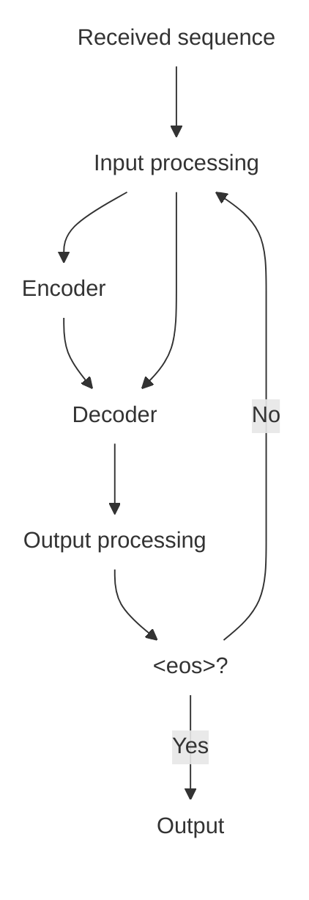
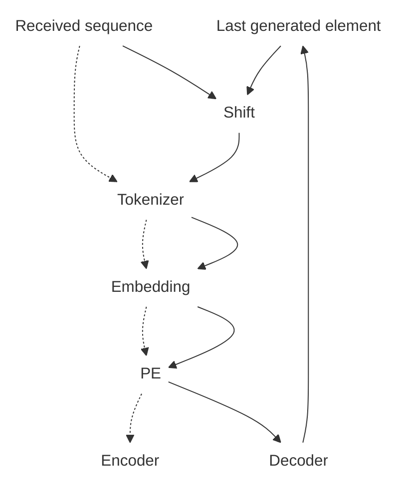
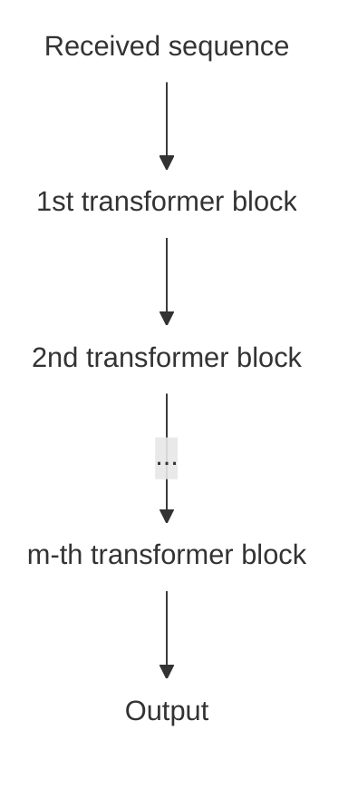
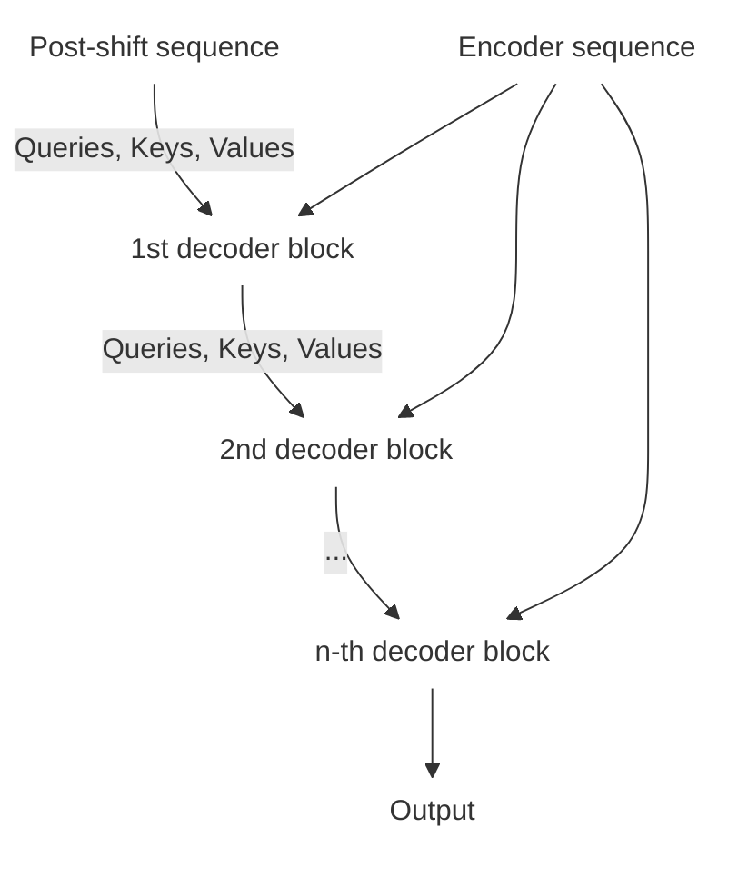
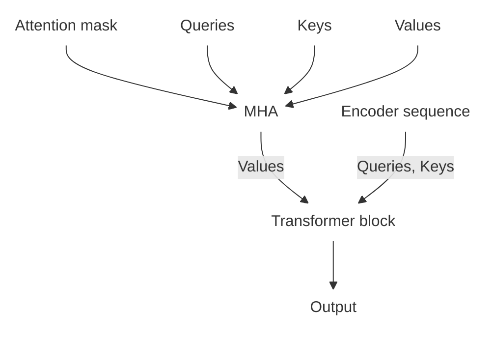
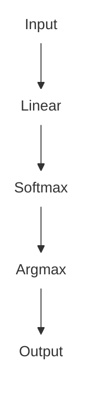

In 2017, Google Brain published the paper "Attention is All you Need," which introduced the Transformer to the world: a neural-network architecture for attention-based sequence transduction that enabled the creation of models that outperformed all previous models in language translation.

Years later, this architecture gave rise to many alternatives that achieved state-of-the-art results in several applications, especially in the creation of language models, which greatly popularized the use of generative AI for many natural-language-processing applications. At the time of writing, variants of the Transformer, such as Generative Pre-trained Transformers (GPTs), are being used behind advanced artificial-intelligence systems such as ChatGPT, Claude, and Gemini, showing the potential of this architecture and its legacy in the history of artificial intelligence.

To help explain what makes Transformers special, this post explains how Transformers work through a from-scratch example implementation in Python using PyTorch, assuming only a few prerequisites.

Although many Transformer implementations are available online, I wanted to provide a didactic, end-to-end explanation of the topic through a single implementation.

Unfortunately, if absolutely no prerequisites are assumed, the content becomes too extensive to cover at once. Therefore, to understand everything explained here, it is important to understand the following topics:

- How matrix operations such as dot products, matrix multiplication, and matrix transposition work.
- How the components of feed-forward neural networks work.
- How to program in Python at the level of creating classes and objects and interacting with third-party libraries.
- How to use the basic components of PyTorch, such as tensors, devices, modules, autograd, optimizers, and so on.
- Why performing batched operations with matrix operations can be much faster than performing them individually.

## Objective

In general, Transformers can be used to model sequence-transduction applications: applications where it is necessary to generate a sequence of elements from another sequence. This means that many applications can be modeled as sequence transduction, such as machine translation, text generation, text summarization, and molecule synthesis.

Using a more formal definition, a sequence-transduction model relates an ordered sequence $s = <s_1,s_2,\cdots,s_{n}>$, composed of elements from an enumerable set $S$, to another sequence $t = <t_1,t_2,\cdots,t_{m}>$, composed of elements from an enumerable set $T$.

To simplify the explanation of how Transformers work, many explanations will use examples based on a specific application. Given the importance of Transformers to the progress of applications such as Large Language Models, the examples in this post will be based on creating a language model.

The goal of a language model is to determine the next characters in a text from the previous ones, as automatic corrections used on smartphone keyboards do, for example.

Adapting the previous definition, a language model relates a text $s = <s_1,s_2,\cdots,s_{n}>$, composed of characters from the vocabulary $S$, to another text $s' = <s'_1,s'_2,\cdots,s'_{m}>$, also composed of characters from the vocabulary $S$. Note that $S$ and $T$ being equal is specific to applications such as language models. In machine translation, for example, the texts may be in different languages, so their vocabularies may also be different.

### Note

Besides creating a language model in general, a major challenge in developing neural networks is maximizing their computational efficiency. Although it is possible to implement a Transformer using only structures such as variables, lists, and loops, this type of implementation can produce models that are too slow to train and use in practice because of the large number of computations that would be performed inefficiently in a naive implementation. Therefore, it is necessary to consider parallel-programming techniques from the beginning of the model's implementation.

In general, the most practical way to implement parallelism in neural networks is to take advantage of modern devices' ability to perform mathematical operations on vectors, matrices, and tensors in parallel very efficiently. Therefore, by changing the representation of the data during the execution of the operations, it is possible to create efficient algorithms in a simple way, although this requires the algorithms to be designed with multidimensional data in mind from the beginning.

### A little history

Creating efficient models for sequence transduction was an open problem for the scientific community for many years. The challenge was to solve problems common to training architectures that were alternatives to Transformers. Even with the creation of advanced techniques such as Transformers, satisfactory models of this type still do not exist for several applications.

Techniques based on recurrent neural networks had the best performance in applications such as text translation, as was the case with the architecture proposed by Google for Google Translate in 2014 in the influential paper "Sequence to Sequence Learning with Neural Networks." Although explaining this type of architecture is outside the scope of this post, recurrent-neural-network training had common problems that encouraged the development of alternatives:

1. Its recursive nature can cause vanishing-gradient problems. This effect occurs when the gradients generated by backpropagation are too small for the model to converge to the global minimum by the end of training, effectively stopping before the loss becomes close to the global minimum.

2. The sequential order of the operations involved in this type of model can make inference very slow, which can make training and subsequent use of the model impractical.

3. The model's inability to understand the meaning of a word in a sentence based on its context can compromise the generated text.

These problems were critical to using these models in many applications, which encouraged research into architectures that would converge faster and produce models with better performance. In particular, creating models capable of assigning different meanings to words based on their context to solve some of these problems led to the study of attention mechanisms, which have exactly this goal.

As with much of neural-network research, many of the decisions and conventions used here are based on what produced the best results in the experiments conducted. In the case of Transformers, however, choices were also made to ensure that the algorithms are computationally efficient during training and inference and do not suffer from the same convergence problems as the alternatives.

In this sense, the great differentiator of Transformers is that they are based only on feed-forward neural networks and attention mechanisms. This leads to models capable of solving the problems mentioned above in several applications and achieving the best performance thus far in sequence transduction.

This conclusion explains the paper's title: from the point of view of the model's architecture, recurrent neural networks are not necessary to create efficient models; only attention mechanisms are needed, hence, "Attention is All you Need."

## Data representation

To work with texts, it is necessary to define a numerical representation equivalent to a text so that this representation can be used by Transformers. The approach used by most techniques for this process is to convert these values into tokens and embeddings.

### Tokens

Because texts are represented by a finite, known alphabet, it is possible to enumerate all the characters in that alphabet and create a function that associates each one with a unique numerical representation. These numerical representations are known as tokens, and the function is known as a tokenizer.

In addition to enumerating individual characters, it is possible to enumerate sequences of characters, forming words or n-grams (ordered sequences of $n$ characters), producing tokenizers with even more tokens. This is very common in language models, with the goal of improving their overall performance. Using algorithms such as Byte Pair Encoding, WordPiece, and SentencePiece, it is possible to create tokenizers with hundreds of thousands of tokens.

However, because the language model assumes that the text has already passed through the tokenizer, the choice of tokenization method does not affect the architecture in any way. Therefore, to simplify the explanation, we will use a simple tokenizer composed only of the printable characters in the ASCII table, available in Python's `string` module as the `printable` object.

| Character | Token |
| --------- | ----- |
| `a`       | `1`   |
| `b`       | `2`   |
| `c`       | `3`   |
| ...       | ...   |
| `z`       | `26`  |
| `␣`       | `27`  |
| `.`       | `28`  |
| `,`       | `29`  |

A sequence of tokens generated from a text can be represented using a vector containing the value of each token in order. By concatenating these vectors as rows, it is possible to represent a batch of texts using a matrix, which will be the dimension expected by the model to maximize its computational efficiency.

$$
\begin{array}{ccc}
    \texttt{c} & \texttt{a} & \texttt{t}
\end{array}
$$

$$
\downarrow
$$

$$
\begin{bmatrix}
    3  &  1  & 20
\end{bmatrix}
$$

In addition, the tokenizer adds two special tokens to the sequence. The first token, `<bos>` (beginning of sentence), represents the beginning of the text, and the second token, `<eos>` (end of sentence), represents the end of the text.

In the examples, `<bos>` and `<eos>` will always be represented numerically by `1` and `2`, respectively. Therefore, the numerical representations mentioned above begin at `3`.

| Character | Token |
| --------- | ----- |
| `<bos>`   | `1`   |
| `<eos>`   | `2`   |
| `a`       | `3`   |
| `b`       | `4`   |
| `c`       | `5`   |
| ...       | ...   |
| `z`       | `28`  |
| `␣`       | `29`  |
| `.`       | `30`  |
| `,`       | `31`  |

$$
\begin{array}{ccc}
    \texttt{c} & \texttt{a} & \texttt{t}
\end{array}
$$

$$
    \downarrow
$$

$$
\begin{array}{ccccc}
    \texttt{<bos>} & \texttt{c} & \texttt{a} & \texttt{t} & \texttt{<eos>}
\end{array}
$$

$$
    \downarrow
$$

$$
\begin{bmatrix}
    1 & 5  &  3  & 22 & 2
\end{bmatrix}
$$

The `<bos>` and `<eos>` tokens can also be used to separate the received sequence from the generated sequence, which will be useful when training Transformers later. For example, if the model receives the text "house" and generates the text "maison," these sequences can be described as a single sequence:

$$
\begin{array}{ccccccccccccccc}
\texttt{<bos>} & \texttt{h} & \texttt{o} & \texttt{u} & \texttt{s} & \texttt{e} & \texttt{<eos>} & \texttt{<bos>} & \texttt{m} & \texttt{a} & \texttt{i} & \texttt{s} & \texttt{o} & \texttt{n} & \texttt{<eos>}
\end{array}
$$

```python
from string import printable

string_to_int = {
    '<bos>': 1,
    '<eos>': 2,
}

string_to_int.update({
    char: index + 2
    for index, char in enumerate(printable, 1)
})

special_tokens = {'<bos>', '<eos>'}

def split(text: str) -> Generator[str, None, None]:
    index = 0

    while index < len(text):
        token = text[index]
        for special_token in special_tokens:
            if text.startswith(special_token, index):
                token = special_token
                break

        yield token

        index += len(token)

def tokenize(self: Self, text: str) -> torch.Tensor:
    tokens = [string_to_int[token] for token in split(text)]
    tokens = torch.tensor(tokens)
    return tokens
```

### Padding

As introduced earlier, one way to develop fast models simply is to maximize the number of operations performed in batches using tensor operations.

A text, after being transformed into a sequence of tokens, can be represented as a vector. By performing this transformation on all texts in a batch and concatenating them, it is possible to create a matrix that represents a batch of texts and allows tensor operations in the next steps to be accelerated. However, concatenating these vectors to create a matrix assumes that all elements in the batch have the same length. Since the original texts can have different lengths, this assumption is not always valid.

One way to ensure that all vectors in a batch always have the same length is to pad the vectors. Padding is the process of repeatedly adding special tokens to each sequence until all sequences have $n$ elements.

This special token is called the padding token, represented by `<pad>`, and in the examples it will always be represented numerically by `0`. Also assume that every batch always has $b$ elements.

| Character | Token |
| --------- | ----- |
| `<pad>`   | `0`   |
| `<bos>`   | `1`   |
| `<eos>`   | `2`   |
| `a`       | `4`   |
| `b`       | `5`   |
| `c`       | `6`   |
| ...       | ...   |
| `z`       | `28`  |
| `␣`       | `29`  |
| `.`       | `30`  |
| `,`       | `31`  |

Finally, there are several ways to determine $t$, the number of elements each sequence will have after padding:

1. Define $t$ as the length of the longest sequence in the batch.
2. Define $t$ as an arbitrary constant value.

For example, a batch of texts transformed into tokens and padded according to option 1 would be produced as follows:

$$
\begin{array}{c}
    \text{cat} \\
    \text{elephant} \\
    \text{fish} \\
    \text{bird} \\
    \text{dog}
\end{array}
$$

$$
\downarrow
$$

$$
\begin{array}{cccccccccc}
    \texttt{<bos>} & \texttt{ c } & \texttt{ a } & \texttt{ t } & \texttt{<eos>} & \texttt{<pad>} & \texttt{<pad>} & \texttt{<pad>} & \texttt{<pad>} & \texttt{<pad>} \\
    \texttt{<bos>} & \texttt{e} & \texttt{l} & \texttt{e} & \texttt{p} & \texttt{h} & \texttt{a} & \texttt{n} & \texttt{t}  & \texttt{<eos>} \\
    \texttt{<bos>} & \texttt{f} & \texttt{i} & \texttt{s} & \texttt{h} & \texttt{<eos>}  & \texttt{<pad>} & \texttt{<pad>} & \texttt{<pad>} & \texttt{<pad>} \\
    \texttt{<bos>} & \texttt{b} & \texttt{i} & \texttt{r} & \texttt{d} & \texttt{<eos>} & \texttt{<pad>} & \texttt{<pad>} & \texttt{<pad>} & \texttt{<pad>} \\
    \texttt{<bos>} & \texttt{d} & \texttt{o} & \texttt{g} & \texttt{<eos>} & \texttt{<pad>} & \texttt{<pad>} & \texttt{<pad>} & \texttt{<pad>} & \texttt{<pad>}
\end{array}
$$

$$
\downarrow
$$

$$
\begin{bmatrix}
   1 &  5  &  3  & 22 &  2 &  0 &  0 &  0 &  0 &  0 \\
   1 &  7  & 14  &  7 & 18 & 10 &  3 & 16 & 22 &  2\\
   1 &  8  & 11  & 21 & 10 &  2  &  0 &  0 &  0 &  0 \\
   1 &  4  & 11  & 20 &  6 &  2 &  0 &  0 &  0  &  0 \\
   1 &  6  & 18  &  9 &  2 &  0 &  0 &  0 &  0  &  0
\end{bmatrix}
$$

In general, the speed increase obtained from padding is large enough to justify the additional memory usage, since the time spent is often a greater limitation than the memory used by a type of neural network during training and inference.

Both alternatives can affect operation speed depending on the type of hardware used. On CPUs and GPUs, option 1 may be more advantageous because it saves memory; in this case, option 2 does not provide any speed increase. On TPUs, operations on fixed-size batches can be faster than the same operations on batches of different sizes, so option 2 may be more advantageous.

```python
char_ids = {
    '<pad>': 0,
    '<bos>': 1,
    '<eos>': 2,
}

char_ids.update({
    char: index + 3
    for index, char in enumerate(printable)
})

special_tokens = {'<pad>', '<bos>', '<eos>'}

def pad(
    self: Self,
    tokens: torch.Tensor,
    amount: int,
    fill_value: int,
    side: Literal["left", "right"],
) -> torch.Tensor:
    if amount == 0:
        return tokens

    padding = torch.full(
        size=(amount,),
        fill_value=fill_value,
    )
    padded_tensor = (tokens, padding) if side == "right" else (padding, tokens)
    padded_tensor = torch.cat(padded_tensor)

    return padded_tensor

def batch_encode(
    texts: list[str],
    side: Literal["left", "right"] = "right",
    strategy: Literal["max", "fixed"] = "max",
    amount: int | None = None,
    truncate: bool = False,
) -> torch.Tensor:
    token_lists = [encode(text) for text in texts]
    lengths = [len(tokens) for tokens in token_lists]

    max_length = max(lengths)
    max_length = max_length if amount is None else max(max_length, amount)

    token_lists = [
        pad(
            tokens=tokens,
            amount=max_length - length,
            fill_value=0,
            side=side,
        )
        for tokens, length in zip(token_lists, lengths)
    ]
    token_lists = torch.stack(token_lists)

    if strategy == "fixed" and truncate:
        token_lists = token_lists[:, :amount]

    return token_lists
```

Out of curiosity, the `torch.nested` module allows matrices to be represented from a list of vectors with different lengths. However, this module is still experimental, and using it can make operations slower than the other alternatives.

### Truncation

Even when choosing option 1, it is also common to define a maximum size for the sequences. If a sequence originally has more tokens than this limit, it is truncated, causing its last elements to be discarded.

In both cases, the value of $t$ is generally chosen based on the available memory, or determined empirically as the sequence length at which, on average, the models being trained can no longer consider the entire received sequence during generation.

```python reference="Complete tokenizer implementation"
class Tokenizer:
    def __init__(
        self: Self,
        vocab: set[str],
        config: TokenizerConfig,
    ) -> None:
        super().__init__()
        self.vocab = vocab
        self.config = config

        self.string_to_int = {
            self.config.pad_token: 0,
            self.config.bos_token: 1,
            self.config.eos_token: 2,
        }
        self.string_to_int.update(
            {char: (index + 3) for index, char in enumerate(self.vocab)}
        )

        self.pad_token_int = self.string_to_int[self.config.pad_token]
        self.bos_token_int = self.string_to_int[self.config.bos_token]
        self.eos_token_int = self.string_to_int[self.config.eos_token]

        self.vocab_size = len(self.string_to_int)

        self.int_to_string = {
            0: self.config.pad_token,
            1: self.config.bos_token,
            2: self.config.eos_token,
        }
        self.int_to_string.update(
            {(index + 3): char for index, char in enumerate(self.vocab)}
        )

    def split(self: Self, chars: str) -> Generator[str, None, None]:
        index = 0
        while index < len(chars):
            token = chars[index]
            for special_token in self.config.special_tokens:
                if chars.startswith(special_token, index):
                    token = special_token
                    break

            yield token
            index += len(token)

    def encode(self: Self, text: str) -> torch.Tensor:
        tokens = [self.string_to_int[token_string] for token_string in self.split(text)]
        tokens = torch.tensor(tokens)
        return tokens

    def pad(
        self: Self,
        tokens: torch.Tensor,
        amount: int,
        fill_value: int,
        side: Literal["left", "right"],
    ) -> torch.Tensor:
        if amount == 0:
            return tokens

        padding = torch.full(
            size=(amount,),
            fill_value=fill_value,
        )
        padded_tensor = (tokens, padding) if side == "right" else (padding, tokens)
        padded_tensor = torch.cat(padded_tensor)

        return padded_tensor

    def batch_encode(
        self: Self,
        texts: list[str],
        side: Literal["left", "right"] = "right",
        strategy: Literal["max", "fixed"] = "max",
        amount: int | None = None,
        truncate: bool = False,
    ) -> torch.Tensor:
        token_lists = [self.encode(text) for text in texts]
        lengths = [len(tokens) for tokens in token_lists]

        max_length = max(lengths)
        max_length = max_length if amount is None else max(max_length, amount)

        token_lists = [
            self.pad(
                tokens=tokens,
                amount=max_length - length,
                fill_value=self.pad_token_int,
                side=side,
            )
            for tokens, length in zip(token_lists, lengths)
        ]
        token_lists = torch.stack(token_lists)

        if strategy == "fixed" and truncate:
            token_lists = token_lists[:, :amount]

        return token_lists

    def decode(self: Self, tokens: torch.Tensor) -> str:
        outputs = [self.int_to_string[token] for token in tokens.tolist()]
        outputs = "".join(outputs)
        return outputs

    def batch_decode(self: Self, tokens: torch.Tensor) -> list[str]:
        outputs = [self.decode(item) for item in tokens]
        return outputs

    def batch_shift(
        self: Self,
        input_tokens: torch.Tensor,
        output_tokens: torch.Tensor,
    ) -> str:
        outputs = torch.cat((input_tokens[:, 1:], output_tokens), dim=1)
        return outputs

    def add_special_tokens(self: Self, text: str) -> str:
        return self.config.bos_token + text + self.config.eos_token
```

### Embeddings

The numerical representation of tokens is a simple way to convert characters into numerical values. However, using it directly as the representation space for the elements of the received sequence during model training can create unwanted biases.

This bias occurs because using the literal numerical representation makes the model treat an element with token $n$ as a smaller value than an element with token $n+1$, since both are integers. Although this relationship is not true, the model may find patterns that do not exist in the training data, making the process more difficult. By transforming these values into vectors of dimension $t$, if the space is suitable, this ordering relationship will not be present.

Embeddings are representations from the space of one variable (for example, the integers used for the numerical representation of tokens) in another space. In machine learning, this space generally has $d$ dimensions, where $d$ is a hyperparameter different from the dimensions of the original space. Both $d$ and the space are chosen with the goal of representing the original values in another form that helps train models.

Regardless of the technique used to determine the embeddings for each element, the batch of received sequences will be transformed from a matrix of dimension $b \times t$ into a tensor of dimension $b \times t \times d$.

$$
    \begin{bmatrix}
        1   & 14    & \dots  & 10 & 2 \\
        1   & 25    & \dots  & 0 & 2 \\
        \vdots & \vdots  & \ddots & \vdots & \vdots \\
        1   & 5    & \dots & 0 & 2
    \end{bmatrix}
$$

$$
    \downarrow
$$

$$
    \begin{bmatrix}
        \begin{bmatrix}
            0.23   & 1.45    & \dots  & 2.67 \\
            3.14   & 4.56    & \dots  & 5.78 \\
            \vdots & \vdots  & \ddots & \vdots \\
            1.76   & 0.65    & \dots  & 0.13 \\
            6.89 & 7.01 & \dots & 8.23
        \end{bmatrix} \\
        \quad \\
        \begin{bmatrix}
            0.23   & 1.45    & \dots  & 2.67 \\
            9.34   & 0.12    & \dots  & 1.34 \\
            \vdots & \vdots  & \ddots & \vdots \\
            1.49    & 5.59    & \dots  & 0.33 \\
            6.89   & 7.01    & \dots  & 8.23
        \end{bmatrix} \\
        \vdots \\
        \begin{bmatrix}
            0.23   & 1.45    & \dots  & 2.67 \\
            5.79 & 6.80 & \dots & 7.91 \\
            \vdots & \vdots  & \ddots & \vdots \\
            1.49   & 5.59    & \dots & 0.33 \\
            6.89   & 7.01   & \dots & 8.23
        \end{bmatrix}
    \end{bmatrix}
$$

Using one of the simplest ways to transform tokens into embeddings efficiently, it is first necessary to apply one-hot encoding to each element, transforming them into sparse vectors (which have high dimensionality but many zero values).

If $|T|$ is the size of the vocabulary, the representation of the text "papa" using One-Hot Encoding will be. For readability, only the vocabulary columns used by this sequence are shown:

$$
    \begin{array}{cccccccccc}
        \texttt{<bos>} & \texttt{p} & \texttt{a} & \texttt{p} & \texttt{a} & \texttt{<eos>}
    \end{array}
$$

$$
    \downarrow
$$

$$
    \begin{bmatrix}
        1 & 18 & 3 & 18 & 3 & 2
    \end{bmatrix}
$$

$$
    \downarrow
$$

$$
\begin{array}{c|cccc}
    & 1 & 2 & 3 & 18 \\
    \hline
    1  & 1 & 0 & 0 & 0 \\
    18 & 0 & 0 & 0 & 1 \\
    3  & 0 & 0 & 1 & 0 \\
    18 & 0 & 0 & 0 & 1 \\
    3  & 0 & 0 & 1 & 0 \\
    2  & 0 & 1 & 0 & 0
\end{array}
$$

One-Hot Encoding is used because it makes it possible to access individual elements of a matrix from a batch of indices, which in this case will be the received sequence. This happens because multiplying one of the rows of the sequence after One-Hot Encoding, with dimensions $1 \times |T|$, by a matrix with dimensions $|T| \times d$ produces the $m$-th row of that matrix. This matrix is called a lookup matrix, since this behavior is similar to accessing a lookup table or accessing elements of a list or array through indices.

Therefore, multiplying the entire sequence after One-Hot Encoding, with dimensions $t \times |T|$, by the lookup matrix produces its rows concatenated according to the order of the tokens in the received sequence.

In the example, let us assume that the embedding of each token always has the same value after this transformation. In that case, it is possible to concatenate all $|T|$ possible embeddings in order to create a lookup matrix, and the combination of these operations can represent the process of transforming the sequence into embeddings.

$$
    \underbrace{
        \begin{array}{c|cccccc}
            & 0 & 1 & 2 & 3 & 4 & \dots & |T| \\
            \hline
            1 & 0 & 1 & 0 & 0 & 0 & \dots & 0 \\
            4 & 0 & 0 & 0 & 0 & 1 & \dots & 0 \\
            3 & 0 & 0 & 0 & 1 & 0 & \dots & 0 \\
            4 & 0 & 0 & 0 & 0 & 1 & \dots & 0 \\
            3 & 0 & 0 & 0 & 1 & 0 & \dots & 0 \\
            2 & 0 & 0 & 1 & 0 & 0 & \dots & 0
        \end{array}
    }_{\text{One-Hot Encoding}}
$$

$$
    \times
$$

$$
    \underbrace{
        \begin{array}{c|cccc}
            & 1 & 2 & \dots & d \\
            \hline
            1      & 0.7    & 0.8    & \dots  & 0.3 \\
            2      & 0.4    & 0.5    & \dots  & 0.9 \\
            3      & 0.9    & 0.1    & \dots  & 0.5 \\
            \vdots & \vdots & \vdots & \ddots & \vdots \\
            18     & 0.3    & 0.9    & \dots  & 0.1
        \end{array}
    }_{\text{Lookup matrix}}
$$

$$
    \downarrow
$$

$$
    \underbrace{
        \begin{array}{c|cccc}
            & 1 & 2 & \dots & d \\
            \hline
            1  & 0.7 & 0.8 & \dots & 0.3 \\
            18 & 0.3 & 0.9 & \dots & 0.1 \\
            3  & 0.9 & 0.1 & \dots & 0.5 \\
            18 & 0.3 & 0.9 & \dots & 0.1 \\
            3  & 0.9 & 0.1 & \dots & 0.5 \\
            2  & 0.4 & 0.5 & \dots & 0.9 \\
        \end{array}
    }_{\text{Embeddings}}
$$

Besides being accelerated using linear algebra, this way of accessing embeddings allows the embedding values to be optimized during model training to improve performance. To do this, it is enough to treat the lookup matrix as the weights of a linear layer in a feed-forward neural network and optimize its values using the model's loss function through backpropagation. In this way, it is possible to find an optimal space for representing the tokens in the training dataset, with only the value of $d$ needing to be defined.

In addition to performance, the vectors found in this space are dense, since $d$, which is usually in the thousands, is generally much smaller than $|T|$, which can reach hundreds of thousands of tokens in the context of Large Language Models. This means that the model requires much less memory during use and avoids problems caused by the high dimensionality involved in training models directly with One-Hot Encoding.

In PyTorch, this component is encapsulated in the `torch.nn.Embedding` class.

```python
embed_dim = 512

embedder = nn.Embedding(
    num_embeddings=len(printable) + 1,
    embedding_dim=embed_dim,
)

embedding = embedder(42)
```

## Attention

In the context of neural networks for sequence transduction, the use of attention generally refers to a model's ability to understand the context of each element in a sequence when generating a new value for each received element.

In this process, attention weights are generated: an intermediate sequence representing how strongly each received element should be used to generate each new element individually. By combining the attention weights with the original elements, the generated sequence is obtained.

Using attention mechanisms in this way allows models to understand the context in which each word appears using fewer operations. This accelerates training and can optimize models by preventing them from interpreting ambiguous texts without considering their context.

For example, consider the following text:

> John told Mike that he was late. John apologized for the delay.

For simplicity, ignore the special tokens and assume that each word is represented by an embedding (through the process abstracted by $\text{Emb}(X)$), transforming the text into the following sequence:

$$
    \begin{array}{ccccccccc}
        \text{John } & \text{told } & \text{Mike }  & \text{that } & \text{he } & \text{was } & \text{late. } & \text{John } & \cdots \\
        \quad         \\
        \downarrow   & \downarrow      & \downarrow & \downarrow   & \downarrow     & \downarrow     & \downarrow  & \downarrow   \\
        \quad         \\
        64           & 23              & 28         & 91           & 12             & 44             & 57          & 72           \\
        \quad         \\
        \downarrow   & \downarrow      & \downarrow & \downarrow   & \downarrow     & \downarrow     & \downarrow  & \downarrow   \\
        \quad         \\
        0.02         & 0.68            & 0.46       & 1.49         & 0.6            & 1.36           & 0.7         & 0.38         \\
        0.12         & 1.05            & 1.7        & 1.59         & 0.88           & 0.3            & 1.85        & 0.94         \\
        0.13         & 1.57            & 0.75       & 0.69         & 0.7            & 1.75           & 0.7         & 0.63         \\
        \cdots       & \cdots          & \cdots     & \cdots       & \cdots         & \cdots         & \cdots      & \cdots      &        \\
        0.8          & 0.34            & 0.84       & 0.34         & 0.67           & 0.53           & 0.49        & 0.5
    \end{array}
$$

An attention mechanism then receives this sequence and generates another sequence of the same length. The contextual representation of the word "he" should assign a high attention weight to "John," while "Mike" remains a competing candidate until the later context resolves the reference:

$$
    \underbrace{
        \begin{array}{ccccccccc}
            \text{John told Mike that he was late. John...}
        \end{array}
    }_{X}
$$

$$
    \downarrow
$$

$$
    \underbrace{
        \begin{bmatrix}
            0.02   & 0.68   & 0.46   & 1.49   & 0.6    & 1.36   & 0.7    & 0.38   & \cdots & 1.23   \\
            0.12   & 1.05   & 1.7    & 1.59   & 0.88   & 0.3    & 1.85   & 0.94   & \cdots & 0.11   \\
            0.13   & 1.57   & 0.75   & 0.69   & 0.7    & 1.75   & 0.7    & 0.63   & \cdots & 1.04   \\
            \vdots & \vdots & \vdots & \vdots & \vdots & \vdots & \vdots & \vdots & \ddots & \vdots \\
            0.8    & 0.34   & 0.84   & 0.34   & 0.67   & 0.53   & 0.49   & 0.5    & \cdots & 0.09
        \end{bmatrix}
    }_{\text{Emb}(X)}
$$

$$
    \downarrow
$$

$$
\underbrace{
    \begin{bmatrix}
        0.02   & 0.68   & 0.46   & 1.49   & 0.6    & 1.36   & 0.7    & 0.05   & \cdots 1.23   \\
        0.12   & 1.05   & 1.7    & 1.59   & 0.88   & 0.3    & 1.85   & 0.08   & \cdots 0.11   \\
        0.13   & 1.57   & 0.75   & 0.69   & 0.7    & 1.75   & 0.7    & 0.16   & \cdots 1.04   \\
        \vdots & \vdots & \vdots & \vdots & \vdots & \vdots & \vdots & \vdots & \ddots \vdots \\
        0.8    & 0.34   & 0.84   & 0.34   & 0.67   & 0.53   & 0.49   & 0.11   & \cdots 0.09
    \end{bmatrix}
}_{\text{Atn}(X)}
$$

$$
    \text{Atn} \circ \text{Emb } (\text{he}) \approx \text{Atn} \circ \text{Emb } (\text{John})
$$

### Self-attention

All mechanisms used in the Transformer architecture are based only on combining elements of the received sequence with one another to determine attention for each element.

However, not all mechanisms work this way. Others depend on external resources to determine attention, such as other variables or models. Therefore, the mechanisms explained here are said to use Self-Attention, meaning that they assume attention for each element can be determined correctly without external resources.

### ELI5: Queries, Keys, and Values

To explain how these mechanisms work conceptually, some operations will receive different abstract names, even though their numerical values are initially the same.

In simplified terms, an attention mechanism works like a Python dictionary, where keys (or $K$) are associated with values (or $V$), and a value can later be retrieved using its key, called a query (or $Q$). In the mechanism, these roles are played by:

- Query: An element of the received sequence, such as the word "he."
- Keys: All the original elements of the received sequence.
- Value: An element of the received sequence.
  - If context is needed, it will be the element that best represents the query, such as the word "John" for the word "he."
  - Otherwise, it will be the query itself.

The following example illustrates this analogy:

```python
sequence = keys = values = [
    'John',
    'told',
    'Mike',
    'that',
    'he',
    'was',
    'late.',
    'John',
    ...
]

mechanism = AttentionMechanism(keys, values)
query = 'he'

assert mechanism[query] == 'John'
```

One of the main differences between the two structures is that returning only one element for each query may not be enough to represent the context correctly in more ambiguous situations. For example:

> I saw John and Mary yesterday. They were together.

In this case, the word "They" cannot be understood correctly using only one value. Therefore, an attention mechanism will not return just one value, but rather a fraction indicating how much each possible value should be considered:

```python
sequence = keys = values = [
    'I',
    'John',
    'and',
    'Mary',
    'yesterday.',
    'They',
    ...
]

mechanism = AttentionMechanism(keys, values)
query = 'They'

assert mechanism[query] == {
    'I': 0.01,
    'John': 0.45,
    'and': 0.01,
    'Mary': 0.45,
    'yesterday.': 0.01,
    'They': 0.01,
    ...
}
```

These fractions are the attention weights and form a normalized sequence: the sum of all elements is 1. Because the weights are normalized and the received sequences in Transformers are represented by embeddings, it is possible to apply a weighted average using the weights to generate a new element, which becomes the sequence generated by the attention mechanism.

The weights must be normalized so that the attention that can be distributed is finite and the mechanism works correctly. If the score of one element is relatively higher, the score of at least one other element will be relatively lower in proportion, preserving this property.

$$
    \text{Atn}(\text{They}) = 0.45 \cdot \text{Emb} (\text{John}) + 0.45 \cdot \text{Emb} (\text{Mary}) + \cdots
$$

$$
    \underbrace{
        \begin{array}{c|cccc}
            & 1 & 2 & \dots & d \\
            \hline
            1  & 0.7 & 0.8 & \dots & 0.3 \\
            2  & 0.3 & 0.2 & \dots & 0.2 \\
            \vdots & \vdots & \vdots & \ddots & \vdots \\
            t  & 0.2 & 0.4 & \dots & 0.1
        \end{array}
    }_{V}
$$

$$
    \times
$$

$$
\underbrace{
    \begin{array}{c|cccc}
        & 1 & 2 & \dots & t \\
        \hline
        1  & 0.5 & 0.5 & \dots & 0.0 \\
        2  & 0.2 & 0.3 & \dots & 0.4 \\
        \vdots & \vdots & \vdots & \ddots & \vdots \\
        t  & 0.1 & 0.2 & \dots & 0.5
    \end{array}
}_{\text{Attention weights}}
$$

$$
    \downarrow
$$

$$
    \underbrace{
        \begin{array}{c|cccc}
            & 1 & 2 & \dots & d \\
            \hline
            1  & 0.4 & 0.3 & \dots & 0.8 \\
            2  & 0.9 & 0.1 & \dots & 0.1 \\
            \vdots & \vdots & \vdots & \ddots & \vdots \\
            t  & 0.2 & 0.5 & \dots & 0.3
        \end{array}
    }_{\text{Atn}(X)}
$$

Because Transformers need to transform every element of the received sequence, the mechanism can also be accelerated by running it in a batch, making the queries equal to the received sequence as well.

$$
    \underbrace{
        \begin{array}{c|cccc}
            & 1 & 2 & \dots & d \\
            \hline
            1  & 0.7 & 0.8 & \dots & 0.3 \\
            2  & 0.3 & 0.2 & \dots & 0.2 \\
            \vdots & \vdots & \vdots & \ddots & \vdots \\
            t  & 0.2 & 0.4 & \dots & 0.1
        \end{array}
    }_{Q}
    \qquad
    \underbrace{
        \begin{array}{c|cccc}
            & 1 & 2 & \dots & d \\
            \hline
            1  & 0.7 & 0.8 & \dots & 0.3 \\
            2  & 0.3 & 0.2 & \dots & 0.2 \\
            \vdots & \vdots & \vdots & \ddots & \vdots \\
            t  & 0.2 & 0.4 & \dots & 0.1
        \end{array}
    }_{K}
$$

$$
    \downarrow
$$

$$
    \underbrace{
    \begin{array}{c|cccc}
        & 1 & 2 & \dots & t \\
        \hline
        1  & 0.5 & 0.5 & \dots & 0.0 \\
        2  & 0.2 & 0.3 & \dots & 0.4 \\
        \vdots & \vdots & \vdots & \ddots & \vdots \\
        t  & 0.1 & 0.2 & \dots & 0.5
    \end{array}
    }_{\text{Attention weights}}
$$

Therefore, although queries, keys, and values initially come from the same sequence, it is important to separate their roles in each part of the mechanism.

### Attention mechanisms

#### Dot-Product Attention (DPA)

In this mechanism, the attention weights for each element are determined from the dot product between queries and keys.

$$
  \text{Scores-DPA}(Q,K) = Q^TK
$$

Computing the new sequence in a batch, DPA can be defined as:

$$
  \text{DPA}(Q,K,V) = \text{Scores-DPA}(Q,K) \cdot V = Q^TKV
$$

However, the dot product of two vectors is not contained between 0 and 1; it lies between $-\infty$ and $\infty$. Thus, the mechanism could assign unbounded attention across the elements, which could bias the model and make the mechanism unusable. To correct this and normalize the attention, the softmax function is applied to the weights.

$$
  \text{DPA}(Q,K,V) = \text{Softmax}(Q^TK)V
$$

#### Scaled Dot-Product Attention (SDPA)

This variation of DPA adds a normalization term to the weights to stabilize the gradients generated by the mechanism during backpropagation:

$$
  \text{SDPA}(Q,K,V) = \text{Softmax}\left(\frac{Q^TK}{\sqrt{d}}\right)V
$$

The origin of the normalization by $\sqrt{d}$ is empirical. Before Transformers, it had already been observed experimentally that normalizing the variance of the gradient generated by hidden layers prevents vanishing-gradient problems and dead neurons during model training. This characteristic was later adapted to the architecture.

```python
def apply_scaled_dot_product_attention(
    queries: torch.Tensor,
    keys: torch.Tensor,
    values: torch.Tensor,
) -> torch.Tensor:
    keys = keys.transpose(2, 3)
    scores = queries @ keys / (split_embed_dim**0.5)

    if mask is not None:
        scores = scores.masked_fill(mask, float("-inf"))

    weights = F.softmax(scores, dim=3)
    outputs = weights @ values

    return outputs
```

#### Linear projections

One way Transformers make SDPA more efficient is by linearly projecting queries, keys, and values into different spaces, multiplying them by matrices of trainable parameters (denoted $W^Q$, $W^K$, and $W^V$). This makes the values of queries, keys, and values different from one another. During training, the parameters are optimized so that the Transformer converts the original embeddings into another space with the same dimensions, but one that better represents the value of each token in its context.

$$
  \text{SDPA-Transformer}(Q,K,V) =  SDPA(QW^Q, KW^K,VW^V)
$$

```python
queries_projection = nn.Linear(embed_dim, embed_dim, bias=False)
keys_projection = nn.Linear(embed_dim, embed_dim, bias=False)
values_projection = nn.Linear(embed_dim, embed_dim, bias=False)

queries = queries_projection(queries)
keys = keys_projection(keys)
values = values_projection(values)

embeddings = apply_scaled_dot_product_attention(queries, keys, values)
```

#### Multihead Attention (MHA)

This variation of SDPA consists of applying the mechanism $h$ times to the embeddings and combining the results of those applications, where the number of heads $h$ is a model hyperparameter.

Because the weights in SDPA are normalized, it is not possible to pay attention to all elements simultaneously. The goal of using MHA is for each SDPA application to focus on a different type of pattern when representing context, producing a better model during training.

As an analogy, MHA would be equivalent to reading a text $h$ times, allowing attention to be paid to different parts of the text each time in order to better understand the context of each word. In the mechanism, the difference is that all readings can be performed at the same time.

Although this mechanism is effective for optimizing models, a literal implementation would require calculating SDPA $h$ times, making MHA $h$ times slower. This is undesirable because one of the goals of Transformers is to create computationally efficient models. Therefore, the following alternative algorithm is used so that the mechanism's scalability is not affected by the number of heads:

1. Split the queries, keys, and values into $h$ contiguous sections, changing the batch dimensions from $b \times t \times d$ to $b \times t \times h \times \frac{h}{d}$.
2. Reorder the elements of the queries, keys, and values, changing the batch dimensions from $b \times t \times h \times \frac{h}{d}$ to $b \times h \times t \times \frac{h}{d}$.
3. Apply SDPA to the batch $h$ times, using a different projection for each head.
4. Concatenate the embeddings from each head.
5. Restore the order of the elements in the generated batch, restoring the dimensions to $b \times t \times d$.
6. Apply a linear projection $W^O$ to the concatenated embeddings.

After step 3, the algorithm can be described by the following equation:

$$
  \text{MHA}(Q,K,V) = \left(\Big \Vert^h_{i=1} \text{SDPA}(QW^Q_i, KW^K_i,VW^V_i) \right) W^O
$$

Thus, SDPA is still applied $h$ times, but because the elements have smaller dimensions, each application is $\frac{1}{h}$ times faster, making the scalability of SDPA and MHA the same.

In practice, applying MHA is still slower than applying SDPA because of the linear projection $W^O$. However, the added time does not grow with any variable.

```python
n_heads = 8
split_embed_dim = embed_dim // n_heads
outputs_projection = nn.Linear(embed_dim, embed_dim, bias=False)


def split_embeddings(
    embeddings: torch.Tensor,
    batch_size: int,
    n_tokens: int,
) -> torch.Tensor:
    splitted = embeddings.view(batch_size, n_tokens, n_heads, split_embed_dim)
    splitted = splitted.transpose(1, 2)

    return splitted


def join_embeddings(
    embeddings: torch.Tensor,
    batch_size: int,
    n_tokens: int,
) -> torch.Tensor:
    joined = embeddings.transpose(1, 2)
    joined = joined.contiguous()
    joined = joined.view(batch_size, n_tokens, embed_dim)
    return joined


def apply_multihead_attention(
    queries: torch.Tensor,
    keys: torch.Tensor,
    values: torch.Tensor,
) -> torch.Tensor:
    batch_size, n_tokens, _ = queries.size()

    queries = queries_projection(queries)
    keys = keys_projection(keys)
    values = values_projection(values)

    queries = split_embeddings(queries, batch_size, n_tokens)
    keys = split_embeddings(keys, batch_size, n_tokens)
    values = split_embeddings(values, batch_size, n_tokens)

    keys = keys.transpose(2, 3)
    scores = queries @ keys / (split_embed_dim**0.5)
    weights = F.softmax(scores, dim=3)

    outputs = weights @ values
    outputs = join_embeddings(outputs, batch_size, n_tokens)
    outputs = outputs_projection(outputs)

    return outputs

class MultiheadAttention(nn.Module):
    def __init__(self: Self, embed_dim: int, n_heads: int) -> None:
        super().__init__()

        self.embed_dim = embed_dim
        self.n_heads = n_heads
        self.split_embed_dim = self.embed_dim // self.n_heads

        self.queries_projection = nn.Linear(self.embed_dim, self.embed_dim, bias=False)
        self.keys_projection = nn.Linear(self.embed_dim, self.embed_dim, bias=False)
        self.values_projection = nn.Linear(self.embed_dim, self.embed_dim, bias=False)
        self.outputs_projection = nn.Linear(self.embed_dim, self.embed_dim, bias=False)

    def split_embeddings(
        self: Self,
        embeddings: torch.Tensor,
        batch_size: int,
        n_tokens: int,
    ) -> torch.Tensor:
        splitted = embeddings.view(
            batch_size,
            n_tokens,
            self.n_heads,
            self.split_embed_dim,
        )

        splitted = splitted.transpose(1, 2)

        return splitted

    def join_embeddings(
        self: Self,
        embeddings: torch.Tensor,
        batch_size: int,
        n_tokens: int,
    ) -> torch.Tensor:
        joined = embeddings.transpose(1, 2)
        joined = joined.contiguous()
        joined = joined.view(batch_size, n_tokens, self.embed_dim)

        return joined

    def forward(
        self: Self,
        queries: torch.Tensor,
        keys: torch.Tensor,
        values: torch.Tensor,
    ) -> torch.Tensor:
        batch_size, n_tokens, _ = queries.size()

        queries = self.queries_projection(queries)
        keys = self.keys_projection(keys)
        values = self.values_projection(values)

        queries = self.split_embeddings(queries, batch_size, n_tokens)
        keys = self.split_embeddings(keys, batch_size, n_tokens)
        values = self.split_embeddings(values, batch_size, n_tokens)

        keys = keys.transpose(2, 3)

        scores = queries @ keys / (self.split_embed_dim**0.5)
        weights = F.softmax(scores, dim=3)

        outputs = weights @ values
        outputs = self.join_embeddings(outputs, batch_size, n_tokens)
        outputs = self.outputs_projection(outputs)

        return outputs
```

## Positional Encoding (PE)

None of the attention mechanisms explained so far considers the position of the elements in the received sequence when generating the output sequence. This means that changing the order of the elements does not affect the result, an undesirable effect that can bias models during training.

Before applying any attention mechanism, the positions of the original elements are represented using a PE technique, which generates a sequence of embeddings where each element represents a position in the original sequence in some way.

These embeddings are combined with the received sequence to alter it so that each element has its position individually encoded.

The PE technique introduced in the Transformer architecture is based on the following function:

$$
    \text{PE}(i, j, p) = \begin{cases}
        \sin \dfrac{p}{\theta^{\frac{2i}{d}}} & \text{if }j \text{ is even}, \\
        \cos \dfrac{p}{\theta^{\frac{2i}{d}}} & \text{if }j \text{ is odd}.
    \end{cases}
$$

Where:

- $p$ is the position of an element in the received sequence.
- $j$ is the position of an item in an element of the received sequence.
- $0 \leq i < \frac{d}{2}$, and $i$ is incremented for every two consecutive items in an element of the received sequence.
- $\theta$ is a hyperparameter.

The embeddings generated by $PE$ are then added to the received sequence, and this sequence can be used by the attention mechanisms.

In Transformers, this function was chosen because it is equivalent to applying a rotation matrix to the elements of the sequence, where the rotation angle of an element is determined by its position.

The PE technique used is relative; that is, it prioritizes representing the position of an element relative to its neighbors over representing the absolute order of the elements.

To illustrate calculating $PE$ in a batch, the sequence of embeddings that will be added to a received sequence where $t = 5$, $d = 4$, and $\theta = 10000$ is:

$$
    i =
    \begin{bmatrix}
        0 & 0 & 1 & 1 \\
        0 & 0 & 1 & 1 \\
        0 & 0 & 1 & 1 \\
        0 & 0 & 1 & 1 \\
        0 & 0 & 1 & 1
    \end{bmatrix}
$$

$$
    j =
    \begin{bmatrix}
        0 & 1 & 2 & 3 \\
        0 & 1 & 2 & 3 \\
        0 & 1 & 2 & 3 \\
        0 & 1 & 2 & 3 \\
        0 & 1 & 2 & 3
    \end{bmatrix}
$$

$$
    p =
    \begin{bmatrix}
        0 & 0 & 0 & 0 \\
        1 & 1 & 1 & 1 \\
        2 & 2 & 2 & 2 \\
        3 & 3 & 3 & 3 \\
        4 & 4 & 4 & 4
    \end{bmatrix}
$$

$$
    PE(i,j,p) =
    \begin{bmatrix}
         0.0000 &  1.0000 & 0.0000 & 1.0000 \\
         0.8415 &  0.5403 & 0.0100 & 0.9999 \\
         0.9093 & -0.4161 & 0.0200 & 0.9998 \\
         0.1411 & -0.9899 & 0.0300 & 0.9996 \\
        -0.7568 & -0.6536 & 0.0400 & 0.9992 \\
    \end{bmatrix}
$$

In PyTorch, this calculation can be performed in a batch without using loops, significantly accelerating the operation, as follows:

```python
@dataclass
class PositionalEncoderConfig:
    embed_dim: int
    theta: int = 10000
```

&nbsp;

```python
class PositionalEncoder(nn.Module):
    def __init__(self: Self, config: PositionalEncoderConfig) -> None:
        super().__init__()
        self.config = config

    @torch.no_grad()
    def forward(self: Self, embeddings: torch.Tensor) -> torch.Tensor:
        batch_size, n_tokens, _ = embeddings.size()

        indexes = torch.arange(self.config.embed_dim, dtype=torch.float)

        positions = torch.arange(n_tokens, dtype=torch.float)
        positions = positions.view(n_tokens, 1)

        i = torch.arange(self.config.embed_dim // 2)
        i = i.float()
        i = i.repeat_interleave(2)

        cos_indexes = indexes % 2
        cos_indexes = cos_indexes.bool()
        cos_indexes = cos_indexes.expand((n_tokens, self.config.embed_dim))

        sin_indexes = ~cos_indexes

        encodings = positions / (self.config.theta ** (2 * i / self.config.embed_dim))

        encodings[sin_indexes] = encodings[sin_indexes].sin()
        encodings[cos_indexes] = encodings[cos_indexes].cos()

        encodings = encodings.expand((batch_size, n_tokens, self.config.embed_dim))

        return embeddings + encodings
```

## Autoregressive models

Transformers are models that perform sequence transduction autoregressively, a characteristic that determines how all components are combined.

When a sequence-transduction model receives a sequence, if the model is autoregressive, it will be trained to transform that sequence through a process called a shift, in which:

- The first element is discarded.
- All elements are shifted one position backward.
- A new element generated by the model fills the last position.

The last element generated by the model becomes the first element of the generated sequence. This post-shift sequence then becomes the new received sequence, and the result is a new element for the generated sequence, continuing until a stopping criterion is reached.

Possible stopping criteria include:

1. Define a maximum number of iterations.
2. End the algorithm when the last generated element is equal to a special value, such as the `<eos>` token.

The following example illustrates the autoregressive translation of the English word "house" into the French word "maison." The special tokens separate the received text from the generated text, which will be represented as `<bos>house<eos><bos>maison<eos>`.

$$
\underbrace{
 \begin{array}{c|ccccccc}
    & 0              & 1              & 2              & 3              & 4              & 5              & 6              \\
    \hline
  1 & \texttt{<bos>} & \texttt{h} & \texttt{o} & \texttt{u} & \texttt{s} & \texttt{e} & \texttt{<eos>} \\
  2 & \texttt{h} & \texttt{o} & \texttt{u} & \texttt{s} & \texttt{e} & \texttt{<eos>} & \texttt{<bos>} \\
  3 & \texttt{o} & \texttt{u} & \texttt{s} & \texttt{e} & \texttt{<eos>} & \texttt{<bos>} & \texttt{m} \\
  4 & \texttt{u} & \texttt{s} & \texttt{e} & \texttt{<eos>} & \texttt{<bos>} & \texttt{m} & \texttt{a} \\
  5 & \texttt{s} & \texttt{e} & \texttt{<eos>} & \texttt{<bos>} & \texttt{m} & \texttt{a} & \texttt{i} \\
  6 & \texttt{e} & \texttt{<eos>} & \texttt{<bos>} & \texttt{m} & \texttt{a} & \texttt{i} & \texttt{s} \\
  7 & \texttt{<eos>} & \texttt{<bos>} & \texttt{m} & \texttt{a} & \texttt{i} & \texttt{s} & \texttt{o} \\
  8 & \texttt{<bos>} & \texttt{m} & \texttt{a} & \texttt{i} & \texttt{s} & \texttt{o} & \texttt{n} \\
  9 & \texttt{m} & \texttt{a} & \texttt{i} & \texttt{s} & \texttt{o} & \texttt{n} & \texttt{<eos>}
 \end{array}
}_{\text{Original sequence}}
$$

$$
\downarrow
$$

$$
\underbrace{
    \begin{array}{c|ccccccc}
        & 0 & 1 & 2 & 3 & 4 & 5 & 6 \\
        \hline
        1 & \texttt{h} & \texttt{o} & \texttt{u} & \texttt{s} & \texttt{e} & \texttt{<eos>} & \texttt{<bos>} \\
        2 & \texttt{o} & \texttt{u} & \texttt{s} & \texttt{e} & \texttt{<eos>} & \texttt{<bos>} & \texttt{m} \\
        3 & \texttt{u} & \texttt{s} & \texttt{e} & \texttt{<eos>} & \texttt{<bos>} & \texttt{m} & \texttt{a} \\
        4 & \texttt{s} & \texttt{e} & \texttt{<eos>} & \texttt{<bos>} & \texttt{m} & \texttt{a} & \texttt{i} \\
        5 & \texttt{e} & \texttt{<eos>} & \texttt{<bos>} & \texttt{m} & \texttt{a} & \texttt{i} & \texttt{s} \\
        6 & \texttt{<eos>} & \texttt{<bos>} & \texttt{m} & \texttt{a} & \texttt{i} & \texttt{s} & \texttt{o} \\
        7 & \texttt{<bos>} & \texttt{m} & \texttt{a} & \texttt{i} & \texttt{s} & \texttt{o} & \texttt{n} \\
        8 & \texttt{m} & \texttt{a} & \texttt{i} & \texttt{s} & \texttt{o} & \texttt{n} & \texttt{<eos>}
    \end{array}
}_{\text{Sequence after the shift}}
$$

Notice that the first shift always has the same result: moving the `<bos>` token from the beginning to the end of the text. This pattern will be useful when training Transformers later.

Also note that the size of the generated sequence is equal to the number of shifts performed, independently of the size of the received sequence. Therefore, sequences of any length can be generated using autoregressive models.

### Attention mask

All the attention mechanisms explained above use every element of the received sequence to generate a new element. Thus, the $i$-th element of the generated sequence will be based on the $(i+1)$-th element, the $(i+2)$-th element, and so on. During training, this characteristic can bias the model.

This bias occurs because the loss function is calculated by comparing the post-shift sequence with the generated sequence. For every element except the last one, the loss is based on comparing whether the $i$-th generated element became equal to the $(i+1)$-th received element. Therefore, if the $(i+1)$-th element can be considered during generation, the model will always use only that value.

This pattern is data leakage. If it is not corrected, the model has a high chance of failing to generate the last element correctly. Therefore, it is necessary to limit the model's access to later elements during generation so that it can identify the correct attention patterns during training.

In Transformers, this limitation is implemented by applying an attention mask, which cancels part of the weights so that a new element will not be generated using later elements.

Applying the attention mask consists of adding $-\infty$ to the elements in the upper-triangular part of the attention-weight matrix. As a result, these elements have value 0 after Softmax is applied.

$$
    \text{SDPA-Mask}(Q,K,V,M) = \text{Softmax}\left(\frac{Q^TK}{\sqrt{d_{in}}}+M\right)V
$$

$$
    \underbrace{
    \begin{array}{c|ccccc}
        & 1      & 2      & 3      & \dots  & t-1    & t      \\
    \hline
    1      & 6.32   & -1.12  & 1.32   & \dots  & -2.16  & 1.92   \\
    2      & -1.81  & 0.96   & 0.89   & \dots  & 0.03   & 1.76   \\
    3      & -1.81  & 0.06   & -2.27  & \dots  & 1.01   & -1.32  \\
    \vdots & \vdots & \vdots & \vdots & \ddots & \vdots & \vdots \\
    t-1    & -0.11  & 1.55   & -0.18  & \dots  & 0.95   & 0.95   \\
    t      & 1.45   & -1.42  & 1.62   & \dots  & 2.06  & -0.23
    \end{array}
    }_{\text{Attention weights}}
$$

$$
    +
$$

$$
    \underbrace{
        \begin{array}{c|ccccc}
            & 1      & 2          & 3        & \dots  & t-1      & t        \\
        \hline
        1        & 0      & -\infty  & -\infty  & \dots  & -\infty  & -\infty  \\
        2        & 0      & 0        & -\infty  & \dots  & -\infty  & -\infty  \\
        3        & 0      & 0        & 0        & \dots  & -\infty  & -\infty  \\
        \vdots   & \vdots & \vdots   & \vdots   & \ddots & \vdots   & \vdots   \\
        t-1      & 0      & 0        & 0        & \dots  & 0        & -\infty  \\
        t        & 0      & 0        & 0        & \dots  & 0        & 0
        \end{array}
    }_{\text{Attention mask}}
$$

$$
    \downarrow
$$

$$
    \underbrace{
        \begin{array}{c|ccccc}
            & 1      & 2      & 3      & \dots  & t-1    & t      \\
        \hline
        1      & 6.32   & -\infty & -\infty    & \dots  & -\infty  & -\infty  \\
        2      & -1.81  & 0.96    & -\infty    & \dots  & -\infty  & -\infty  \\
        3      & -1.81  & 0.06    & -2.27      & \dots  & -\infty  & -\infty  \\
        \vdots & \vdots & \vdots  & \vdots     & \ddots & \vdots   & \vdots   \\
        t-1    & -0.11  & 1.55    & -0.18      & \dots  & 0.95     & -\infty  \\
        t      & 1.45   & -1.42   & 1.62       & \dots  & 2.06     & -0.23
        \end{array}
    }_{\text{Masked weights}}
$$

There are cases where this leakage is not a problem, in which case the applied attention mask is simply a zero tensor.

$$
    \underbrace{
        \begin{array}{c|ccccc}
            & 1      & 2      & 3      & \dots  & t-1    & t      \\
        \hline
        1      & 6.32   & -1.12  & 1.32   & \dots  & -2.16  & 1.92   \\
        2      & -1.81  & 0.96   & 0.89   & \dots  & 0.03   & 1.76   \\
        3      & -1.81  & 0.06   & -2.27  & \dots  & 1.01   & -1.32  \\
        \vdots & \vdots & \vdots & \vdots & \ddots & \vdots & \vdots \\
        t-1    & -0.11  & 1.55   & -0.18  & \dots  & 0.95   & 0.95   \\
        t      & 1.45   & -1.42  & 1.62   & \dots  & 2.06  & -0.23
        \end{array}
    }_{\text{Attention weights}}
$$

$$
    +
$$

$$
    \underbrace{
        \begin{array}{c|ccccc}
                   & 1      & 2      & 3      & \dots  & t-1    & t      \\
            \hline
            1      & 0      & 0      & 0      & \dots  & 0      & 0      \\
            2      & 0      & 0      & 0      & \dots  & 0      & 0      \\
            3      & 0      & 0      & 0      & \dots  & 0      & 0      \\
            \vdots & \vdots & \vdots & \vdots & \ddots & \vdots & \vdots \\
            t-1    & 0      & 0      & 0      & \dots  & 0      & 0      \\
            t      & 0      & 0      & 0      & \dots  & 0      & 0
        \end{array}
    }_{\text{Zero matrix}}
$$

$$
    \downarrow
$$

$$
    \underbrace{
        \begin{array}{c|ccccc}
            & 1      & 2      & 3      & \dots  & t-1    & t      \\
        \hline
        1      & 6.32   & -1.12  & 1.32   & \dots  & -2.16  & 1.92   \\
        2      & -1.81  & 0.96   & 0.89   & \dots  & 0.03   & 1.76   \\
        3      & -1.81  & 0.06   & -2.27  & \dots  & 1.01   & -1.32  \\
        \vdots & \vdots & \vdots & \vdots & \ddots & \vdots & \vdots \\
        t-1    & -0.11  & 1.55   & -0.18  & \dots  & 0.95   & 0.95   \\
        t      & 1.45   & -1.42  & 1.62   & \dots  & 2.06  & -0.23
        \end{array}
    }_{\text{Attention weights}}
$$

An attention mask for an arbitrary tensor can be obtained as follows:

```python
def attn_mask_like(size: tuple[int]) -> torch.Tensor:
    mask = torch.ones(size)
    mask = mask.triu(diagonal=1)
    mask = mask.bool()
    return mask
```

## Architecture components

The original Transformer architecture is composed of the components presented above, in the following order:



To illustrate how each component of the architecture works, consider a language model. In this case, the received sequences will always use the format `<bos><received sequence><eos><bos><generated sequence><eos>`.

### Input processing

Input processing follows the process presented earlier, creating token embeddings from a text in order.



Two sequences are generated from the text. The first, which is the encoder's input, starts from the received sequence. The second, which is the decoder's input, starts from the post-shift received sequence.

Using the result of the shift is possible because, in the first iteration, the result of the shift is predictable, and in later iterations, the result of the previous iteration is the post-shift sequence.

For example, if the only received text is `house` and the generated text is `maison`, the sequences in the first iteration will be:

- Encoder input: `<bos>house<eos>`
- Decoder input: `house<eos><bos>`

In the second iteration, the sequences will be:

- Encoder input: `house<eos><bos>`
- Decoder input: `house<eos><bos>m`

And so on.

```python
@dataclass
class InputProcessorConfig:
    embedder: EmbedderConfig
    positional_encoder: PositionalEncoderConfig
    pad_token_int: int
```

&nbsp;

```python
class InputProcessor(nn.Module):
    def __init__(self: Self, config: InputProcessorConfig) -> None:
        super().__init__()
        self.config = config
        self.embedder = nn.Embedding(
            num_embeddings=self.config.embedder.n_tokens,
            embedding_dim=self.config.embedder.embed_dim,
            padding_idx=self.config.pad_token_int,
        )
        self.positional_encoder = PositionalEncoder(self.config.positional_encoder)

    def forward(self: Self, tokens: torch.Tensor) -> torch.Tensor:
        embeddings = self.embedder(tokens)
        embeddings = self.positional_encoder(embeddings)
        return embeddings

```

### Transformer blocks

The encoder and decoder are based on Transformer blocks, which generate another intermediate sequence of embeddings. These components work as follows:

1. Queries, keys, and values are transformed through MHA.
2. The transformed sequence is added to the values.
3. The sum is normalized through LayerNorm.
4. The normalized sum is transformed into an intermediate sequence by a feed-forward neural network.
5. The generated sequence is added to the normalized sum.
6. The second sum is normalized through LayerNorm.

```mermaid
flowchart
    Key@{ shape: text, label: "Keys" }
    Mask@{ shape: text, label: "Attention mask" }
    Query@{ shape: text, label: "Queries" }
    Value@{ shape: text, label: "Values" }
    Sum1@{ shape: text, label: "&#43" }
    Sum2@{ shape: text, label: "&#43" }
    MHA@{ shape: text, label: "MHA" }
    LayerNorm1@{ shape: text, label: "LayerNorm" }
    LayerNorm2@{ shape: text, label: "LayerNorm" }
    Linear1@{ shape: text, label: "Linear" }
    Linear2@{ shape: text, label: "Linear" }
    ReLU@{ shape: text, label: "ReLU" }
    output@{ shape: text, label: "Output" }
    Mask --> MHA
    Query --> MHA
    Key --> MHA
    Value --> MHA
    MHA --> Sum1
    Sum1 --> LayerNorm1
    LayerNorm1 --> Linear1
    Linear1 --> ReLU
    ReLU --> Linear2
    LayerNorm1 --> Sum2
    Linear2 --> Sum2
    Sum2 --> LayerNorm2
    LayerNorm2 --> output
    Value --> Sum1
```

Steps 2 and 5, where the result of a layer is added to its input, are known as residual connections. This technique was introduced with the ResNet architecture and aims to make the loss-function curve smoother. Smoothing means there are fewer local minima in the function and the loss approaches the global minimum in fewer steps during training.

LayerNorm layers are trained to normalize the results of hidden layers based on their distribution, stabilizing the variance of the gradient generated by the previous layer.

The feed-forward network used in step 4 is trained to generate a sequence of embeddings in some space.

The blocks will always be intermediate components of the model. This means that during training, the space of these embeddings is chosen to optimize the model, just like the space of the token embeddings.

The architecture of the feed-forward networks will be:

1. A linear layer that increases the dimension of the sequence elements to $d_{ff}$.
2. A ReLU activation function.
3. Another linear layer that reduces the dimension of the sequence elements back to $d$.

Here, $d_{ff}$ is a hyperparameter.

```python
@dataclass
class TransformerBlockConfig:
    embed_dim: int = 512
    n_heads: int = 8
    hidden_dim: int = 2048
```

&nbsp;

```python reference="Transformer blocks in PyTorch"
class TransformerBlock(nn.Module):
    def __init__(self: Self, config: TransformerBlockConfig) -> None:
        super().__init__()
        self.config = config

        self.mha = MultiheadAttention(
            embed_dim=self.config.embed_dim,
            n_heads=self.config.n_heads,
        )
        self.mha_layernorm = nn.LayerNorm(normalized_shape=self.config.embed_dim)

        self.ff = nn.Sequential(
            nn.Linear(self.config.embed_dim, self.config.hidden_dim),
            nn.ReLU(),
            nn.Linear(self.config.hidden_dim, self.config.embed_dim),
        )

        self.ff_layernorm = nn.LayerNorm(self.config.embed_dim)

    def forward(
        self: Self,
        queries: torch.Tensor,
        keys: torch.Tensor,
        values: torch.Tensor,
        mask: torch.Tensor | None = None,
    ) -> torch.Tensor:
        mha_res = values

        mha_outputs = self.mha(queries, keys, values, mask)
        mha_res_outputs = mha_outputs + mha_res
        norm_mha_outputs = self.mha_layernorm(mha_res_outputs)

        ff_res = norm_mha_outputs
        ff_outputs = self.ff(norm_mha_outputs)
        norm_ff_outputs = self.ff_layernorm(ff_outputs + ff_res)

        return norm_ff_outputs
```

### Encoder

The encoder generates another sequence of embeddings from the received sequence. These embeddings help the decoder generate the elements of the output sequence. They belong to a dedicated space determined during training to optimize the decoder.

The encoder architecture consists of $m$ encoder blocks. The first block uses the received sequence as input, and the other blocks use the output of the previous block instead. The sequence generated by the $m$-th block is considered the sequence generated by the encoder.

The value of $m$ is a hyperparameter that must be defined before training.



```python
@dataclass
class EncoderConfig:
    block: TransformerBlockConfig
    n_blocks: int
```

&nbsp;

```python reference="Encoder in PyTorch"
class Encoder(nn.Module):
    def __init__(self: Self, config: EncoderConfig) -> None:
        super().__init__()
        self.config = config
        self.blocks = nn.ModuleList(
            TransformerBlock(self.config.block) for _ in range(self.config.n_blocks)
        )

    def forward(
        self: Self,
        queries: torch.Tensor,
        keys: torch.Tensor,
        values: torch.Tensor,
    ) -> torch.Tensor:
        block, *blocks = self.blocks

        outputs = block(queries=queries, keys=keys, values=values)

        for block in blocks:
            outputs = block(queries=outputs, keys=outputs, values=outputs)

        return outputs
```

### Decoder

The decoder is responsible for combining the post-shift sequence and the encoder sequence into a final sequence of embeddings.

The decoder architecture consists of $n$ decoder blocks. All blocks receive two sequences, one of which is the encoder sequence. However, the first block also uses the post-shift sequence as input, and the other blocks use the output of the previous block instead.

The value of $n$ is a hyperparameter that must be defined before training.



&nbsp;

```python
@dataclass
class DecoderConfig:
    block: TransformerBlockConfig
    n_blocks: int
```

&nbsp;

```python reference="Decoder in PyTorch"
class Decoder(nn.Module):
    def __init__(self: Self, config: DecoderConfig) -> None:
        super().__init__()
        self.config = config
        self.blocks = nn.ModuleList(
            DecoderBlock(self.config.block) for _ in range(self.config.n_blocks)
        )

    def forward(
        self: Self,
        queries: torch.Tensor,
        keys: torch.Tensor,
        values: torch.Tensor,
        encoder_outputs: torch.Tensor,
    ) -> torch.Tensor:
        block, *blocks = self.blocks

        outputs = block(
            queries=queries,
            keys=keys,
            values=values,
            encoder_outputs=encoder_outputs,
        )

        for block in blocks:
            outputs = block(
                queries=outputs,
                keys=outputs,
                values=outputs,
                encoder_outputs=encoder_outputs,
            )

        return outputs
```

Decoder blocks have the following architecture:

1. Queries, keys, and values are transformed through MHA using an attention mask.
2. The transformed sequence and the encoder sequence are transformed using Encoder-Decoder Attention.

Encoder-Decoder Attention (EDA) is a type of MHA and is the only case in the architecture where queries, keys, and values do not have the same value, since it receives two sequences as input. The difference between EDA and MHA is that EDA uses the elements of the sequence transformed in step 1 as values and the elements of the encoder sequence as queries and keys.



&nbsp;

```python reference="Decoder block in PyTorch"
class DecoderBlock(nn.Module):
    def __init__(self: Self, config: TransformerBlockConfig) -> None:
        super().__init__()
        self.config = config
        self.mha = MultiheadAttention(
            embed_dim=self.config.embed_dim,
            n_heads=self.config.n_heads,
        )
        self.transformer_block = TransformerBlock(self.config)

    def forward(
        self: Self,
        queries: torch.Tensor,
        keys: torch.Tensor,
        values: torch.Tensor,
        encoder_outputs: torch.Tensor,
    ) -> torch.Tensor:
        batch_size, n_tokens, _ = keys.size()
        mask = attn_mask_like((batch_size, self.config.n_heads, n_tokens, n_tokens))

        outputs = self.mha(
            queries=queries,
            keys=keys,
            values=values,
            mask=mask,
        )

        outputs = self.transformer_block(
            queries=encoder_outputs,
            keys=encoder_outputs,
            values=outputs,
        )

        return outputs
```

### Output processing

The final sequence of embeddings is transformed into output-vocabulary tokens as follows:

1. The final sequence is transformed linearly, changing the dimensions from $d$ to the number of tokens in the output vocabulary.
2. The elements are normalized through Softmax, turning them into probabilities for each possible token at each position in the sequence.
3. The indices with the highest probability are obtained through Argmax.



Each index obtained in this way represents the token predicted at that position in the sequence, and this sequence is the result of the autoregressive model's iteration.

During training, the tokens in this sequence are compared with the expected predicted tokens to calculate the loss.

After training, in addition to performing all the iterations required by the autoregressive model, it is necessary to convert the generated tokens into their equivalent text values and concatenate them.

```python
@dataclass
class OutputProcessorConfig:
    in_features: int
    out_features: int
```

&nbsp;

```python reference="Output processing in PyTorch"
class OutputProcessor(nn.Module):
    def __init__(self: Self, config: EmbedderConfig) -> None:
        super().__init__()

        self.config = config

        self.linear = nn.Linear(
            in_features=self.config.in_features,
            out_features=self.config.out_features,
        )

    def forward(
        self: Self,
        embeddings: torch.Tensor,
        return_logits: bool = False,
        return_probabilities: bool = False,
    ) -> torch.Tensor:
        embeddings = self.linear(embeddings)
        if return_logits:
            return embeddings

        batch_size, n_tokens, _ = embeddings.size()

        probabilities = embeddings.softmax(dim=2)
        probabilities = probabilities.view(
            batch_size * n_tokens,
            self.config.out_features,
        )

        if return_probabilities:
            return probabilities

        tokens = probabilities.argmax(dim=1)
        tokens = tokens + 2
        tokens = tokens.view(batch_size, n_tokens)

        return tokens
```

## Conclusion

With all components defined, the implementation of the Transformer architecture is complete. The example below combines them and executes the model, applying the shift once.

### Model

```python
class Transformer(nn.Module):
    def __init__(self: Self, config: TransformerConfig) -> None:
        super().__init__()
        self.config = config

        self.input_processor = InputProcessor(self.config.input_processor)
        self.encoder = Encoder(self.config.encoder)
        self.decoder = Decoder(self.config.decoder)
        self.output_processor = OutputProcessor(self.config.output_processor)

    def forward(
        self: Self,
        encoder_tokens: torch.Tensor,
        decoder_tokens: torch.Tensor,
        return_logits: bool = False,
        return_probabilities: bool = False,
    ) -> torch.Tensor:
        encoder_tokens = self.input_processor(encoder_tokens)
        decoder_tokens = self.input_processor(decoder_tokens)

        encoder_outputs = self.encoder(
            queries=encoder_tokens,
            keys=encoder_tokens,
            values=encoder_tokens,
        )

        decoder_outputs = self.decoder(
            queries=decoder_tokens,
            keys=decoder_tokens,
            values=decoder_tokens,
            encoder_outputs=encoder_outputs,
        )

        outputs = self.output_processor(
            embeddings=decoder_outputs,
            return_logits=return_logits,
            return_probabilities=return_probabilities,
        )

        return outputs
```

### `TransformerExecutor`

To execute the model itself, it is necessary to apply the autoregressive algorithm. As in the other stages, this must be done in a way that is efficient for batches. For this purpose, a `TransformerExecutor` class will be created, responsible for interacting with the model and tokenizer and executing the algorithm efficiently at each iteration.

```python
class TransformerExecutor:
    def __init__(
        self: Self,
        tokenizer: Tokenizer,
        transformer: Transformer,
    ) -> None:
        super().__init__()
        self.tokenizer = tokenizer
        self.transformer = transformer

    def get_output_tokens(
        self: Self,
        tokens: torch.Tensor,
        mask: torch.Tensor,
    ) -> torch.Tensor:
        is_padding = mask != self.tokenizer.pad_token_int
        is_padding = is_padding.sum(dim=1)

        columns = is_padding - 1
        batch_size, _ = tokens.size()
        rows = torch.arange(batch_size)

        tokens = tokens[rows, columns]
        tokens = tokens.unsqueeze(1)

        return tokens

    def get_bos_tokens(self: Self, length: int) -> torch.Tensor:
        output_tokens = torch.full((length, 1), self.tokenizer.bos_token_int)
        return output_tokens

    def make_prediction():
        pass

    @torch.no_grad()
    def predict(
        self: Self,
        texts: list[str],
        max_new_tokens: int | None = None,
    ) -> list[str]:
        texts = [self.tokenizer.add_special_tokens(chars) for chars in texts]
        input_tokens = self.tokenizer.batch_encode(texts)

        bos_tokens = self.get_bos_tokens(len(texts))

        encoder_tokens = input_tokens
        decoder_tokens = self.tokenizer.batch_shift(encoder_tokens, bos_tokens)

        output_tokens = [output for output in bos_tokens]
        eos_indexes = [None for _ in texts]
        index = 1

        while any(eos_index is None for eos_index in eos_indexes) and (
            max_new_tokens is None or index < max_new_tokens
        ):
            predicted_tokens = self.transformer(encoder_tokens, decoder_tokens)

            next_output_tokens = self.get_output_tokens(
                tokens=predicted_tokens,
                mask=input_tokens,
            )

            shifted_decoder_tokens = self.tokenizer.batch_shift(
                input_tokens=decoder_tokens,
                output_tokens=next_output_tokens,
            )

            encoder_tokens, decoder_tokens = decoder_tokens, shifted_decoder_tokens

            output_tokens = [
                previous_output_tokens
                if eos_index is not None
                else torch.cat((previous_output_tokens, next_output_token))
                for previous_output_tokens, next_output_token, eos_index in zip(
                    output_tokens,
                    next_output_tokens,
                    eos_indexes,
                )
            ]

            eos_indexes = [
                eos_index
                if eos_index is not None
                else index
                if token == self.tokenizer.eos_token_int
                else None
                for eos_index, token in zip(eos_indexes, next_output_tokens)
            ]

            index += 1

        outputs = self.tokenizer.batch_decode(output_tokens)

        return outputs
```

### Putting everything together

The following code shows how to use the modules above. In addition to this implementation, the training algorithm still needs to be implemented.

```python
vocab = set(printable)

tokenizer_config = TokenizerConfig()
tokenizer = Tokenizer(vocab, tokenizer_config)

transformer_config = TransformerConfig(tokenizer.vocab_size)

transformer = Transformer(transformer_config)
executor = TransformerExecutor(tokenizer, transformer)

texts = [
    "Where is the nearest hospital?",
    "Why did the dinosaurs disappear?",
    "Who lives in the White House?",
    "Transformers? Those car movies?",
]

predicted = executor.predict(
    texts=texts,
    max_new_tokens=16,
)
```

All the code in this post can be accessed more easily through the [language-models](http://github.com/eshiraishi/language-models/) library. When a model is instantiated in this way, its output will probably be random because the model has not yet been trained, producing strange results:

```txt
Where is the nearest hospital?   -> <bos><eos>
Why did the dinosaurs disappear? -> <bos>qfJ1L"11fJ1__\rb
Who lives in the White House?    -> <bos>1;";1__V"1\rfJ"J
Transformers? Those car movies?  -> <bos>fJ"2J[fJ;"JJp9J
```

However, this is expected. In one of the next posts, a model using this code will be trained to show more plausible results.

## References

- [Attention is All You Need](https://arxiv.org/abs/1706.03762)
- [Deep Residual Learning for Image Recognition](https://arxiv.org/abs/1512.03385) (ResNet)
- [Layer Normalization](https://arxiv.org/abs/1607.06450)
- [Formal Algorithms for Transformers](https://arxiv.org/abs/2207.09238)
- [Sequence to Sequence Learning with Neural Networks](https://arxiv.org/abs/1409.3215)

## Additional resources

- [Andrew Karpathy's lecture](https://youtu.be/VMj-3S1tku0?si=TwjBr_x28focppys) on fundamental neural-network and backpropagation concepts.
- [UvA DL lecture #2](https://uvadlc-notebooks.readthedocs.io/en/latest/tutorial_notebooks/tutorial2/Introduction_to_PyTorch.html) on feed-forward neural networks in PyTorch.
- [UvA DL lecture #3](https://uvadlc-notebooks.readthedocs.io/en/latest/tutorial_notebooks/tutorial3/Activation_Functions.html) on avoiding dead neurons.
- [UvA DL lecture #4](https://uvadlc-notebooks.readthedocs.io/en/latest/tutorial_notebooks/tutorial4/Optimization_and_Initialization.html) on variance-normalization techniques.

## Acknowledgments

- [Peter Bloem](https://peterbloem.nl), for his excellent [post](https://peterbloem.nl/blog/transformers) about Transformers in detail.
