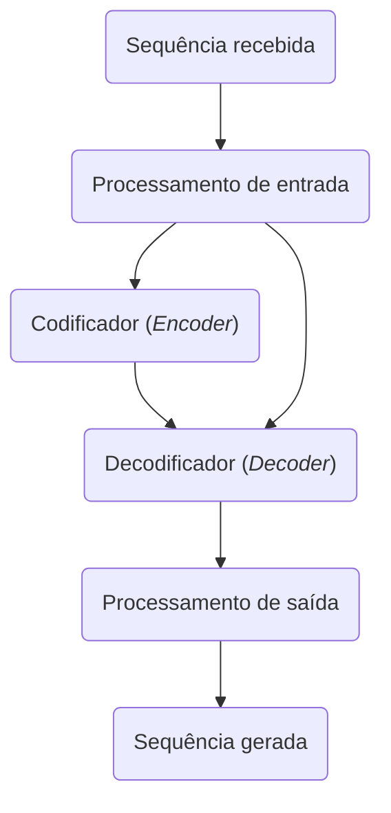
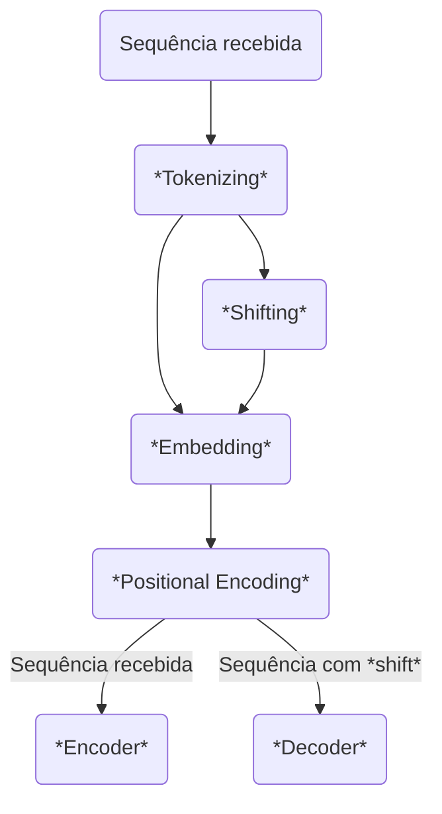
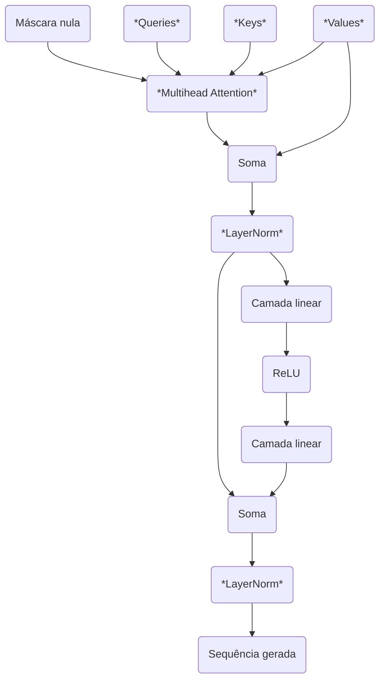
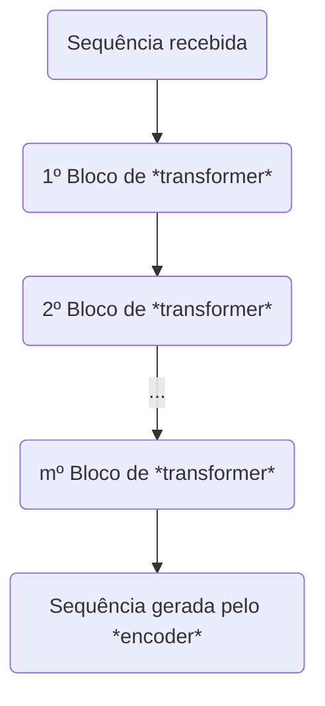
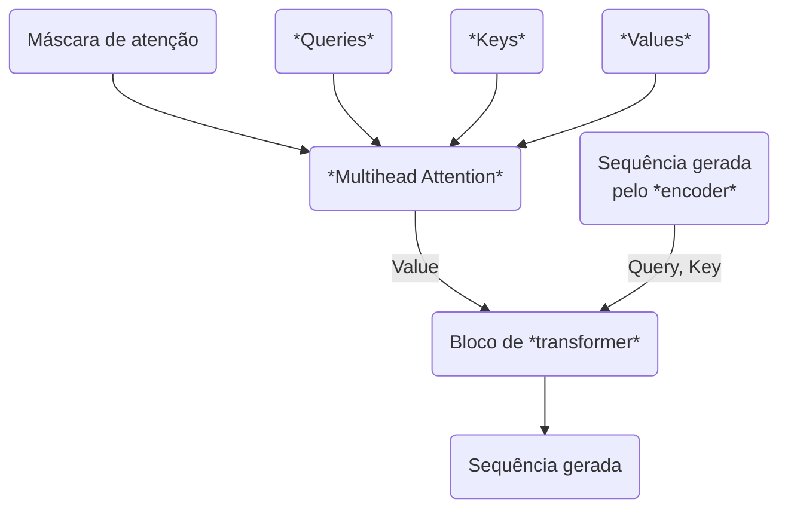
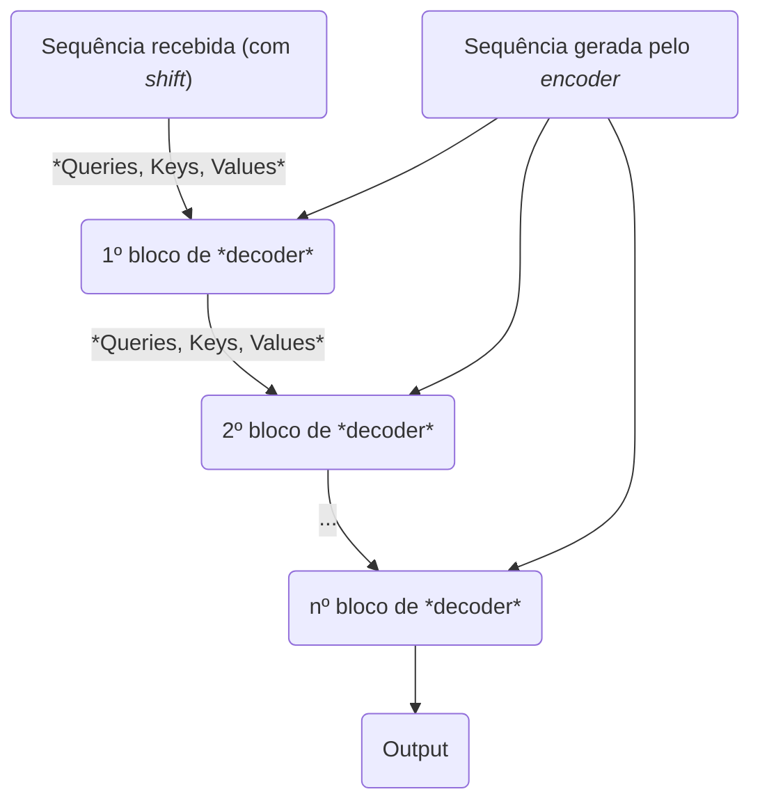
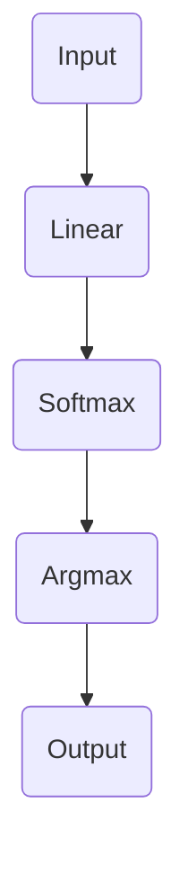

Nesse post, vou explicar como a arquitetura *transformer*, introduzida no artigo *"Attention is All You Need"*, funciona, assumindo o mínimo possível de pré-requisitos. Além disso, vou escrever uma versão da arquitetura do zero usando *PyTorch*.

Infelizmente, se eu não assumir absolutamente nenhum pré-requisito, o conteúdo ficará extenso demais para ser feito de uma vez (embora talvez possa fazer algo parecido caso tenham interesse). Por isso, vou assumir que você já entende:

* Como funcionam operações matriciais (como produto interno, produto matricial, transposição de matrizes, etc.)
* Como funcionam redes neurais *feed-forward*
* Conceitos fundamentais do PyTorch (como tensores, módulos, *autograd*, otimizadores, etc.)

## Contexto

Transformers são aplicações que se destacam em transdução de sequências, que são situações onde é necessário criar um modelo que consegue receber uma sequência de elementos de tamanho arbitrário e gerar outra sequência de elementos de tamanho arbitrário. Essas duas sequências não precisam ter o mesmo comprimento e os elementos das duas sequências podem pertencer a conjuntos diferentes.

Embora existam diversas áreas do conhecimento que possam usar transdução de sequências, vamos focar em aplicações voltadas à geração de linguagem natural, ou seja, onde a sequência recebida representa um texto e a sequência gerada também representa um texto.

Embora esses textos possam ser de domínios diferentes, como em um modelo de tradução entre idiomas, onde os elementos (letras) da sequência recebida (texto) pertencem a um vocabulário (o do idioma original), e os elementos (letras) da sequência gerada (texto traduzido) pertencem a outro vocabulário (o do idioma alvo). Porém, a aplicação mais notável dos *transformers* no momento de escrita desse post é em modelagem de linguagens, onde dada uma sequência de elementos (texto), um modelo gera os próximos elementos da sequência até entender que ela chegou ao fim, completando o texto original.

Modelos de linguagem são o que alimentam as inteligências artificiais conversacionais que tiveram uma explosão em popularidade a partir de 2022 com o lançamento de produtos como o ChatGPT, que são baseados em variações da arquitetura *transformer* e mostram o poder desse tipo de aplicação e arquitetura quando usados em grande escala.

Muitas das convenções que serão descritas tem como foco principal garantir a eficiência dos modelos gerados, tanto do ponto de vista de performance computacional como do ajuste dos modelos, e por ser um campo experimental, e muitas das conclusões e consensos tomados na criação de arquiteturas foram tomadas por experiência empírica.

## Representação dos dados

Modelos preditivos nada mais são do que algoritmos que podem ser adaptados para conjuntos de dados numéricos usando técnicas de otimização, e *transformers* não são diferentes. Portanto, para conseguir receber e gerar dados textuais, é necessário criar uma representação numérica para esses dados.

### *Tokens*

Como textos são representados por um vocabulário finito e conhecido, é possível enumerar todos os elementos que compõem um vocabulário de forma a criar uma função que associa elementos do vocabulário às suas representações numéricas. Essas representações numéricas são conhecidas como *tokens*, a função, como *tokenizer*, e no contexto do modelo, o vocabulário é o conjunto de representações numéricas dos elementos do vocabulário original.

Porém, ainda é necessário definir esse vocabulário original. Para definir um vocabulário simples, é possível usar um subconjunto dos caracteres que podem ser representados em um computador moderno, como os caracteres que compõem as tabelas *ASCII* e *Unicode*. Porém, isso não é uma restrição. Grandes Modelos de Linguagem usados para IAs Generativas e conversacionais frequentemente usam vocabulários compostos de sequências de elementos de um subconjunto dos caracteres representáveis, gerando funções que podem mapear centenas de milhares de *tokens*, que são escolhidos usando algoritmos especializados para maximizar a performance desses modelos.

| Letra   | Token   |
|---------|---------|
| `a`     | `1`     |
| `b`     | `2`     |
| `c`     | `3`     |
| ...     | ...     |
| `z`     | `26`    |
| `␣`     | `27`    |
| `.`     | `28`    |
| `,`     | `29`    |

Para fins didáticos, esse post não vai mostrar como realizar esse tipo de tarefa e vamos usar um vocabulário pequeno composto apenas de um subconjunto dos caracteres que podem ser representados na tabela Unicode. Porém, o conceito é o mesmo, mudando apenas a escala no treinamento do modelo de linguagem.

$$
\begin{array}{cccc}
    \text{g} & \text{a} & \text{t} & \text{o}
\end{array}
\rightarrow
\begin{bmatrix}
    7  &  1  & 20 & 15
\end{bmatrix}
$$

### Processamento em escala

Um grande desafio no uso de redes neurais complexas é minimzar o tempo de inferência. É possível implementar um transformer usando apenas estruturas como variáveis, listas e laços de repetição em Python puro, porém, esse tipo de implementação ingênua é lento demais para ser treinado e usado na prática pelo grande número de computações que precisam ser realizadas na inferência. Portanto, é necessário considerar técnicas de programação paralela desde o início da implementação do modelo.

Em geral, a forma mais prática de implementar paralelismo em redes neurais é aproveitar a capacidade dos dispositivos como placas de vídeo de realizar operações matemáticas sobre dados tensoriais (como vetores e matrizes) em paralelo de forma muito mais eficiente que processadores. Portanto, mudando a representação dos dados, é possível gerar algoritmos muito mais eficientes.

Uma sequência de *tokens* singular gerada a partir de um texto pode ser representanda usando um vetor (tensor unidimensional) com os valores de cada *token* em ordem. Concatenando esses vetores como linhas, é possível representar um lote (*batch*) de textos usando uma matriz (tensor bidimensional), que será a unidade mínima esperada pelo modelo para maximizar a eficiência da computação dos valores.

Mas nesse caso, é necessário encontrar uma forma de lidar com textos de comprimentos diferentes em um mesmo lote. É possível representar matrizes com linhas de tamanhos diferentes em PyTorch usando o módulo `torch.nested` (que ainda está em fase experimental), mas a forma mais comum de lidar com essa situação é realizar o preenchimento (*padding*) do tensor. Isso implica em adicionar um *token* especial ao *tokenizer* chamado de *padding token*, que não tem significado real no vocabulário e é usado apenas para preencher o tensor bidimensional, e adicionar elementos às sequências com esse valor até todas as linhas possuírem o tamanho desejado, que também é arbitrário. As duas formas mais comuns de realizar *padding* são adicionar elementos até que todas as linhas até que tenham o mesmo tamanho da maior (*max padding*) ou determinar um tamanho máximo fixo (*constant padding*), e essa decisão também é um consenso que depende da aplicação.

Esse post usará o elemento 0 como *pad token* e a técnica de *max padding* para realizar o preenchimento.

| Letra   | Token   |
|---------|---------|
| `<pad>` | `0`     |
| `<bos>` | `1`     |
| `<eos>` | `2`     |
| `a`     | `4`     |
| `b`     | `5`     |
| `c`     | `6`     |
| ...     | ...     |
| `z`     | `28`    |
| `␣`     | `29`    |
| `.`     | `30`    |
| `,`     | `31`    |

<!-- ```txt
+---+---+---+---+                    +----+----+----+----+----+----+----+----+
| g | a | t | o |                    |  7 |  1 | 20 | 15 |  0 |  0 |  0 |  0 |
+---+---+---+---+---+---+---+---+    +----+----+----+----+----+----+----+----+
| e | l | e | f | a | n | t | e |    |  5 | 12 |  5 |  6 |  1 | 14 | 20 |  5 |
+---+---+---+---+---+---+---+---+    +----+----+----+----+----+----+----+----+
| p | e | i | x | e |             -> | 16 |  5 |  9 | 24 |  5 |  0 |  0 |  0 |
+---+---+---+---+---+---+---+        +----+----+----+----+----+----+----+----+
| p | á | s | s | a | r | o |        | 16 | 27 | 19 | 19 |  1 | 18 | 15 |  0 |
+---+---+---+---+---+---+---+        +----+----+----+----+----+----+----+----+
| c | ã | o |                        |  3 | 28 | 15 |  0 |  0 |  0 |  0 |  0 |
+---+---+---+                        +----+----+----+----+----+----+----+----+
``` -->

$$
\begin{array}{cccccccc}
    \text{g} & \text{a} & \text{t} & \text{o} & \text{ } & \text{ } & \text{ } & \text{ } \\
    \text{e} & \text{l} & \text{e} & \text{f} & \text{a} & \text{n} & \text{t} & \text{e} \\
    \text{p} & \text{e} & \text{i} & \text{x} & \text{e} & \text{ } & \text{ } & \text{ } \\
    \text{p} & \text{á} & \text{s} & \text{s} & \text{a} & \text{r} & \text{o} & \text{ } \\
    \text{c} & \text{ã} & \text{o} & \text{ } & \text{ } & \text{ } & \text{ } & \text{ }
\end{array}
\rightarrow
\begin{bmatrix}
    7  &  1  & 20 & 15 &  0 &  0 &  0 &  0 \\
    5  & 12  &  5 &  6 &  1 & 14 & 20 &  5 \\
   16  &  5  &  9 & 24 &  5 &  0 &  0 &  0 \\
   16  & 27  & 19 & 19 &  1 & 18 & 15 &  0 \\
    3  & 28  & 15 &  0 &  0 &  0 &  0 &  0
\end{bmatrix}
$$

Embora essa técnica pareça ser ineficiente, e ela pode ser em certos cenários, como caso o tamanho máximo escolhido seja inadequado, de forma geral, o ganho de performance com a adição desses elementos para preencher a matriz ainda é superior ao gasto adicional em memória, que é o principal limitante para o treino e inferência desses modelos do ponto de vista computacional.

Por último, por convenção, vamos assumir que os lotes sempre têm o mesmo número de frases, $b$.

### *Embeddings*

Além da representação numérica dos *tokens*, usaremos *token embeddings*, representações vetoriais de cada *token*. Essa representação torna uma matriz de lote de textos em um tensor tridimensional, onde cada elemento (matriz) do tensor representa uma palavra, e cada linha desse elemento é o *token embedding* de uma palavra.

Portanto, agora a dimensão esperada para os dados recebidos é um tensor de $b$ lotes, cada um com $t$ tokens de dimensão $d$.

De forma ingênua, é possível criar um vetor esparso (ou seja, possuem grande dimensionalidade e muitos valores como 0) representando o *token*. Essa técnica é conhecida como *one-hot encoding*, e foi historicamente muito usada em diversas aplicações.

<!-- ```txt
                                              1   2   ...   26
                                            +---+---+-----+---+
+---+---+---+---+    +---+---+---+---+    2 | 1 | 0 | ... | 0 |
| b | a | b | a | -> | 2 | 1 | 2 | 1 | -> 1 | 0 | 1 | ... | 0 |
+---+---+---+---+    +---+---+---+---+    2 | 1 | 0 | ... | 0 |
                                          1 | 0 | 1 | ... | 0 |
                                            +---+---+-----+---+
``` -->

$$
\underbrace{
\begin{array}{cccc}
b & a & b & a \\
\end{array}
}_{\text{Original Sequence}}
\quad \to \quad
\underbrace{
\begin{bmatrix}
  2 & 1 & 2 & 1 \\
\end{bmatrix}
}_{\text{Encoded Sequence}}
\quad \to \quad
\underbrace{
\begin{array}{c|cccc}
      & 1 & 2 & \dots & 26 \\
    \hline
    2 & 1 & 0 & \dots & 0 \\
    1 & 0 & 1 & \dots & 0 \\
    2 & 1 & 0 & \dots & 0 \\
    1 & 0 & 1 & \dots & 0
\end{array}
}_{\text{Permutation Matrix}}
$$

Porém, os *token embeddings* usados nesse post serão densos (ou seja, possuem dimensionalidade menor em relação a vetores esparsos e poucos valores serão zero) e de tamanho fixo. Esses valores são obtidos usando uma camada linear, que será um parâmetro treinável da rede neural. É possível imaginar esse parâmetro como uma matriz onde cada linha representa o valor de um *token embedding* na ordem do vocabulário, assim, multiplicando essa matriz pela representação do *token* usando *one-hot encoding*, é posível obter o valor do *token embedding* diretamente como se fosse um dicionário.

<!-- ```txt
    1   2   ...   26            1     2    ...    d             1     2    ...    d      
  +---+---+-----+---+        +-----+-----+-----+-----+       +-----+-----+-----+-----+
2 | 1 | 0 | ... | 0 |      1 | 0.1 | 0.2 | ... | 0.6 |     2 | 0.7 | 0.8 | ... | 0.3 |
1 | 0 | 1 | ... | 0 |  x   2 | 0.7 | 0.8 | ... | 0.3 |  =  1 | 0.1 | 0.2 | ... | 0.6 |
2 | 1 | 0 | ... | 0 |      3 | 0.4 | 0.5 | ... | 0.9 |     2 | 0.7 | 0.8 | ... | 0.3 |
1 | 0 | 1 | ... | 0 |      4 | 0.9 | 0.1 | ... | 0.5 |     1 | 0.1 | 0.2 | ... | 0.6 |
  +---+---+-----+---+    ... | 0.5 | 0.3 | ... | 0.8 |       +-----+-----+-----+-----+
                          26 | 0.2 | 0.4 | ... | 0.1 |                                                  
                             +-----+-----+-----+-----+                                                  
``` -->

$$
\underbrace{
    \begin{array}{c|cccc}
      & 1 & 2 & \dots & 26 \\
    \hline
    2 & 1 & 0 & \dots & 0 \\
    1 & 0 & 1 & \dots & 0 \\
    2 & 1 & 0 & \dots & 0 \\
    1 & 0 & 1 & \dots & 0
\end{array}
}_{\text{Permutation Matrix}}
\times
\underbrace{
\begin{array}{c|cccc}
      & 1 & 2 & \dots & d \\
    \hline
    1  & 0.1 & 0.2 & \dots & 0.6 \\
    2  & 0.7 & 0.8 & \dots & 0.3 \\
    3  & 0.4 & 0.5 & \dots & 0.9 \\
    4  & 0.9 & 0.1 & \dots & 0.5 \\
    \vdots & \vdots & \vdots & \ddots & \vdots \\
    26 & 0.2 & 0.4 & \dots & 0.1
\end{array}
}_{\text{Data Matrix}}
=
\underbrace{
\begin{array}{c|cccc}
      & 1 & 2 & \dots & d \\
    \hline
    2 & 0.7 & 0.8 & \dots & 0.3 \\
    1 & 0.1 & 0.2 & \dots & 0.6 \\
    2 & 0.7 & 0.8 & \dots & 0.3 \\
    1 & 0.1 & 0.2 & \dots & 0.6
\end{array}
}_{\text{Reordered Data Matrix}}
$$

A maior vantagem de usar essa técnica é permitir a otimização dos valores de cada *token embedding* como parâmetros do modelo, de forma a otimizar a sua performance (veremos mais para a frente como isso é feito). Além disso, esses vetores possuem tamanho fixo, que frequentemente é menor que o tamanho do vocabulário, aumentando a velocidade de aprendizado do modelo durante o treinamento. Além disso, veremos que isso pode ser usado para permitir que a arquitetura possa receber frases de qualquer tamanho.

O uso de *embeddings* densos introduz o primeiro hiperparâmetro de um *transformer*: a dimensão $d$ dos *token embeddings*. No código, esse valor será referenciado como `embed_dim`.

```python
class Tokenizer(nn.Module):
    def __init__(self: Self, vocab: str, embed_dim: int) -> None:
        super().__init__()
        self.vocab = set(vocab)
        self.embed_dim = embed_dim
        self.char_ids = {char: index + 1 for index, char in enumerate(self.vocab)}
        self.embedding = nn.Embedding(
            num_embeddings=len(self.vocab) + 1,
            embedding_dim=self.embed_dim,
        )

    def tokenize(self: Self, chars: str) -> list[int]:
        return [self.char_ids[char] for char in chars]

    def forward(self: Self, inputs: list[str]) -> torch.Tensor:
        chars, *inputs = inputs

        tokens = self.tokenize(chars)
        token_lists = [tokens]

        token_count = len(tokens)
        token_counts = [token_count]

        max_length = token_count

        for chars in inputs:
            tokens = self.tokenize(chars)
            token_lists.append(tokens)

            token_count = len(tokens)
            token_counts.append(token_count)

            max_length = max(max_length, token_count)

        for tokens, token_count in zip(token_lists, token_counts):
            tokens.extend(0 for _ in range(max_length - token_count))

        embedding_inputs = torch.tensor(token_lists)
        embeddings = self.embedding(embedding_inputs)
        return embeddings, token_counts
```

## O que é atenção?

No contexto de redes neurais para transdução de sequências, atenção se refere à capacidade do modelo de gerar um novo vetor para cada vetor original de forma que os novos vetores sejam mais representativos pelo seu contexto na frase. No caso dos *transformers*, essa combinação é feita a partir de uma média ponderada de todos os vetores originais, onde o peso de cada vetor é o valor predito pelo mecanismo de atenção.

Imagine a seguinte frase:

> Então, João se lembrou: O ônibus estava cheio, mas ele conseguiu uma cadeira livre.

Considere que cada palavra representa um *token*. Nesse caso, o mecanismo de atenção permite alterar o valor do *token embedding* do *token* "ele" para seja mais próximo do valor de "João" do que de "ônibus", preservando o contexto da frase no valor de cada *embedding* individual. Isso é importante porque permite que as próximas possam fazer transformações nos dados sem ter que levar todo o texto em consideração, que de forma geral significa poder fazer predições que levam o contexto do texto em consideração de forma mais rápida que as alternativas.

A atenção total que pode ser prestada entre os *embeddings* é finita, ou seja, é descrita como um vetor de valores entre 0 e 1 cuja soma é 1. Logo, se um *embedding* recebe atenção a mais, os outros receberão a menos de alguma forma.

## *Queries, Keys, Values*

No contexto dos mecanismos de atenção, os *token embeddings* possuem nomes diferentes dependendo do seu papel. Fazendo uma analogia com um dicionário em Python, onde dado um conjunto de chaves que são associadas a outros valores, é possível encontrar o valor associado ao valor de uma variável de consulta no dicionário comparando essa variável a partir das chaves e retornando o valor dessa chave. Um mecanismo de atenção é similar, porém ao invés de retornar apenas um valor associado a uma chave, dado uma variável de consulta, é obtido uma fração de cada valor no dicionário a partir da comparação com as chaves.

Essa analogia tem mais valor histórico que figurativo para explicar o funcionamento de um mecanismo de atenção, mas gera a nomenclatura original para as variáveis envolvidas. Para um conjunto de *embeddings* representando uma sequência, o *embedding* que terá seu novo valor gerado é a consulta (*query*), os *embeddings* que serão comparados com a *query* para gerar a atenção serão as chaves do dicionário (*keys*), e os valores que serão multiplicados pela atenção serão os valores do dicionário (*values*).

A analogia acima usa apenas um *embedding* por vez, mas como falamos anteriormente, é importante realizar o máximo de operações em lote que forem possíveis para maximizar a performance do modelo. Então, visualizando de forma matricial, se para cada um dos $b$ lotes recebidos, os *tokens* de um texto são representados como uma matriz de $t$ *embeddings* de dimensão $d$, a atenção em um *transformer* será representada como um tensor com $b$ lotes de matrizes $t \times t$, onde cada linha representa a atenção que um *embedding* deve considerar nos *values* gerados:

<!-- ```txt

       1     2    ...    d             1     2     ...     t              1     2    ...    d   
    +-----+-----+-----+-----+       +-----+-----+-------+-----+        +-----+-----+-----+-----+
  1 | 0.7 | 0.8 | ... | 0.3 |     1 | 0.5 | 0.5 |  ...  | 0.0 |      1 | 0.4 | 0.3 | ... | 0.8 |
  2 | 0.3 | 0.2 | ... | 0.2 |  x  2 | 0.2 | 0.3 |  ...  | 0.4 | ->   2 | 0.9 | 0.1 | ... | 0.1 |
... | 0.1 | 0.9 | ... | 0.5 |   ... | ... | ... |  ...  | ... |    ... | 0.8 | 0.7 | ... | 0.4 |
  t | 0.2 | 0.4 | ... | 0.1 |     t | 0.1 | 0.2 |  ...  | 0.5 |      t | 0.2 | 0.5 | ... | 0.3 |
    +-----+-----+-----+-----+       +-----+-----+-------+-----+        +-----+-----+-----+-----+
``` -->

$$
\underbrace{
\begin{array}{c|cccc}
      & 1 & 2 & \dots & d \\
    \hline
    1  & 0.7 & 0.8 & \dots & 0.3 \\
    2  & 0.3 & 0.2 & \dots & 0.2 \\
    \vdots & \vdots & \vdots & \ddots & \vdots \\
    t  & 0.2 & 0.4 & \dots & 0.1
\end{array}
}_{\text{Feature Matrix}}
\times
\underbrace{
\begin{array}{c|cccc}
      & 1 & 2 & \dots & t \\
    \hline
    1  & 0.5 & 0.5 & \dots & 0.0 \\
    2  & 0.2 & 0.3 & \dots & 0.4 \\
    \vdots & \vdots & \vdots & \ddots & \vdots \\
    t  & 0.1 & 0.2 & \dots & 0.5
\end{array}
}_{\text{Transformation Matrix}}
\rightarrow
\underbrace{
\begin{array}{c|cccc}
      & 1 & 2 & \dots & d \\
    \hline
    1  & 0.4 & 0.3 & \dots & 0.8 \\
    2  & 0.9 & 0.1 & \dots & 0.1 \\
    \vdots & \vdots & \vdots & \ddots & \vdots \\
    t  & 0.2 & 0.5 & \dots & 0.3
\end{array}
}_{\text{Transformed Feature Matrix}}
$$

Note que dessa forma é possível calcular os valores novos de todos os *embeddings* simultaneamente.

A forma como a atenção é calculada para cada *token* é determinada pelo mecanismo de atenção. O mecanismo usado originalmente nos *transformers* é conhecido como *Multihead Attention*, que é uma variação do *Scaled Dot-Product Attention*, que é uma variação do *Dot-Product Attention* que é um tipo de *Self-Attention*.

*Self-Attention* é um termo que tem mais valor histórico que prático atualmente, mas significa que os vetores de atenção não são gerados por nenhum modelo paramétrico externo ao *transformer*: Os *embeddings* originais são usados tanto para determinar quanta atenção deve ser prestada em cada *embedding* no valor final quanto para gerar os valores dos novos *embeddings*.

## *Scaled Dot-Product Attention*

No caso do mecanismo de *Dot-Product Attention*, a atenção prestada é feita a partir do produto interno (*dot product*) dos *token embeddings*. O modelo toma a premissa de que cada *embedding* deve prestar atenção em outro *embedding* de forma diretamente proporcional ao produto interno deles. Pensando de forma matricial, a atenção pode ser calculada como:

$$
  \text{DPA}(Q,K,V) = Q^TKV
$$

Note que dessa forma é possível calcular a atenção de todos os *embeddings* entre si e os seus valores novos simultaneamente.

Porém, existe um problema nesse processo. Embora a atenção entre cada par de *embeddings* esteja sempre entre 0 e 1, o produto interno de dois vetores está entre $-\infty$ e $\infty$, o que permite o mecanismo prestar atenção infinita entre todos os valores, o que pode atrapalhar o treinamento do modelo. Para normalizar os *embeddings*, a atenção é normalizada usando a função *softmax*, que faz com que os valores de cada linha sejam normalizados entre 0 e 1 preservando a proporção dos valores originais.

$$
  \text{DPA}(Q,K,V) = \text{Softmax}(Q^TK)V
$$

Na implementação original dos *transformers*, o mecanismo usado é uma variação do *Scaled Dot-Product Attention*, que é diferente do *Dot-Product Attention* em apenas uma coisa:

$$
  \text{SDPA}(Q,K,V) = \text{Softmax}\left(\frac{Q^TK}{\sqrt{d_{in}}}\right)V
$$

Onde $d$ é a dimensão dos *embeddings*. Essa normalização dos valores tem origem empírica, onde foi observado que realizar processos de normalização como esses evita que redes neurais sejam treinadas incorretamente por causa da magnitude dos elementos da matriz de atenção antes da função *softmax*.

## Projeções lineares

Um dos segredos do *transformer* para tornar o mecanismo de atenção mais eficiente é projetar linearmente as *Queries*, *Keys* e *Values*. Isso significa multiplicar cada um desses valores por uma matriz de parâmetros treináveis (denominadas $W^Q$, $W^K$ e $W^V$). Isso faz com que os valores das *Queries*, *Keys* e *Values* sejam diferentes entre si, e durante o treino, os valores dessas matrizes de parâmetros sejam otimizados para maximizar como o *transformer* converte os *embeddings* originais em novos *embeddings* que representam melhor o valor de cada *token* no contexto onde estão inseridos.

$$
  \text{SDPA-Transformer}(Q,K,V) =  SDPA(QW^Q, KW^K,VW^V)
$$

## *Multihead Attention*

O verdadeiro mecanismo utilizado originalmente nos *transformers é conhecido como *Multihead Attention*, que consiste em aplicar *Scaled Dot-Product Attention* $h$ vezes sobre os *embeddings* para combinar os resultados dessas aplicações. O valor $h$ (ou o número de cabeças) é um hiperparâmetro do modelo.

Como não é possível prestar atenção em todos os elementos simultaneamente, o objetivo desse mecanismo é permitir que um *embedding* possa ser gerado prestando atenção em partes diferentes dos outros valores ao mesmo tempo. É como se o modelo tivesse vários pares de olhos independentes e conseguisse ler várias partes de um texto ao mesmo tempo, e ainda conseguisse entender o que está acontecendo.

O maior problema de usar esse mecanismo da forma descrita acima é que a atenção precisa ser calculada $h$ vezes, então se torna $h$ vezes mais lenta, e um dos objetivos dos *transformers* é ter modelos que podem fazer predições rapidamente. Por isso, é usado um truque para manter o tempo desse algoritmo constante em relação ao número de cabeças:

1. Dividir as *Queries*, *Keys* e *Values* em $h$ pedaços individuais (ou aplicar $h$ projeções lineares diferentes nas *Queries*, *Keys* e *Values*), fazendo com que as dimensões do tensor passem de $b \times t \times d_{in}$ para $b \times t \times h \times \frac{h}{d_{in}}$.
2. Reordenar a ordem dos elementos das *Queries*, *Keys* e *Values*, fazendo com que as dimensões do tensor passem de $b \times t \times h \times \frac{h}{d_{in}}$ para $b \times h \times t \times \frac{h}{d_{in}}$.
3. Aplicar *Scaled Dot Product-Attention* nos *embeddings* recebidos, usando projeções diferentes para cada cabeça.
4. Concatenar os *embeddings* de cada cabeça e retornar a ordem original dos elementos, fazendo com que o tensor volte a ter dimensões $b \times t \times d_{in}$.
5. Aplicar uma projeção linear $W^O$ nos *embeddings* concatenados.

$$
  MHA(Q,K,V) = \left(\Big \Vert^h_{i=1} SDPA(QW^Q_i, KW^K_i,VW^V_i) \right) W^O
$$

Dessa forma, apesar da atenção precisar ser calculada $h$ vezes, cada cálculo é $\frac{1}{h}$ vezes mais rápido que o original, o que leva o mesmo tempo que aplicar *Scaled Dot-Product Attention*. No final, aplicar *Multihead Attention* ainda vai ser mais lento que aplicar *Scaled Dot-Product Attention*, porque o novo mecanismo ainda precisa realizar a projeção linear $W^O$, mas o tempo adicional não aumenta com relação a $h$. Essa diferença é ainda maior se uma projeção linear a base de multiplicações de matrizes for feita para cada cabeça, caso em que a diferença aumenta com relação a $h$. Porém, se a projeção for feita dividindo os valores originais manipulando os elementos da matriz (como veremos no código em PyTorch), essa etapa tem tempo constante e pode ser omitida.

```python
class MultiheadAttention(nn.Module):
    def __init__(self: Self, embed_dim: int, n_heads: int) -> None:
        super().__init__()

        self.embed_dim = embed_dim
        self.n_heads = n_heads
        self.head_dim = self.embed_dim // self.n_heads

        self.query_projection = nn.Linear(embed_dim, embed_dim, bias=False)
        self.key_projection = nn.Linear(embed_dim, embed_dim, bias=False)
        self.value_projection = nn.Linear(embed_dim, embed_dim, bias=False)
        self.output_projection = nn.Linear(embed_dim, embed_dim, bias=False)

    def split_embeddings(
        self: Self,
        inputs: torch.Tensor,
        batches: int,
        tokens: int,
    ) -> torch.Tensor:
        split_inputs = inputs.view(batches, tokens, self.n_heads, self.head_dim)
        head_sorted_inputs = split_inputs.transpose(1, 2)
        return head_sorted_inputs

    def join_embeddings(
        self: Self,
        inputs: torch.Tensor,
        batches: int,
        tokens: int,
    ) -> torch.Tensor:
        token_sorted_inputs = inputs.transpose(1, 2)
        token_sorted_inputs = token_sorted_inputs.contiguous()
        joined_inputs = token_sorted_inputs.view(batches, tokens, self.embed_dim)
        return joined_inputs

    def forward(
        self: Self,
        queries: torch.Tensor,
        keys: torch.Tensor,
        values: torch.Tensor,
        mask: torch.Tensor | None = None,
    ) -> torch.Tensor:
        batches, tokens, _ = queries.size()

        queries = self.query_projection(queries)
        keys = self.key_projection(keys)
        values = self.value_projection(values)

        queries = self.split_embeddings(queries, batches, tokens)
        keys = self.split_embeddings(keys, batches, tokens)
        values = self.split_embeddings(values, batches, tokens)

        keys = keys.transpose(2, 3)

        scores = queries @ keys / (self.head_dim**0.5)

        if mask is not None:
            scores = scores.masked_fill(mask, float("-inf"))
            print(scores)

        weights = F.softmax(scores, dim=3)

        attn_outputs = weights @ values
        joined_outputs = self.join_embeddings(attn_outputs, batches, tokens)
        projected_outputs = self.output_projection(joined_outputs)

        return projected_outputs
```

## *Positional encoding*

Uma falha na definição dos mecanismos de atenção da forma com que foram mostrados é que nenhuma das operações envolvidas nos mecanismos leva em consideração a posição dos elementos na sequência para a criação dos novos elementos gerados pelo mecanismo. Isso significa que permutações na ordem dos elementos não afetam o resultado, o que é um efeito indesejado e que pode atrapalhar o processo de treino do modelo. Durante o treinamento, o *transformer* deve aprender a projetar os elementos originais de forma que preserve o seu contexto na frase, mas se a posição não for levada em consideração, é difícil que o modelo consiga remover ambiguidades de forma efetiva.

Para mitigar esse problema, antes da aplicação de qualquer mecanismo de atenção, os elementos originais passam por um processo de codificação posicional (*Posicional Encoding*), que tem como objetivo alterar os valores de cada elemento para representar sua posição na sequência original. Como essa codificação altera os valores dos elementos, alterará seus produtos internos e por consequência, a atenção prestada pelo modelo em cada elemento.

A forma com que essa codificação é realizada na implementação original segue a função a seguir:

$$
    \text{PE}(i, j, p) =
    \begin{cases}
    \sin \dfrac{p}{\theta^{\frac{2i}{d_{in}}}} & \text{se }j \text{ é par}, \\ ~ \\
    \cos \dfrac{p}{\theta^{\frac{2i}{d_{in}}}} & \text{se }j \text{ é ímpar}.
    \end{cases}
$$

Onde:

* $p$ é a posição de um elemento na sequência (ou linha da matriz atual).
* $j$ é a posição de um item em um elemento da sequência (ou coluna da linha atual)
* $0 \leq i < \frac{d}{2}$, e seu valor aumenta em um a cada dois itens consecutivos de um elemento da sequência.
* $\theta$ é um hiperparâmetro.

Embora a explicação a seguir envolva conceitos externos a esse post, essa função é usada porque é o equivalente a aplicar uma matriz de rotação nos elementos da sequência, onde o ângulo de rotação de um elemento é determinado pela sua posição. Isso significa que a codificação posicional é relativa, ou seja, prioriza representar a posição de um elemento em relação aos seus vizinhos mais do que representar a ordem dos elementos de forma absoluta.

De forma matricial, os valores de $PE$ para uma sequência com 5 elementos com $d = 4$ e $\theta = 10000$  podem ser visualizados da seguinte forma:

$$
i =
\begin{bmatrix}
0 & 0 & 1 & 1 \\
0 & 0 & 1 & 1 \\
0 & 0 & 1 & 1 \\
0 & 0 & 1 & 1 \\
0 & 0 & 1 & 1 \\
\end{bmatrix}
$$
$$
j =
\begin{bmatrix}
0 & 1 & 2 & 3 \\
0 & 1 & 2 & 3 \\
0 & 1 & 2 & 3 \\
0 & 1 & 2 & 3 \\
0 & 1 & 2 & 3 \\
\end{bmatrix}
$$
$$
p =
\begin{bmatrix}
0 & 0 & 0 & 0 \\
1 & 1 & 1 & 1 \\
2 & 2 & 2 & 2 \\
3 & 3 & 3 & 3 \\
4 & 4 & 4 & 4 \\
\end{bmatrix}
$$

$$
PE(i,j,p) =
\begin{bmatrix}
0.0000 & 1.0000 & 0.0000 & 1.0000 \\
0.8415 & 0.5403 & 0.0100 & 0.9999 \\
0.9093 & -0.4161 & 0.0200 & 0.9998 \\
0.1411 & -0.9899 & 0.0300 & 0.9996 \\
-0.7568 & -0.6536 & 0.0400 & 0.9992 \\
\end{bmatrix}
$$

Por fim, $PE(i,j,p)$ é somado ao lote de sequências, e esse resultado será o valor usado pelo modelo como entrada.

```python
class PositionalEncoder(nn.Module):
    def __init__(self: Self, embed_dim: int, theta: int) -> None:
        super().__init__()
        self.embed_dim = embed_dim
        self.theta = theta

    @torch.no_grad()
    def forward(self, inputs: torch.Tensor) -> torch.Tensor:
        batches, tokens, _ = inputs.size()

        indexes = torch.arange(self.embed_dim, dtype=torch.float)

        positions = torch.arange(tokens, dtype=torch.float)
        positions = positions.view(tokens, 1)

        i = torch.arange(self.embed_dim // 2)
        i = i.float()
        i = i.repeat_interleave(2)

        cos_indexes = indexes % 2
        cos_indexes = cos_indexes.bool()
        cos_indexes = cos_indexes.expand((tokens, self.embed_dim))

        sin_indexes = ~cos_indexes

        encodings = positions / (self.theta ** (2 * i / self.embed_dim))

        encodings[sin_indexes] = encodings[sin_indexes].sin()
        encodings[cos_indexes] = encodings[cos_indexes].cos()

        encodings = encodings.expand((batches, tokens, self.embed_dim))

        return inputs + encodings
```

## Transdução autoregressiva de sequências

Antes de falar de como um *transformer* funciona, é importante entender como podemos fazer transdução de sequências a partir de outra sequência de elementos de forma geral para simplificar a explicação do funcionamento. Além disso, é importante entender o que significa fazer essa tarefa de forma autoregressiva, característica desse tipo de modelo.

Vamos voltar para o caso em que estamos criando um modelo que recebe um texto e gera outro. Como vimos anteriormente, o modelo recebe $b$ sequências de $t$ elementos, representando os textos recebidos. Do ponto de vista de uma sequência, o resultado é outra sequência de $t$ elementos, que representa a mesma sequência recebida sem o primeiro *token* e com um novo *token*, decidido pelo modelo, ao final. O processo de remover o primeiro *token* da sequência recebida e adicionar o próximo *token* da sequência esperada será denominado *shift*.

Esse processo é o equivalente a gerar o próximo *token* do texto recebido. Se essa sequência gerada for usada como a sequência recebida do modelo novamente, será gerado mais um novo *token*, e o processo é repetido até que o modelo gere o *token* especial de fim de sequência. esse processo é o que torna o modelo autoregressivo, ou seja, as predições do modelo também são usadas como seus dados recebidos até que o modelo chegue em certo critério de parada, que no caso é o *token* especial.

O exemplo a seguir ilustra como um modelo faria a tradução da palavra "cachorro" em Português para a palavra "dog" em Inglês. As colunas representam os valores das sequências em cada posição, e as linhas, as iterações do algoritmo:

$$
\underbrace{
\begin{array}{c|cccccccccc}
    & 0 & 1 & 2 & 3 & 4 & 5 & 6 & 7 & 8 & 9 \\\hline
 1 & \text{<bos>} & \text{c} & \text{a} & \text{c} & \text{h} & \text{o} & \text{r} & \text{r} & \text{o} & \text{<eos>} \\
 2 & \text{c} & \text{a} & \text{c} & \text{h} & \text{o} & \text{r} & \text{r} & \text{o} & \text{<eos>} & \text{<bos>} \\
 3 & \text{a} & \text{c} & \text{h} & \text{o} & \text{r} & \text{r} & \text{o} & \text{<eos>} & \text{<bos>} & \text{d} \\
 4 & \text{c} & \text{h} & \text{o} & \text{r} & \text{r} & \text{o} & \text{<eos>} & \text{<bos>} & \text{d} & \text{o} \\
 5 & \text{h} & \text{o} & \text{r} & \text{r} & \text{o} & \text{<eos>} & \text{<bos>} & \text{d} & \text{o} & \text{g} \\
\end{array}
}_{\text{Sequência original}}
$$

$$
\rightarrow
$$

$$
\underbrace{
\begin{array}{c|cccccccccc}
    & 0 & 1 & 2 & 3 & 4 & 5 & 6 & 7 & 8 & 9 \\\hline
 1 & \text{c} & \text{a} & \text{c} & \text{h} & \text{o} & \text{r} & \text{r} & \text{o} & \text{<eos>} & \text{<bos>} \\
 2 & \text{a} & \text{c} & \text{h} & \text{o} & \text{r} & \text{r} & \text{o} & \text{<eos>} & \text{<bos>} & \text{d} \\
 3 & \text{c} & \text{h} & \text{o} & \text{r} & \text{r} & \text{o} & \text{<eos>} & \text{<bos>} & \text{d} & \text{o} \\
 4 & \text{h} & \text{o} & \text{r} & \text{r} & \text{o} & \text{<eos>} & \text{<bos>} & \text{d} & \text{o} & \text{g} \\
 5 & \text{o} & \text{r} & \text{r} & \text{o} & \text{<eos>} & \text{<bos>} & \text{d} & \text{o} & \text{g} & \text{<eos>} \\
\end{array}
}_{\text{Sequência após o \textit{shift}}}
$$

Note que o primeiro *shift* sempre terá o mesmo resultado: remover o *token* `<bos>` e o adicionar ao final da sequência, porque isso será importante na implementação da arquitetura. Além disso, como a concatenação dos *tokens* gerados dessa forma a cada iteração representam a sequência gerada, o tamanho dessa sequência é indepentedente do tamanho da sequência recebida, logo é possível gerar qualquer sequência de tamanho arbitrário.

### Máscara de atenção

A descrição do algoritmo acima é bem mais antiga que os *transformers*, e por mais que um algoritmo faça sentido teoricamente ao assumir que o modelo irá acertar o processo, ainda é necessário criar um modelo capaz de realizar a predição no formato proposto corretamente. E no caso de transdução de sequências, é possível argumentar que modelos que consigam predizer elementos da forma correta ainda é um desafio em diversas aplicações, mesmo com arquiteturas modernas como as usadas nos *Large Language Models*.

Um problema encontrado em outras arquiteturas para a mesma tarefa é garantir convergência para o mínimo global durante o treinamento. Por exemplo, arquiteturas baseadas em redes neurais recorrentes (*RNNs*) podem ter problemas no treinamento envolvendo desaparecimento de gradientes (*gradient vanishing*), efeito que acontece quando os valores dos gradientes gerados pelo processo de *backpropagation* são pequenos demais para que o modelo consiga convergir até o final de treinamento, fazendo com que o treinamento praticamente pare antes do valor da função de perda se tornar próximo do mínimo global. Já outras arquiteturas baseadas em *sequence-to-sequence learning* resolvem esse problema, mas podem se tornar muito lentas durante a inferência pela sua natureza sequencial.

Um dos objetivos de realizar operações em paralelo sobre todos os elementos da sequência nos mecanismos de atenção estudados é evitar esses dois problemas simultaneamente, e os autores mostram que é possível realizar isso usando basicamente apenas mecanismos de atenção, ou seja, outros mecanismos não são necessários, **atenção é tudo que você precisa (*Attention is all you need*)**.

Mas, durante o treinamento desses modelos, para que o modelo consiga aprender a predizer o próximo elemento da sequência correntamente, é necessário limitar o seu conhecimento sobre os valores da sequência para que a sequência gerada pelo mecanismo de atenção seja gerada corretamente.

Perceba que os mecanismos de atenção mostrados até aqui consideram todos os elementos de uma sequência na geração dos novos elementos o que significa que o i-ésimo elemento da sequência gerada considerará o i+1-ésimo elemento, e também o i+2-ésimo e assim por diante. A consequência disso é que isso afetará o processo de *backpropagation*, já que como durante o treinamento, a perda será calculada a partir do resultado de cada iteração do algoritmo de autoregressão mostrado acima (que será a mesma sequência, mas sem o primeiro elemento recebido e com um novo elemento gerado por último).

Considere agora como a perda será calculada nesse caso. Para todos os elementos exceto o último, os elementos da sequência gerada pelo mecanismo de atenção já estavam na sequência original, e foram apenas deslocados uma posição à esquerda. Portanto, quando os parâmetros treináveis do mecanismo de atenção forem atualizados, eles convergirão de forma que irá perceber esse processo e apenas deslocar os valores dos elementos para a esquerda em uma posição, o que pode facilmente inviabilizar a convergência do modelo durante o treinamento.

Portanto, é necessário usar uma forma de limitar o conhecimento do modelo durante a atenção para que o i-ésimo elemento da sequência gerada não seja escolhido considerando o valor dos próximos valores na sequência original, mesmo que esse seja o objetivo do modelo durante o treinamento. A forma com que isso é feito é aplicando uma máscara de atenção (*attention mask*), que anula os valores posteriores a um elemento na sequência para cada elemento no tensor de atenção.

A forma com que implementaremos a aplicação da matriz de atenção é transformar esses valores em $-\infty$ antes de aplicar a função *softmax* somando um tensor onde cada elemento é uma matriz triangular superior da seguinte forma:

$$
  \text{SDPA-Mask}(Q,K,V,M) = \text{Softmax}\left(\frac{Q^TK}{\sqrt{d_{in}}}+M\right)V
$$

$$
\underbrace{
\begin{array}{c|ccccc}
       & 1      & 2      & 3      & \dots  & t-1    & t      \\
\hline
1      & 6.32   & -1.12  & 1.32   & \dots  & -2.16  & 1.92   \\
2      & -1.81  & 0.96   & 0.89   & \dots  & 0.03   & 1.76   \\
3      & -1.81  & 0.06   & -2.27  & \dots  & 1.01   & -1.32  \\
\vdots & \vdots & \vdots & \vdots & \ddots & \vdots & \vdots \\
t-1    & -0.11  & 1.55   & -0.18  & \dots  & 0.95   & 0.95   \\
t      & 1.45   & -1.42  & 1.62   & \dots  & 2.06  & -0.23
\end{array}
}_{\text{Atenção original}}
$$
$$
+
$$
$$
\underbrace{
\begin{array}{c|ccccc}
    & 1      & 2          & 3        & \dots  & t-1      & t        \\
\hline
1        & 0      & -\infty  & -\infty  & \dots  & -\infty  & -\infty  \\
2        & 0      & 0        & -\infty  & \dots  & -\infty  & -\infty  \\
3        & 0      & 0        & 0        & \dots  & -\infty  & -\infty  \\
\vdots   & \vdots & \vdots   & \vdots   & \ddots & \vdots   & \vdots   \\
t-1      & 0      & 0        & 0        & \dots  & 0        & -\infty  \\
t        & 0      & 0        & 0        & \dots  & 0        & 0
\end{array}
}_{\text{Máscara de atenção}}
$$
$$
=
$$
$$
\underbrace{
\begin{array}{c|ccccc}
    & 1      & 2      & 3      & \dots  & t-1    & t      \\
\hline
1      & 6.32   & -\infty & -\infty    & \dots  & -\infty  & -\infty  \\
2      & -1.81  & 0.96    & -\infty    & \dots  & -\infty  & -\infty  \\
3      & -1.81  & 0.06    & -2.27      & \dots  & -\infty  & -\infty  \\
\vdots & \vdots & \vdots  & \vdots     & \ddots & \vdots   & \vdots   \\
t-1    & -0.11  & 1.55    & -0.18      & \dots  & 0.95     & -\infty  \\
t      & 1.45   & -1.42   & 1.62       & \dots  & 2.06     & -0.23
\end{array}
}_{\text{Atenção mascarada}}
$$

A máscara é aplicada antes da função *softmax* porque como $-\infty$ é o menor valor real possível, esses elementos se tornarão zero após a normalização, enquanto que a soma dos demais elementos será igual a 1, fazendo com que a atenção ignore completamente esses elementos.

Veremos ainda que apesar dessa limitação criada para garantir funcionamento do modelo durante o algoritmo de autoregressão, existem casos na arquitetura onde não há problemas em não usar uma máscara de atenção, e nesse caso, a máscara usada será apenas um tensor nulo, assim, a aplicação da máscara nula não surtirá nenhum efeito no resultado final.

$$
\underbrace{
\begin{array}{c|ccccc}
       & 1      & 2      & 3      & \dots  & t-1    & t      \\
\hline
1      & 6.32   & -1.12  & 1.32   & \dots  & -2.16  & 1.92   \\
2      & -1.81  & 0.96   & 0.89   & \dots  & 0.03   & 1.76   \\
3      & -1.81  & 0.06   & -2.27  & \dots  & 1.01   & -1.32  \\
\vdots & \vdots & \vdots & \vdots & \ddots & \vdots & \vdots \\
t-1    & -0.11  & 1.55   & -0.18  & \dots  & 0.95   & 0.95   \\
t      & 1.45   & -1.42  & 1.62   & \dots  & 2.06  & -0.23
\end{array}
}_{\text{Atenção original}}
$$
$$
+
$$
$$
\underbrace{
\begin{array}{c|ccccc}
    & 1      & 2          & 3        & \dots  & t-1      & t        \\
\hline
1        & 0      & 0        & 0        & \dots  & 0        & 0        \\
2        & 0      & 0        & 0        & \dots  & 0        & 0        \\
3        & 0      & 0        & 0        & \dots  & 0        & 0        \\
\vdots   & \vdots & \vdots   & \vdots   & \ddots & \vdots   & \vdots   \\
t-1      & 0      & 0        & 0        & \dots  & 0        & 0        \\
t        & 0      & 0        & 0        & \dots  & 0        & 0
\end{array}
}_{\text{Máscara de atenção}}
$$
$$
=
$$
$$
\underbrace{
\begin{array}{c|ccccc}
       & 1      & 2      & 3      & \dots  & t-1    & t      \\
\hline
1      & 6.32   & -1.12  & 1.32   & \dots  & -2.16  & 1.92   \\
2      & -1.81  & 0.96   & 0.89   & \dots  & 0.03   & 1.76   \\
3      & -1.81  & 0.06   & -2.27  & \dots  & 1.01   & -1.32  \\
\vdots & \vdots & \vdots & \vdots & \ddots & \vdots & \vdots \\
t-1    & -0.11  & 1.55   & -0.18  & \dots  & 0.95   & 0.95   \\
t      & 1.45   & -1.42  & 1.62   & \dots  & 2.06  & -0.23
\end{array}
}_{\text{Atenção original}}
$$

```python
def get_attn_mask(size: int | tuple[int]) -> torch.Tensor:
    mask = torch.ones(size)
    mask = mask.triu(diagonal=1)
    mask = mask.bool()
    return mask
```

## Montando um *transformer*



Agora que os conceitos principais da arquitetura foram apresentados, podemos visualizar como o modelo funciona.

Os *transformers* originalmente são compostos de operações similares que são aplicadas de forma sequencial sobre um lote de sequências, uma escolha que, como a maioria delas até aqui, tem como objetivo aumentar a eficiência computacional do modelo durante treino e inferência. É possível visualizar um *transformer* como sendo composto dos seguintes componentes:

### Processamento de entrada



Todos os componentes do processamento de entrada já foram introduzidos antes:

1. Uma sequência tem seus elementos convertidos para *tokens*
2. Os *tokens* são convertidos em *token embeddings*
3. *Positional Encoding* é aplicado sobre os *token embeddings*, gerando o lote de sequências que será usado pelo modelo como entrada de fato.

```python
class InputProcessor(nn.Module):
    def __init__(
        self: Self,
        tokenizer: Tokenizer,
        positional_encoder: PositionalEncoder,
    ) -> None:
        super().__init__()
        self.tokenizer = tokenizer
        self.positional_encoder = positional_encoder

    def forward(self: Self, inputs: list[str]) -> torch.Tensor:
        input_tensors, token_counts = self.tokenizer(inputs)
        encoded_tensors = self.positional_encoder(input_tensors)
        return encoded_tensors, token_counts
```

### Camada de *Transformer*



Antes de falar sobre o *encoder* e *decoder*, vamos ver as camadas de *transformer*, que são uma operação que acontece em ambos os componentes. Essas camadas operam da seguinte forma:

1. As *Queries*, *Keys* e *Values* passam por um mecanismo de *Multihead Attention*, gerando uma sequência de elementos com valores atualizados para representar melhor os seus contextos na sequência.
2. A sequência gerada é somada aos *Values* originais, em uma operação denominada conexão residual.
3. A sequência resultante tem seus valores normalizados através de uma operação denominada *LayerNorm*.
4. A sequência normalizada passa por uma rede neural *feed-forward* composta por:
    1. Uma camada linear que aumenta a dimensão dos elementos da sequência para $d_{ff}$.
    2. Uma função de ativação ReLU.
    3. Outra camada linear que reduz a dimensão dos elementos da sequência de volta para $d_{in}$.
5. A sequência gerada é somada ao resultado do *LayerNorm* anterior em uma nova conexão residual.
6. A sequência resultante tem seus valores normalizados através de uma nova *LayerNorm*.

Conexões residuais são muito comuns em redes neurais desde a sua proposição na arquitetura *ResNet*, que demostrou empiricamente que essa operação torna a função de custo mais suave (ou seja, com menos mínimos locais) e faz com que o custo do modelo se aproxime do mínimo global mais rapidamente durante o treinamento. Essa propriedade se mostrou verdadeira em muitos casos, incluindo os *transformers*. O mesmo motivo leva à aplicação da *LayerNorm*, que nesse caso, normaliza os valores dos gradientes no processo de *backpropagation*.

A ideia de aplicar uma rede neural *feed-forward* em um bloco de *transformer* é que durante o treino, essa rede aprenda durante o treinamento a converter cada elemento da sequência em elementos da outra sequência que estamos tentando gerar. Porém, não entenda que isso significa que as duas sequências vão ter sempre o mesmo tamanho, porque veremos que ainda é possível gerar sequências de tamanho diferente dessa forma.

```python
@dataclass
class TransformerLayerConfig:
    embed_dim: int = 512
    n_heads: int = 8
    hidden_dim: int = 2048


class TransformerLayer(nn.Module):
    def __init__(self: Self, config: TransformerLayerConfig) -> None:
        super().__init__()
        self.config = config

        self.mha = MultiheadAttention(
            embed_dim=self.config.embed_dim,
            n_heads=self.config.n_heads,
        )
        self.mha_layernorm = nn.LayerNorm(normalized_shape=self.config.embed_dim)

        self.ff = nn.Sequential(
            nn.Linear(self.config.embed_dim, self.config.hidden_dim),
            nn.ReLU(),
            nn.Linear(self.config.hidden_dim, self.config.embed_dim),
        )
        self.ff_layernorm = nn.LayerNorm(self.config.embed_dim)

    def forward(
        self: Self,
        queries: torch.Tensor,
        keys: torch.Tensor,
        values: torch.Tensor,
        mask: torch.Tensor | None = None,
    ) -> torch.Tensor:
        mha_res = values

        mha_outputs = self.mha(queries, keys, values, mask)
        mha_res_outputs = mha_outputs + mha_res
        norm_mha_outputs = self.mha_layernorm(mha_res_outputs)

        ff_res = norm_mha_outputs
        ff_outputs = self.ff(norm_mha_outputs)
        norm_ff_outputs = self.ff_layernorm(ff_outputs + ff_res)

        return norm_ff_outputs
```

### *Encoder*



O codificador ou *encoder* é responsável por converter uma sequência recebida em outra sequência latente. Isso significa que esse valor existe em um espaço que pode não ter um significado claro fora da arquitetura, mas durante o treinamento, o *encoder* é otimizado de forma que o resultado desse componente serve de suporte para que o modelo como um todo possa gerar melhores resultados. No caso, o objetivo do *encoder* é criar uma representação da sequência que será usada de forma mais eficiente pelo *decoder* posteriormente como variável independente adicional.

Um *encoder* é composto de uma série de blocos de *transformer* aplicados em série sobre a sequência original: o 1º bloco usará a sequência original como *Queries*, *Keys* e *Values*, o 2º bloco usará a sequência do 1º bloco como *Queries*, *Keys* e *Values*, e assim por diante, até se obter a sequência gerada pelo $m$º bloco, que será considerada a sequência gerada pelo *encoder*.

```python
class Encoder(nn.Module):
    def __init__(self: Self, n_layers: int, config: TransformerLayerConfig) -> None:
        super().__init__()
        self.n_layers = n_layers
        self.config = config
        self.layers = nn.ModuleList(
            TransformerLayer(self.config) for _ in range(self.n_layers)
        )

    def forward(
        self: Self,
        queries: torch.Tensor,
        keys: torch.Tensor,
        values: torch.Tensor,
    ) -> torch.Tensor:
        layer, *layers = self.layers
        layer_outputs = layer(
            queries=queries,
            keys=keys,
            values=values,
        )

        for layer in layers:
            layer_outputs = layer(
                queries=layer_outputs,
                keys=layer_outputs,
                values=layer_outputs,
            )
        return layer_outputs
```

### *Decoder*

O *decoder* é responsável por gerar, a partir sequência recebida com *shift* e a sequência gerada pelo *encoder*. Além disso, também é composto de blocos iguais aplicados em série, mas os blocos usados são um pouco diferentes:



Esses blocos possuem mais uma operação de *Multihead Attention* a partir da sequência recebida, e nesse caso, será usada a máscara de atenção. A sequência gerada nessa etapa é usada como os *values* em um bloco de *transformer*, e as *queries* e *keys* serão a sequência gerada pelo *encoder*. Realizar essa mudança transforma o mecanismo em outro, denominado *Encoder-Decoder Attention*, e esse caso é um dos motivos pelos quais damos três nomes diferentes para as variáveis de entrada mesmo que sejam iguais em outras etapas.

```python
class DecoderLayer(nn.Module):
    def __init__(self: Self, config: TransformerLayerConfig) -> None:
        super().__init__()
        self.config = config
        self.mha = MultiheadAttention(
            embed_dim=self.config.embed_dim,
            n_heads=self.config.n_heads,
        )
        self.transformer_layer = TransformerLayer(self.config)

    def forward(
        self: Self,
        queries: torch.Tensor,
        keys: torch.Tensor,
        values: torch.Tensor,
        encoder_outputs: torch.Tensor,
    ) -> torch.Tensor:
        batches, tokens, _ = keys.size()
        mask = get_attn_mask((batches, self.config.n_heads, tokens, tokens))
        outputs = self.mha(
            queries=queries,
            keys=keys,
            values=values,
            mask=mask,
        )
        outputs = self.transformer_layer(
            queries=encoder_outputs,
            keys=encoder_outputs,
            values=outputs,
        )
        return outputs
```



O *decoder* é composto de uma série de blocos de *decoder*, onde o primeiro bloco recebe a sequência com *shift*, o segundo bloco recebe a sequência gerada pelo primeiro bloco, e assim por diante, até se obter a sequência gerada pelo $n$º bloco, que será considerada a sequência gerada pelo *decoder*. Em todos os casos, será usada a mesma sequência gerada pelo *encoder*.

Ao usar blocos que determinam a atenção que deve ser prestada em cada elemento da sequência recebida (após a passagem pelo *encoder*), mas geram a sequência usando os elementos da sequência com *shift*, o *decoder* é treinado para conseguir realizar *shift* na sequência recebida sem saber qual é a sequência esperada. E como o primeiro *shift* sempre será remover o *token* `<bos>` do início da sequência e adicioná-lo ao final, sempre é possível realizar a primeira predição do modelo, cujo *token* gerado pode ser usado para gerar a segunda predição do modelo, e assim por diante. Dessa forma é possível gerar uma sequência nova inteira usando apenas a sequência recebida original.

```python
class Decoder(nn.Module):
    def __init__(
        self: Self,
        n_layers: int,
        config: TransformerLayerConfig,
    ) -> None:
        super().__init__()
        self.n_layers = n_layers
        self.config = config
        self.layers = nn.ModuleList(
            DecoderLayer(self.config) for _ in range(self.n_layers)
        )

    def forward(
        self: Self,
        queries: torch.Tensor,
        keys: torch.Tensor,
        values: torch.Tensor,
        encoder_outputs: torch.Tensor,
    ) -> torch.Tensor:
        layer, *layers = self.layers
        layer_outputs = layer(
            queries=queries,
            keys=keys,
            values=values,
            encoder_outputs=encoder_outputs,
        )

        for layer in layers:
            layer_outputs = layer(
                queries=layer_outputs,
                keys=layer_outputs,
                values=layer_outputs,
                encoder_outputs=encoder_outputs,
            )
        return layer_outputs
```

### Processamento de saída



Por último, a sequência gerada pelo decoder é transformada em *tokens* do vocabulário de saída (lembre-se que ele pode ser diferente do vocabulário de entrada caso desejar). A forma com que isso é feita consiste em:

* Aplicar uma transformação linear na sequência gerada, que leva a dimensão dos elementos da sequência de $d_{in}$ para $|v_{out}|$, o número de *tokens* no vocabulário de saída.
* Aplicar a função *softmax* em cada elemento da sequência, normalizando os valores dos elementos e fazendo com que representem as probabilidades de cada *token* ser o valor predito para cada posição da sequência.
* Aplicar a funcão *argmax* em cada elemento da sequência, que obtém o índice com maior probabilidade de cada elemento e fazendo com que representem o *token* mais provável para cada posição da sequência.

Nesse ponto, durante o treinamento, já é possível calcular a perda comparando os *tokens* esperados e os preditos na sua forma numérica. Para gerar um texto, por exemplo, ainda é necessário converter os *tokens* de volta para seus valores textuais (no nosso caso, caracteres) e concatená-los.

```python
class OutputProcessor(nn.Module):
    def __init__(self: Self, embed_dim: int, vocab: str) -> None:
        super().__init__()
        self.embed_dim = embed_dim
        self.vocab = set(vocab)
        self.out_dim = len(self.vocab)
        self.linear = nn.Linear(self.embed_dim, self.out_dim)
        self.id_chars = {index: char for index, char in enumerate(self.vocab)}

    def untokenize(self: Self, tokens: list[int]) -> str:
        return "".join(self.id_chars[token] for token in tokens)

    def forward(self: Self, inputs: torch.Tensor, token_counts: list[int]) -> list[str]:
        linear_outputs = self.linear(inputs)
        batches, tokens, _ = linear_outputs.size()

        probs = linear_outputs.softmax(dim=2)
        probs = probs.view(batches * tokens, self.out_dim)

        predictions = probs.argmax(dim=1)
        predictions = predictions.view(batches, tokens)

        outputs = [self.untokenize(tokens) for tokens in predictions.tolist()]
        outputs = [
            output[:token_count] for output, token_count in zip(outputs, token_counts)
        ]

        return outputs
```

E assim, está feita a implementação da arquitetura de um *transformer* de forma completa.

```python
class Transformer(nn.Module):
    def __init__(
        self: Self,
        encoder_config: TransformerLayerConfig,
        decoder_config: TransformerLayerConfig,
        in_vocab: str | set[str],
        out_vocab: str | set[str],
        embed_dim: int = 512,
        theta: int = 10000,
        n_encoder_layers: int = 6,
        n_decoder_layers: int = 6,
    ) -> None:
        super().__init__()

        self.theta = theta
        self.encoder_config = encoder_config
        self.n_encoder_layers = n_encoder_layers
        self.decoder_config = decoder_config
        self.n_decoder_layers = n_decoder_layers
        self.embed_dim = embed_dim

        self.in_vocab = set(in_vocab)
        self.out_vocab = set(out_vocab)

        self.tokenizer = Tokenizer(
            embed_dim=self.embed_dim,
            vocab=self.in_vocab,
        )

        self.positional_encoder = PositionalEncoder(
            embed_dim=self.embed_dim,
            theta=self.theta,
        )

        self.input_processor = InputProcessor(
            tokenizer=self.tokenizer,
            positional_encoder=self.positional_encoder,
        )

        self.encoder = Encoder(
            n_layers=self.n_encoder_layers,
            config=self.encoder_config,
        )

        self.decoder = Decoder(
            n_layers=self.n_decoder_layers,
            config=self.decoder_config,
        )

        self.output_processor = OutputProcessor(
            embed_dim=self.embed_dim,
            vocab=self.out_vocab,
        )

    def forward(self: Self, inputs: list[str]) -> str:
        input_tensors, token_counts = self.input_processor(inputs)

        encoder_outputs = self.encoder(
            queries=input_tensors,
            keys=input_tensors,
            values=input_tensors,
        )

        decoder_outputs = self.decoder(
            queries=input_tensors,
            keys=input_tensors,
            values=input_tensors,
            encoder_outputs=encoder_outputs,
        )

        outputs = self.output_processor(decoder_outputs, token_counts)
        return outputs
```

Um exemplo de execução:

```python
config = TransformerLayerConfig()

transformer = Transformer(
    in_vocab=printable,
    out_vocab=printable,
    encoder_config=config,
    decoder_config=config,
)

inputs = ["nom", "par", "ca", "da"]

def separate_chars(chars):
    return " ".join(repr(char) for char in chars)

lines = [
    f"{separate_chars(item)} -> {separate_chars(output)}"
    for item, output in zip(inputs, transformer(inputs))
]

print(*lines, sep="\n")
```
