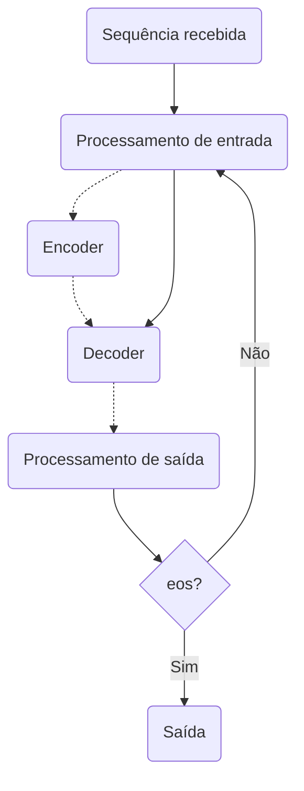
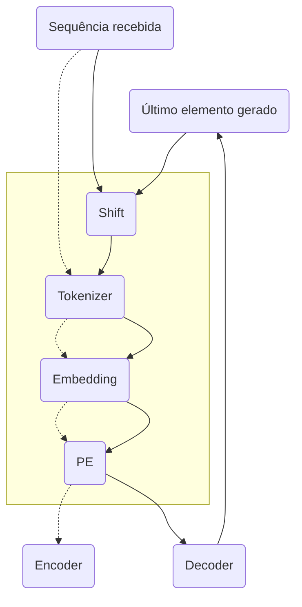
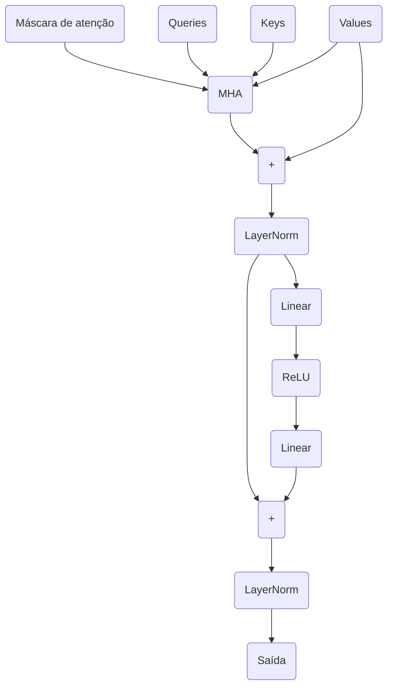
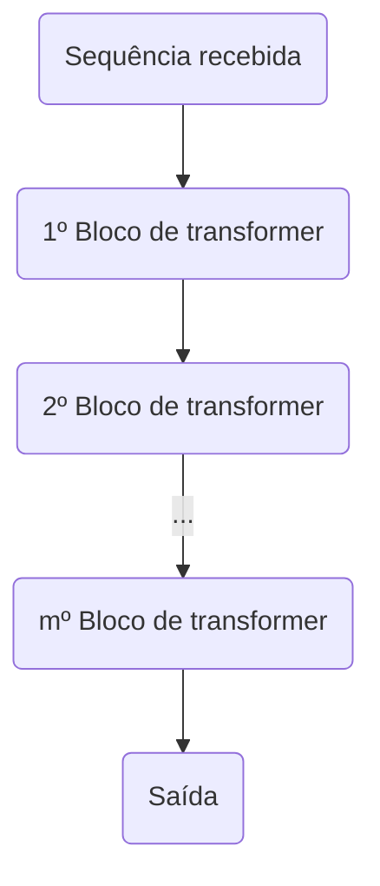
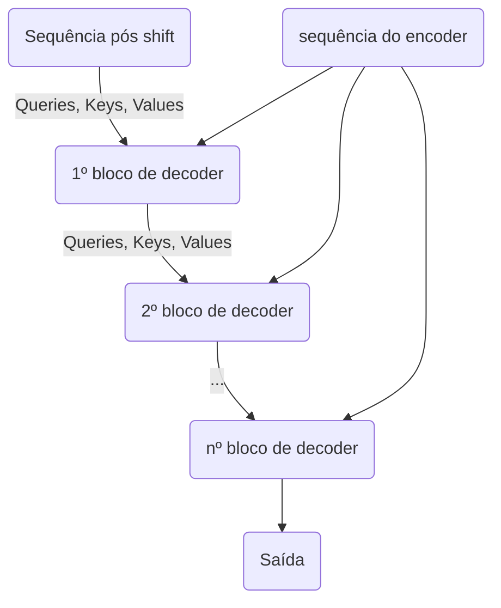
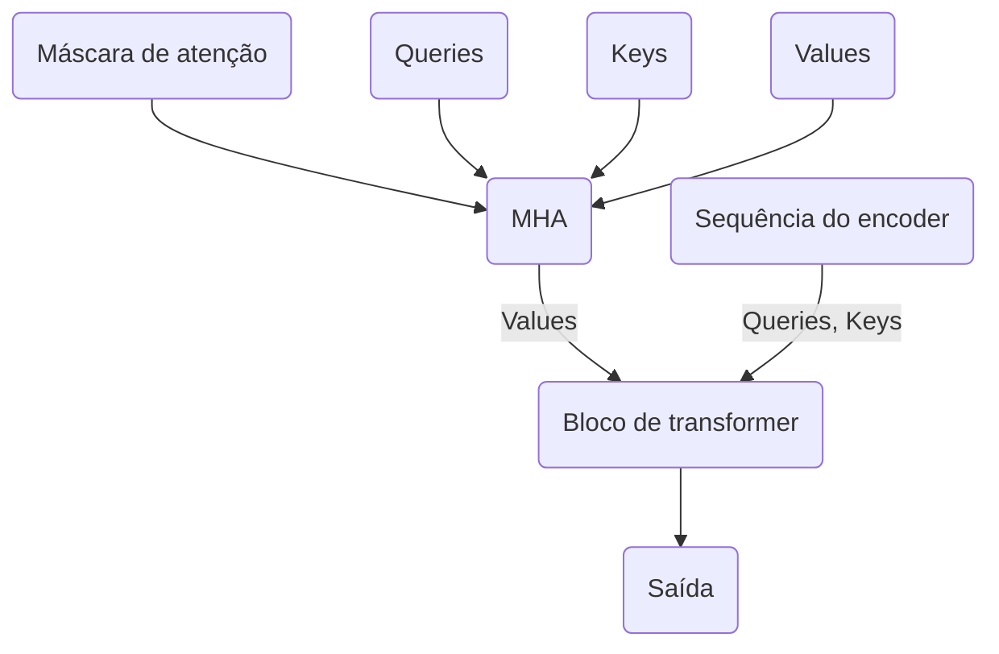
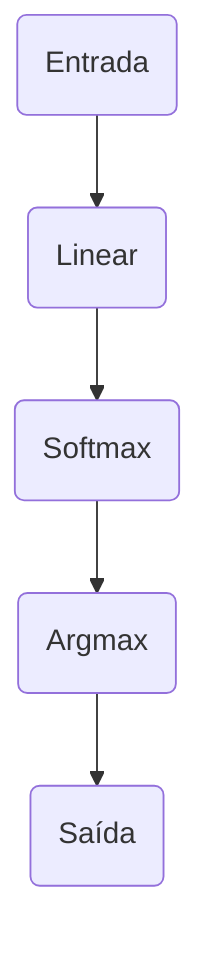

Em 2017, a Google Brain lançou o artigo "Attention is All you Need", que introduziu para o mundo o Transformer, uma arquitetura para redes neurais para transdução de sequências baseada em atenção que permitiu a criação de modelos que superaram todos os outros modelos anteriores em tradução entre idiomas.

Anos depois, essa arquitetura deu origem a muitas alternativas que atingiram o Estado da Arte múltiplas em outras aplicações, em especial na criação de modelos de linguagem, que popularizaram fortemente o uso de IA Generativa para muitas aplicações de processamento de linguagem natural. No momento de escrita desse post, são variações do Transformer como os Generative Pretrained Transformers (GPTs) que estão sendo usadas por trás de inteligências artificiais avançadas, como ChatGPT, Claude e Gemini, mostrando o potencial dessa arquitetura e o seu legado na história da inteligência artificial.

Para ajudar a entender o que os Transformers têm de especial, esse post vai explicar como funcionam os Transformers, através de uma implementação de exemplo construída do zero em Python usando PyTorch, e assumindo poucos pré-requisitos.

Embora já existam muitas implementações de Transformers disponíveis na internet, durante o momento de escrita desse post, não existiam muitos artigos explicando o tópico em Português de forma didática, o que motivou a escrita.

Infelizmente, se absolutamente nenhum pré-requisito for assumido, o conteúdo ficará extenso demais para ser feito de uma vez (embora talvez seja possível escrever outros posts com os pré-requisitos no futuro). Por isso, para entender tudo que será explicado, é importante entender os conteúdos a seguir:

* Como funcionam operações matriciais como produto interno, produto matricial, transposição de matrizes, etc.
* Como funcionam os componentes de redes neurais feed-forward
* Como programar em Python ao nível de criar classes e objetos e interagir com bibliotecas terceiras
* Como usar os componentes básicos do PyTorch, como tensores, dispositivos, módulos, autograd, otimizadores, etc.
* Porque realizar operações em lote usando operações matriciais podem ser muito mais rápido que realizá-las individualmente.

Além disso, a seção de recursos adicionais possui alguns conteúdos em Inglês que explicam esses mencionados.

## Objetivo

De forma geral, Transformers podem ser usados para modelar aplicações de transdução de sequências, que são aplicações onde é necessário gerar uma sequência de elementos a partir de outra. Isso faz com que muitas aplicações possam ser modeladas como uma transdução de sequências, como tradução automática, geração textual, sumarização de textos e síntese de moléculas.

De forma mais completa, uma função de transdução de sequências $M(s)$ relaciona uma sequência ordenada $s = <s_1,s_2,\cdots,s_{n}>$, composta de elementos do conjunto enumerável $S$ a outra sequência $t = <t_1,t_2,\cdots,t_{m}>$, composta de elementos do conjunto enumerável $T$.

Para facilitar a explicação sobre o funcionamento dos Transformers, além da notação formal, serão usados exemplos de uma aplicação específica. Dada a importância dos Transformers para o progresso de inteligências artificiais como os Large Language Models, os exemplos desse post serão baseados no contexto da criação de um modelo de linguagem.

De forma geral, a ideia de um modelo de linguagem é determinar as próximas letras de um texto a partir dos seus elementos anteriores, assim como nos corretores automáticos usados nos teclados digitais de smartphones, por exemplo.

Adaptando a notação anterior, um modelo de linguagem $M(s)$ relaciona um texto $s = <s_1,s_2,\cdots,s_{n}>$, composto de letras do alfabeto $S$ a outro texto $s' = <s'_1,s'_2,\cdots,s'_{m}>$, também composto de letras do alfabeto $S$. Note que $S$ e $T$ serem iguais é uma especificidade de aplicações como modelos de linguagem. Em tradução automática, por exemplo, os textos podem estar em idiomas diferentes (logo os alfabetos podem ser diferentes).

### Observação

Além de criar um modelo de linguagem de forma geral, um grande desafio na criação de redes neurais é minimizar o tempo de inferência desses modelos. Embora seja possível implementar um Transformer usando apenas estruturas como variáveis, listas e laços de repetição, esse tipo de implementação se torna lento demais para treinar e usar na prática pelo grande número de computações que precisam ser realizadas de forma ineficiente. Portanto, é necessário considerar técnicas de programação paralela desde o início da implementação do modelo.

Em geral, a forma mais prática de implementar paralelismo em redes neurais é aproveitar a capacidade dos dispositivos modernos de realizar operações matemáticas sobre vetores, matrizes e tensores em paralelo de forma muito eficiente. Portanto, mudando a representação dos dados durante a execução das operações, é possível gerar algoritmos eficientes de forma simples, embora isso exija que os algoritmos sejam definidos levando em consideração dados multidimensionais desde a sua concepção.

### Um pouco de história

Criar modelos eficientes para transdução de sequências foi um problema em aberto por muitos anos para a comunidade científica, onde o desafio era resolver problemas comuns ao treino de arquiteturas alternativas aos Transformers.

Técnicas baseadas em redes neurais recorrentes possuiam a melhor performance em aplicações como tradução textual, como foi o caso da arquitetura proposta pela Google para o Google Tradutor em 2014 no influente artigo "Sequence to Sequence Learning with Neural Networks"). Embora explicar esse tipo de arquitetura esteja fora do escopo desse post, existiam problemas comuns ao processo de treinamento de redes neurais recorrentes que encorajaram o desenvolvimento de alternativas:

1. A sua natureza recursiva pode causar problemas de gradient vanishing, efeito que ocorre quando os valores dos gradientes gerados via backpropagation são pequenos demais para que o modelo consiga convergir para o mínimo global até o final do treinamento, praticamente parando antes do valor da função de perda se tornar próximo do mínimo global.

2. A ordem sequencial das operações envolvidas nesse tipo de modelo pode tornar a inferência muito lentas, o que pode tornar o treinamento e uso posterior do modelo inviável.

3. A incapacidade do modelo de entender o significado de uma palavra em uma frase com base no seu contexto pode comprometer o texto gerado.

Esses problemas eram críticos para o uso desses modelos em muitas aplicações, o que incentivou a pesquisa sobre a criação de arquiteturas alternativos que convergissem mais rapidamente e em modelos com melhor performance. Em especial, a criação de modelos capazes de resignificar palavras com base no seu contexto para resolver parte desses problemas levou ao estudo de mecanismos de atenção, que têm justamente esse objetivo.

Assim como grande parte da pesquisa em redes neurais, muitas das decisões e convenções que serão usadas são baseadas no que levou aos melhores resultados nos experimentos conduzidos. Porém, no caso dos Transformers, também existem escolhas tomadas com o objetivo de garantir que os algoritmos são eficientes computacionalmente em treino e inferência e não sofram dos mesmos problemas de convergência que as alternativas.

Nesse sentido, o grande diferencial dos Transformers é o fato de serem baseados apenas em redes neurais feed-forward e mecanismos de atenção, o que leva a modelos capazes de resolver os problemas mencionados anteriormente em diversas aplicações e atingir a melhor performance até então em transdução de sequências no processo.

Essa conclusão explica o nome do artigo: do ponto de vista da arquitetura do modelo, redes neurais recorrentes não são necessárias para criar modelos eficientes, apenas mecanismos de atenção, ou seja, "Attention is All you Need".

## Representação dos dados

Para conseguirmos trabalhar com textos, é necessário definir uma representação numérica equivalente a um texto para que essa representação possa ser usada pelos Transformers. A abordagem que a maioria das técnicas usa para realizar esse processo é converter esses valores em tokens e embeddings.

### Tokens

Como textos são representados por um alfabeto finito e conhecido, é possível enumerar todos os caracteres desse alfabeto e criar uma função que os associa a uma representação numérica única. Essas representações numéricas são conhecidas como tokens, e a função como tokenizer.

Além de enumerar caracteres individuais, é possível enumerar sequências de caracteres, formando palavras ou n-gramas (sequências ordenadas de n caracteres), gerando tokenizers com ainda mais tokens. Essa é uma prática realizada muito frequentemente em modelos de linguagem, com o objetivo de melhorar a performance desses modelos de forma geral. usando algortimos como Byte Pair Encoding, WordPiece e SentencePiece, é possível criar tokenizers com centenas de milhares de tokens.

Porém, como o modelo de linguagem assume que o texto já passou pelo tokenizer previamente, a escolha do método de tokenização não afeta a arquitetura de nenhuma forma. Por isso, para simplificar a explicação, usaremos um tokenizer simples composto apenas pelos caracteres imprimíveis da tabela ASCII, disponível no objeto `printable` do módulo `string` em Python.

| Letra   | Token   |
|---------|---------|
| `a`     | `1`     |
| `b`     | `2`     |
| `c`     | `3`     |
| ...     | ...     |
| `z`     | `26`    |
| `␣`     | `27`    |
| `.`     | `28`    |
| `,`     | `29`    |

Uma sequência de tokens gerada a partir de um texto pode ser representanda usando um vetor com os valores de cada token em ordem. Concatenando esses vetores como linhas, é possível representar um batch de textos usando uma matriz, que será a dimensão esperada pelo modelo para maximizar a sua eficiência computacional.

$$
\begin{array}{cccc}
    \texttt{g} & \texttt{a} & \texttt{t} & \texttt{o}
\end{array} \\
\downarrow \\
\begin{bmatrix}
    7  &  1  & 20 & 15
\end{bmatrix}
$$

Além disso, o tokenizer adiciona dois tokens especiais à sequência. O primeiro token, `<bos>` (beginning of sentence), representa o início do texto, e o segundo token, `<eos>` (end of sentence), representa o final do texto.

Nos exemplos, `<bos>` e `<eos>` sempre serão representados numericamente por `1` e `2`, respectivamente, logo, as representações numéricas mencionadas anteriormente começam a partir de `3`.

| Letra       | Token   |
|-------------|---------|
| `<bos>`     | `1`     |
| `<eos>`     | `2`     |
| `a`         | `3`     |
| `b`         | `4`     |
| `c`         | `5`     |
| ...         | ...     |
| `z`         | `28`    |
| `␣`         | `29`    |
| `.`         | `30`    |
| `,`         | `31`    |

$$
\begin{array}{cccc}
    \texttt{g} & \texttt{a} & \texttt{t} & \texttt{o}
\end{array} \\
\downarrow \\
\begin{array}{cccccc}
    \texttt{<bos>} & \texttt{g} & \texttt{a} & \texttt{t} & \texttt{o}  & \texttt{<eos>}
\end{array} \\
\downarrow \\
\begin{bmatrix}
    1 & 9  &  3  & 22 & 17 & 2
\end{bmatrix}
$$

Os tokens `<bos>` e `<eos>` também podem ser usados para separar a sequência recebida da sequência gerada, o que será útil no treinamento dos Transformers futuramente. Por exemplo, se o modelo recebeu o texto "cachorro" e gerou o texto "dog", essas sequências pode ser descritas como sendo uma sequência só:

$$
\begin{array}{cccccc}
\texttt{<bos>} & \texttt{c} & \texttt{a} & \texttt{c} & \texttt{h} & \texttt{o} & \texttt{r} & \texttt{r} & \texttt{o} & \texttt{<eos>} & \texttt{<bos>} & \texttt{d} & \texttt{o} & \texttt{g} & \texttt{<eos>}
\end{array}
$$

```python
from string import printable

char_ids = {
    '<bos>': 1,
    '<eos>': 2,
}

char_ids.update({
    char: index + 2
    for index, char in enumerate(printable, 1)
})


def tokenize(chars: str, char_ids: dict[str,int]) -> list[int]:
    tokens = [1]
    tokens.extend(
        char_ids[char]
        for char in chars
    )
    return [*tokens, 2]
```

### Padding

Como introduzido anteriormente, uma forma de desenvolver modelos rápidos de forma simples é maximizar o número de operações realizadas em batch usando operações tensoriais.

Um texto após ser transformado em sequência de tokens pode ser representado como um vetor, e ao realizar essa transformação em todos os textos de um lote e concatená-los, é possível criar uma matriz, que representa um lote de textos e permite a aceleração de operações tensoriais nas próximas etapas. Porém, concatenar esses vetores para criar uma matriz assume que todos os elementos do lote possuem o mesmo comprimento, mas como os textos originais podem ter comprimentos diferentes, essa premissa não é sempre válida.

Uma forma de garantir que todos os vetores de um batch sempre terão o mesmo comprimento é realizar padding nos vetores, processo onde tokens especiais são adicionados repetidamente a cada sequência até que todas tenham $n$ elementos.

Esse token especial é denominado padding token, representado por `<pad>` e nos exemplos, sempre será representado numericamente por `0`. Também assuma que todos um batch sempre tem $b$ elementos.

| Letra   | Token   |
|---------|---------|
| `<pad>` | `0`     |
| `<bos>` | `1`     |
| `<eos>` | `2`     |
| `a`     | `4`     |
| `b`     | `5`     |
| `c`     | `6`     |
| ...     | ...     |
| `z`     | `28`    |
| `␣`     | `29`    |
| `.`     | `30`    |
| `,`     | `31`    |

Por fim, existem algumas formas de determinar $t$, o número de elementos que cada sequência terá após o padding:

1. Definir $t$ como sendo o comprimento da maior sequência do batch.
2. Definir $t$ como sendo um valor constante e arbitrário.

Por exemplo, um lote de textos transformado em tokens e usando padding seguindo a opção 1 seria feito da seguinte forma:

$$
\begin{array}{c}
    \text{gato} \\
    \text{elefante} \\
    \text{peixe} \\
    \text{pássaro} \\
    \text{cão}
\begin{array}{c}
$$

$$
\downarrow
$$

$$
\begin{array}{cccccccc}
    \texttt{<bos>} & \texttt{ g } & \texttt{ a } & \texttt{ t } & \texttt{ o } & \texttt{<eos>} & \texttt{<pad>} & \texttt{<pad>} & \texttt{<pad>} & \texttt{<pad>} \\
    \texttt{<bos>} & \texttt{e} & \texttt{l} & \texttt{e} & \texttt{f} & \texttt{a} & \texttt{n} & \texttt{t} & \texttt{e}  & \texttt{<eos>} \\
    \texttt{<bos>} & \texttt{p} & \texttt{e} & \texttt{i} & \texttt{x} & \texttt{e}  & \texttt{<eos>} & \texttt{<pad>} & \texttt{<pad>} & \texttt{<pad>} \\
    \texttt{<bos>} & \texttt{p} & \texttt{á} & \texttt{s} & \texttt{s} & \texttt{a} & \texttt{r} & \texttt{o}  & \texttt{<eos>} & \texttt{<pad>} \\
    \texttt{<bos>} & \texttt{c} & \texttt{ã} & \texttt{o} & \texttt{<eos>} & \texttt{<pad>} & \texttt{<pad>} & \texttt{<pad>} & \texttt{<pad>} & \texttt{<pad>}
\end{array}
$$

$$
\downarrow
$$

$$
\begin{bmatrix}
   1 &  7  &  1  & 20 & 15 &  2 &  0 &  0 &  0 &  0 \\
   1 &  5  & 12  &  5 &  6 &  1 & 14 & 20 &  5  &  2\\
   1 & 16  &  5  &  9 & 24 &  5  &  2 &  0 &  0 &  0 \\
   1 & 16  & 27  & 19 & 19 &  1 & 18 & 15  &  2 &  0 \\
   1 &  3  & 28  & 15  &  2 &  0 &  0 &  0 &  0 &  0
\end{bmatrix}
$$

De forma geral, o aumento de velocidade obtido pelo padding é grande o suficiente para justificar o uso adicional de memória, já que o tempo gasto é frequentemente um limitante maior que a memória gasta por tipo de rede neural durante o treinamento e inferência.

As duas alternativas podem impactar a velocidade das operações dependendo do tipo de hardware usado. Em CPUs e GPUs, a opção 1 pode ser mais vantajosa por economizar memória, já que nesse caso a opção 2 não gera nenhum aumento de velocidade. Já em TPUs, operações sobre batches de tamanhos fixos podem ser mais rápidas que as mesmas operações em batches de tamanhos diferentes, logo a opção 2 pode ser mais vantajosa.

```python
char_ids = {
    '<pad>': 0,
    '<bos>': 1,
    '<eos>': 2,
}

char_ids.update({
    char: index + 3
    for index, char in enumerate(printable)
})


def tokenize(chars: str, char_ids: dict[str, int]) -> list[int]:
    tokens = [1]
    tokens.extend(
        char_ids[char]
        for char in chars
    )
    return [*tokens, 2]

def tokenize_and_pad(inputs: list[str]) -> torch.Tensor:
    chars, *inputs = inputs

    tokens = tokenize(chars, char_ids)
    token_lists = [tokens]

    token_count = len(tokens)
    token_counts = [token_count]

    max_length = token_count

    for chars in inputs:
        tokens = tokenize(chars)
        token_lists.append(tokens)

        token_count = len(tokens)
        token_counts.append(token_count)

        max_length = max(max_length, token_count)

    for tokens, token_count in zip(token_lists, token_counts):
        tokens.extend(
            0
            for _ in range(max_length - token_count)
        )

    tokens_tensor = torch.tensor(token_lists)
    return tokens_tensor, token_counts
```

Por curiosidade, o módulo `torch.nested` permite representar matrizes a partir de uma lista de vetores de comprimentos variados. Porém, esse módulo ainda está em fase experimental, e usar esse recurso pode deixar as operações mais lentas que as outras alternativas.

### Truncação

Mesmo ao escolher a opção 1, também é comum definir um tamanho máximo que as sequências podem ter, e caso uma sequência tenha originalmente mais tokens que esse limite, ela será truncada, fazendo com seus últimos elementos sejam descartados.

Em ambos os casos, o valor de $t$ geralmente é escolhido com base na memória disponível ou determinando empiricamente o valor para o comprimento de uma sequência onde, em média, os modelos sendo treinados não conseguem considerar toda a sequência recebida durante a geração.

### Embeddings

A representação numérica dos tokens é uma forma simples de converter caracteres para valores numéricos. Porém, usá-la diretamente como espaço de representação dos elementos da sequência recebida durante o treinamento de modelos pode criar vieses indesejados durante o treinamento.

Esse viés ocorre porque usar a representação numérica literal fará com que o modelo trate elementos com o token $n$ como sendo valores menores que elementos com o token $n+1$, já que ambos são inteiros. Embora essa relação não seja verdadeira, é possível que o modelo encontre padrões que não existem nos conjunto de dados de treinamento, dificultando o processo. Ao transformar esses valores em vetores de dimensão $t$, se o espaço for adequado, essa relação de ordem não estará presente.

Embeddings são representações do espaço de uma variável (por exemplo, os inteiros para a representação numérica dos tokens) em outro espaço. Em aprendizado de máquina, esse espaço geralmente possui $d$ dimensões, onde $d$ é um hiperparâmetro diferente das dimensões do espaço original e tanto $d$ quanto o espaço são escolhidos com o objetivo de representar os valores originais de outra forma que auxilie o treinamento de modelos.

Independentemente da técnica usada para determinar os embeddings para cada elemento, o batch de sequências recebidas será transformado de uma matriz de dimensão $b \times t$ para cada um tensor de dimensão $b \times t \times d$.

$$
    \begin{bmatrix}
        1   & 14    & \dots  & 10 & 2 \\
        1   & 25    & \dots  & 0 & 2 \\
        \vdots & \vdots  & \ddots & \vdots & \vdots \\
        1   & 5    & \dots & 0 & 2
    \end{bmatrix}
$$

$$
    \downarrow
$$

$$
    \begin{bmatrix}
        \begin{bmatrix}
            0.23   & 1.45    & \dots  & 2.67 \\
            3.14   & 4.56    & \dots  & 5.78 \\
            \vdots & \vdots  & \ddots & \vdots \\
            1.76   & 0.65    & \dots  & 0.13 \\
            6.89 & 7.01 & \dots & 8.23 \\
        \end{bmatrix} \\
        \quad \\
        \begin{bmatrix}
            0.23   & 1.45    & \dots  & 2.67 \\
            9.34   & 0.12    & \dots  & 1.34 \\
            \vdots & \vdots  & \ddots & \vdots \\
            1.49   & 5.59    & \dots  & 0.33 \\
            6.89   & 7.01    & \dots  & 8.23 \\
        \end{bmatrix} \\
        \vdots \\
        \begin{bmatrix}
            0.23   & 1.45    & \dots  & 2.67 \\
            5.79 & 6.80 & \dots & 7.91 \\
            \vdots & \vdots  & \ddots & \vdots \\
            1.49   & 5.59    & \dots  & 0.33 \\
            6.89 & 7.01 & \dots & 8.23 \\
        \end{bmatrix}
    \end{bmatrix}
$$

Usando uma das formas mais simples de se transformar tokens em embeddings de forma eficiente, primeiro é necessário aplicar one-hot encoding sobre cada elemento, transformando-os vetores esparsos (que possui grande dimensionalidade mas muitos valores nulos).

Se $|T|$ é o tamanho do vocabulário, a representação do texto "baba" usando One-Hot Encoding será:

$$
    \begin{array}{cccccccccc}
        \texttt{<bos>} & \texttt{b} & \texttt{a} & \texttt{b} & \texttt{a} & \texttt{<eos>}
    \end{array}
$$

$$
    \downarrow
$$

$$
    \begin{bmatrix}
        1 & 4 & 3 & 4 & 3 & 2 \\
    \end{bmatrix}
$$

$$
    \downarrow
$$

$$
\begin{array}{c|cccccc}
    & 0 & 1 & 2 & 3 & 4 & \dots & |T| \\
    \hline
    1 & 0 & 1 & 0 & 0 & 0 & \dots & 0 \\
    4 & 0 & 0 & 0 & 0 & 1 & \dots & 0 \\
    3 & 0 & 0 & 0 & 1 & 0 & \dots & 0 \\
    4 & 0 & 0 & 0 & 0 & 1 & \dots & 0 \\
    3 & 0 & 0 & 0 & 1 & 0 & \dots & 0 \\
    2 & 0 & 0 & 1 & 0 & 0 & \dots & 0
\end{array}
$$

One-Hot Encoding é usado por permitir acessar elementos individuais de uma matriz a partir de um batch de índices, que no caso, será a sequência recebida. Isso ocorre porque ao multiplicar uma das linhas da sequência após One-Hot Encoding, de dimensões $1 \times |T|$, por uma matriz de dimensões $|T| \times d$, o resultado será a $m$-ésima linha dessa matriz. Essa matriz é denominada matriz de consulta, já que esse comportamento é similar a acessar uma tabela de consulta, ou acessar os elementos de uma lista ou array através de índices.

Logo, ao multiplicar a sequência inteira após One-Hot Encoding, de dimensões $t \times d$, pela matriz de consulta, o resultado será as suas linhas concatenadas de acordo com a ordem dos tokens da sequência recebida.

No exemplo, vamos considerar que o embedding de cada token possui sempre o mesmo valor após essa transformação. Nesse caso, é possível concatenar todos os $|T|$ embeddings possíveis em ordem para criar uma matriz de consulta, e a combinação dessas operações pode representar o processo de transformação da sequência em embeddings.

$$
    \underbrace{
        \begin{array}{c|cccccc}
            & 0 & 1 & 2 & 3 & 4 & \dots & |T| \\
            \hline
            1 & 0 & 1 & 0 & 0 & 0 & \dots & 0 \\
            4 & 0 & 0 & 0 & 0 & 1 & \dots & 0 \\
            3 & 0 & 0 & 0 & 1 & 0 & \dots & 0 \\
            4 & 0 & 0 & 0 & 0 & 1 & \dots & 0 \\
            3 & 0 & 0 & 0 & 1 & 0 & \dots & 0 \\
            2 & 0 & 0 & 1 & 0 & 0 & \dots & 0
        \end{array}
    }_{\text{One-Hot Encoding}}
$$

$$
    \times
$$

$$
    \underbrace{
        \begin{array}{c|cccc}
            & 1 & 2 & \dots & d \\
            \hline
            0      & 0.1    & 0.2    & \dots  & 0.6 \\
            1      & 0.7    & 0.8    & \dots  & 0.3 \\
            2      & 0.4    & 0.5    & \dots  & 0.9 \\
            3      & 0.9    & 0.1    & \dots  & 0.5 \\
            4      & 0.3    & 0.9    & \dots  & 0.1 \\
            \vdots & \vdots & \vdots & \ddots & \vdots \\
            |T|    & 0.2    & 0.4    & \dots  & 0.1
        \end{array}
    }_{\text{Matriz de consulta}}
$$

$$
    \downarrow
$$

$$
    \underbrace{
        \begin{array}{c|cccc}
            & 1 & 2 & \dots & d \\
            \hline
            1  & 0.7 & 0.8 & \dots & 0.3 \\
            4  & 0.3 & 0.9 & \dots & 0.1 \\
            3  & 0.9 & 0.1 & \dots & 0.5 \\
            4  & 0.3 & 0.9 & \dots & 0.1 \\
            3  & 0.9 & 0.1 & \dots & 0.5 \\
            2  & 0.4 & 0.5 & \dots & 0.9 \\
        \end{array}
    }_{\text{Embeddings}}
$$

Além de ser acelerável usando álgebra linear, essa forma de acesso aos embeddings permite que os valores dos embeddings possam ser otimizados durante o treinamento do modelo para melhorar a sua performance. Para isso, basta tratar a matriz de consulta como se fossem os pesos de uma camada linear em uma rede neural feed-forward, e otimizar o seu valor a partir da função de perda do modelo através de backpropagation. Assim, é possível encontrar um espaço ótimo para representar os tokens para o conjunto de dados de treinamento, sendo necessário definir apenas o valor de $d$.

Além da performance, os vetores encontrados nesse espaço são densos, já que $d$, que costuma ser um valor na casa dos milhares, geralmente é muito menor do que $|T|$, que pode chegar às centenas de milhares de tokens no contexto de Large Language Models. Isso faz com que o modelo requira muito menos memória durante o seu uso e evita problemas causados pela dimensionalidade elevada presente ao treinar modelos usando One-Hot Encoding diretamente.

Em PyTorch, esse componente está encapsulado na classe `torch.nn.Embedding`.

```python
embed_dim = 512

embedder = nn.Embedding(
    num_embeddings=len(printable) + 1,
    embedding_dim=embed_dim,
)

embedder(42)
```

### Token embeddings em PyTorch

```python
class TokenEmbedder(nn.Module):
    def __init__(self: Self, vocab: str, embed_dim: int) -> None:
        super().__init__()
        self.vocab = set(vocab)
        self.embed_dim = embed_dim

        self.char_ids = {
            '<pad>': 0,
            '<bos>': 1,
            '<eos>': 2,
        }

        self.char_ids.update({
            char: index + 3
            for index, char in enumerate(self.vocab)
        })

        self.embedding = nn.Embedding(
            num_embeddings=len(self.vocab) + 3,
            embedding_dim=self.embed_dim,
        )

    def tokenize(self: Self, chars: str) -> list[int]:
        tokens = [1]
        tokens.extend(self.char_ids[char] for char in chars)
        return [*tokens, 2]

    def forward(self: Self, inputs: list[str]) -> torch.Tensor:
        chars, *inputs = inputs

        tokens = self.tokenize(chars)
        token_lists = [tokens]

        token_count = len(tokens)
        token_counts = [token_count]

        max_length = token_count

        for chars in inputs:
            tokens = self.tokenize(chars)
            token_lists.append(tokens)

            token_count = len(tokens)
            token_counts.append(token_count)

            max_length = max(max_length, token_count)

        for tokens, token_count in zip(token_lists, token_counts):
            tokens.extend(0 for _ in range(max_length - token_count))

    tokens_tensor = torch.tensor(token_lists)
    embeddings = self.embedding(tokens_tensor)
    return embeddings, token_counts
```

## Atenção

No contexto de redes neurais para transdução de sequências, o uso de atenção, de forma geral, se refere à capacidade do modelo de entender o contexto de cada elemento da sequência ao gerar um novo valor para cada elemento recebido.

Nesse processo, os scores de atenção são gerados, uma sequência intermediária representando a intensidade com que cada elemento recebido deve ser utilizado para gerar os novos elementos individualmente. Ao combinar os scores de atenção com os elementos originais, a sequência gerada é obtida.

O uso de mecanismos de atenção dessa forma permite que modelos compreendam o contexto onde cada palavra está inserida usando menos operações, o que acelera treinamentos e pode otimizar os modelos (por evitar que não entendam textos ambíguos sem considerar o contexto).

Por exemplo, considere o texto a seguir:

> João pensou: O trem estava cheio, mas ele conseguiu uma cadeira livre.

Por simplicidade, ignore os tokens especiais e suponha que cada palavra é representada por um embedding (pelo processo abstraído por $\text{Emb}(X)$), transformando o texto na sequência a seguir:

$$
    \begin{array}{ccccccccc}
        \text{João } & \text{pensou: } & \text{O }  & \text{trem } & \text{estava } & \text{cheio, } & \text{mas } & \text{ele } & \cdots \\
        \quad         \\
        \downarrow   & \downarrow      & \downarrow & \downarrow   & \downarrow     & \downarrow     & \downarrow  & \downarrow   \\
        \quad         \\
        64           & 23              & 28         & 91           & 12             & 44             & 57          & 72           \\
        \quad         \\
        \downarrow   & \downarrow      & \downarrow & \downarrow   & \downarrow     & \downarrow     & \downarrow  & \downarrow   \\
        \quad         \\
        0.02         & 0.68            & 0.46       & 1.49         & 0.6            & 1.36           & 0.7         & 0.38         \\
        0.12         & 1.05            & 1.7        & 1.59         & 0.88           & 0.3            & 1.85        & 0.94         \\
        0.13         & 1.57            & 0.75       & 0.69         & 0.7            & 1.75           & 0.7         & 0.63         \\
        \cdots       & \cdots          & \cdots     & \cdots       & \cdots         & \cdots         & \cdots      & \cdots      &        \\
        0.8          & 0.34            & 0.84       & 0.34         & 0.67           & 0.53           & 0.49        & 0.5
    \end{array}
$$

Então, um mecanismo de atenção recebe essa sequência e gera outra de mesmo comprimento, onde o embedding que representa a palavra "ele" será composto de embeddings mais próximos do trecho que compõe a palavra "João" do que da palavra "ônibus":

$$
    \underbrace{
        \begin{array}{ccccccccc}
            \text{João pensou: o trem estava cheio, mas ele...}
        \end{array}
    }_{X}
$$

$$
    \downarrow
$$

$$
    \underbrace{
        \begin{bmatrix}
            0.02   & 0.68   & 0.46   & 1.49   & 0.6    & 1.36   & 0.7    & 0.38   & \cdots & 1.23   \\
            0.12   & 1.05   & 1.7    & 1.59   & 0.88   & 0.3    & 1.85   & 0.94   & \cdots & 0.11   \\
            0.13   & 1.57   & 0.75   & 0.69   & 0.7    & 1.75   & 0.7    & 0.63   & \cdots & 1.04   \\
            \vdots & \vdots & \vdots & \vdots & \vdots & \vdots & \vdots & \vdots & \ddots & \vdots \\
            0.8    & 0.34   & 0.84   & 0.34   & 0.67   & 0.53   & 0.49   & 0.5    & \cdots & 0.09
        \end{bmatrix}
    }_{\text{Emb}(X)}
$$

$$
    \downarrow
$$

$$
\underbrace{
    \begin{bmatrix}
        0.02   & 0.68   & 0.46   & 1.49   & 0.6    & 1.36   & 0.7    & 0.05   & \cdots 1.23   \\
        0.12   & 1.05   & 1.7    & 1.59   & 0.88   & 0.3    & 1.85   & 0.08   & \cdots 0.11   \\
        0.13   & 1.57   & 0.75   & 0.69   & 0.7    & 1.75   & 0.7    & 0.16   & \cdots 1.04   \\
        \vdots & \vdots & \vdots & \vdots & \vdots & \vdots & \vdots & \vdots & \ddots \vdots \\
        0.8    & 0.34   & 0.84   & 0.34   & 0.67   & 0.53   & 0.49   & 0.11   & \cdots 0.09
    \end{bmatrix}
}_{\text{Atn}(X)}
$$

$$
    \text{Atn} \circ \text{Emb } (\text{ele}) \approx \text{Atn} \circ \text{Emb } (\text{João})
$$

### Self-Attention

Todos os mecanismos que serão usados na arquitetura dos Transformers são baseados apenas em combinar os elementos da sequência recebida entre si para determinar a atenção para cada elemento.

Porém, nem todos os mecanismos funcionam dessa forma. Outros dependem de recursos externos para determinar a atenção, como outras variáveis ou modelos. Por isso, é dito que os mecanismos explicados usam Self-Attention, o que significa que assumem que a atenção para cada elemento pode ser determinada corretamente sem a necessidade de usar outros recursos externos.

### Queries, Keys, Values

Para explicar conceitualmente o funcionamento desses mecanismos, embora os termos dessas operações sejam numericamente iguais no primeiro momento, alguns termos receberão nomes abstratos diferentes.

De forma reducionista, um mecanismo de atenção funciona de como um dicionário em Python, onde chaves (keys ou $K$) são associadas a valores (values ou $V$) e é possível recuperar um valor posteriormente a partir da sua chave, denominada consulta (query ou $Q$). A analogia é que no contexto do mecanismo, quem exerce esses papéis são:

* Query: Um elemento da sequência recebida, como a palavra "ele".
* Keys: Serão todos os elementos originais da sequência recebida
* Value: Será algum elemento da sequência recebida.
  * Caso seja necessário entender algum contexto, será um elemento que melhor representa a query, como a palavra "João" no caso da palavra "ele".
  * Caso contrário, será a própria query.

O exemplo a seguir ilustra essa analogia:

```python
sequence = keys = values = [
    'João',
    'pensou',
    'O',
    'trem',
    'estava',
    'cheio',
    'mas',
    'ele',
    ...
]

mechanism = AttentionMechanism(keys, values)
query = 'ele'

assert mechanism[query] == 'João'
```

Uma das grandes diferenças entre as duas estruturas é que retornar apenas um elemento para cada query pode não ser o suficiente para representar o contexto corretamente em situações mais ambíguas. Por exemplo:

> Vi João e Maria ontem. Eles estavam juntos.

Nesse caso, a palavra "Eles" não pode ser compreendida corretamente usando apenas um value. Por isso, um mecanismo de atenção não retornará apenas um valor, e sim uma fração do quanto cada um dos values possíveis deve ser considerado:

```python
sequence = keys = values = [
    'João',
    'pensou',
    'O',
    'trem',
    'estava',
    'cheio',
    'mas',
    'ele',
    ...
]

mechanism = AttentionMechanism(keys, values)
query = 'ele'

assert mechanism[query] == {
    'João': 0.9,
    'pensou': 0.01,
    'O': 0.01,
    'trem': 0.01,
    'estava': 0.01,
    'cheio': 0.01,
    'mas': 0.01,
    'ele': 0.01,
    ...
}
```

Essas frações serão os scores de atenção e são uma sequência normalizada, ou seja, a soma de todos os elementos é 1. Como os scores são normalizados e nos Transformers as sequências recebidas serão representadas por embeddings, é possível aplicar uma média ponderada usando os scores para gerar um novo elemento, que será a sequência gerada pelo mecanismo de atenção.

Os scores precisam ser normalizados para que a atenção que pode ser distribuída seja finita e o mecanismo funcione corretamente. Então, Se o score de um elemento for relativamente maior, o score de pelo menos um dos outros elementos será relativamnnte menor de forma proporcional para manter essa propriedade.

$$
    \text{Atn}(\text{Ele}) = 0.9 \cdot \text{Emb} (\text{João}) + 0.01 \cdot \text{Emb} (\text{pensou: }) + \cdots
$$

$$
    \underbrace{
        \begin{array}{c|cccc}
            & 1 & 2 & \dots & d \\
            \hline
            1  & 0.7 & 0.8 & \dots & 0.3 \\
            2  & 0.3 & 0.2 & \dots & 0.2 \\
            \vdots & \vdots & \vdots & \ddots & \vdots \\
            t  & 0.2 & 0.4 & \dots & 0.1
        \end{array}
    }_{V}
$$

$$
    \times
$$

$$
\underbrace{
    \begin{array}{c|cccc}
        & 1 & 2 & \dots & t \\
        \hline
        1  & 0.5 & 0.5 & \dots & 0.0 \\
        2  & 0.2 & 0.3 & \dots & 0.4 \\
        \vdots & \vdots & \vdots & \ddots & \vdots \\
        t  & 0.1 & 0.2 & \dots & 0.5
    \end{array}
}_{\text{Scores de atenção}}
$$

$$
    \downarrow
$$

$$
    \underbrace{
        \begin{array}{c|cccc}
            & 1 & 2 & \dots & d \\
            \hline
            1  & 0.4 & 0.3 & \dots & 0.8 \\
            2  & 0.9 & 0.1 & \dots & 0.1 \\
            \vdots & \vdots & \vdots & \ddots & \vdots \\
            t  & 0.2 & 0.5 & \dots & 0.3
        \end{array}
    }_{\text{Atn}(X)}
$$

Como nos Transformers será necessário transformar cada elemento da sequência recebida, o mecanismo também poderá ser acelerado ao ser realizado em batch, fazendo com que as queries também sejam iguais à sequência recebida.

$$
    \underbrace{
        \begin{array}{c|cccc}
            & 1 & 2 & \dots & d \\
            \hline
            1  & 0.7 & 0.8 & \dots & 0.3 \\
            2  & 0.3 & 0.2 & \dots & 0.2 \\
            \vdots & \vdots & \vdots & \ddots & \vdots \\
            t  & 0.2 & 0.4 & \dots & 0.1
        \end{array}
    }_{\text{Q}}
    \qquad
    \underbrace{
        \begin{array}{c|cccc}
            & 1 & 2 & \dots & d \\
            \hline
            1  & 0.7 & 0.8 & \dots & 0.3 \\
            2  & 0.3 & 0.2 & \dots & 0.2 \\
            \vdots & \vdots & \vdots & \ddots & \vdots \\
            t  & 0.2 & 0.4 & \dots & 0.1
        \end{array}
    }_{\text{K}}
$$

$$
    \downarrow
$$

$$
    \underbrace{
    \begin{array}{c|cccc}
        & 1 & 2 & \dots & t \\
        \hline
        1  & 0.5 & 0.5 & \dots & 0.0 \\
        2  & 0.2 & 0.3 & \dots & 0.4 \\
        \vdots & \vdots & \vdots & \ddots & \vdots \\
        t  & 0.1 & 0.2 & \dots & 0.5
    \end{array}
    }_{\text{Scores de atenção}}
$$

Por isso, embora queries, keys e values partam da mesma sequência inicialmente, é importante separar o seu papel em cada parte do mecanismo.

### Mecanismos de atenção

#### Dot-Product Attention (DPA)

Nesse mecanismo, os scores de atenção para cada elemento são determinados a partir do produto interno entre queries e keys.

$$
  \text{Scores-DPA}(Q,K) = Q^TK
$$

Calculando a nova sequência em batch, o DPA poderá ser definido como:

$$
  \text{DPA}(Q,K,V) = \text{Scores-DPA}(Q,K) \cdot V = Q^TKV
$$

Porém, o produto interno de dois vetores não está contido entre 0 e 1, e sim entre $-\infty$ e $\infty$. Dessa forma, o mecanismo poderá atribuir atenção infinitamente entre todos os elementos, o que pode enviesar o modelo e inviabilizar o uso do mecanismo. Para corrigir isso e normalizar a atenção, é aplicada a função softmax sobre os scores:

$$
  \text{DPA}(Q,K,V) = \text{Softmax}(Q^TK)V
$$

#### Scaled Dot-Product Attention (SDPA)

Essa variação do DPA adiciona um termo de normalização sobre os scores para estabilizar os gradientes gerados pelo mecanismo durante a etapa de backpropagation:

$$
  \text{SDPA}(Q,K,V) = \text{Softmax}\left(\frac{Q^TK}{\sqrt{d}}\right)V
$$

A origem da normalização por $\sqrt{d}$ é empírica. Antes dos Transformers, já se observava experimentalmente que normalizar a variância do gradiente gerado por camadas ocultas evita problemas de gradient vanishing e neurônios mortos durante o treinamento de modelos, característica que foi adaptada para a arquitetura posteriormente.

#### Projeções lineares

Uma das formas com que os Transformers tornam o SDPA mais eficiente é projetar linearmente as queries, keys e values para espaços diferentes, multiplicando-as por matrizes de parâmetros treináveis (denotadas como $W^Q$, $W^K$ e $W^V$). Isso faz com que os valores das queries, keys e values se tornem diferentes entre si, e durante o treino, esses parâmetros sejam otimizados para otimizar a forma como o transformer converte os embeddings originais em outro espaço com as mesmas dimensões, mas que representam melhor o valor de cada token no contexto onde estão inseridos.

$$
  \text{SDPA-Transformer}(Q,K,V) =  SDPA(QW^Q, KW^K,VW^V)
$$

#### Multihead Attention (MHA)

Essa variação do SDPA consiste em aplicar o mecanismo $h$ vezes sobre os embeddings para combinar os resultados dessas aplicações, onde o número de cabeças $h$ é um hiperparâmetro do modelo.

Como os scores no SDPA são normalizados, não é possível prestar atenção em todos os elementos simultaneamente. O objetivo do uso de MHA é fazer com que cada SDPA foque em um tipo de padrão diferente no representar do contexto para criar um modelo melhor durante o treinamento.

Usando uma analogia, MHA seria o equivalente a ler um texto $h$ vezes, permitindo prestar atenção em partes diferentes do texto a cada vez para entender melhor o contexto de cada palavra. A diferença é que cada leitura é feita simultaneamente no mecanismo.

Embora esse mecanismo seja eficaz em otimizar modelos, se for implementado da forma literal, é necessário calcular SDPA $h$ vezes, tornando o MHA $h$ vezes mais lento, algo que não é desejado, já que um dos dos objetivos dos Transformers é criar modelos eficientes computacionalmente. Por isso, é usado o algoritmo alternativo a seguir para fazer com que a escalabilidade do mecanismo não seja afetada pelo número de cabeças:

1. Dividir as queries, keys e values em $h$ trechos contíguos, transformando as dimensões do batch de $b \times t \times d$ para $b \times t \times h \times \frac{h}{d}$.
2. Reordenar a ordem dos elementos das queries, keys e values, transformando as dimensões do batch de $b \times t \times h \times \frac{h}{d}$ para $b \times h \times t \times \frac{h}{d}$.
3. Aplicar SDPA no batch $h$ vezes, usando projeção diferentes para cada cabeça.
4. Concatenar os embeddings de cada cabeça.
5. Restaurar a ordem dos elementos no batch gerado, restaurando as dimensões para $b \times t \times d$.
6. Aplicar uma projeção linear $W^O$ nos embeddings concatenados.

Após a etapa 3, o algoritmo pode ser descrito pela equação a seguir:

$$
  \text{MHA}(Q,K,V) = \left(\Big \Vert^h_{i=1} \text{SDPA}(QW^Q_i, KW^K_i,VW^V_i) \right) W^O
$$

Dessa forma, SDPA ainda é aplicado $h$ vezes, mas como os elementos possuem dimensões menores, cada uma é $\frac{1}{h}$ vezes mais rápida, o que torna a escalabilidade do SDPA e MHA igual.

De forma prática, aplicar MHA ainda será mais lento que aplicar SDPA devido à projeção linear $W^O$. Porém, o tempo adicionado não aumenta em relação a nenhuma variável.

##### MHA em PyTorch

```python
class MultiheadAttention(nn.Module):
    def __init__(self: Self, embed_dim: int, n_heads: int) -> None:
        super().__init__()

        self.embed_dim = embed_dim
        self.n_heads = n_heads
        self.head_dim = self.embed_dim // self.n_heads

        self.query_projection = nn.Linear(embed_dim, embed_dim, bias=False)
        self.key_projection = nn.Linear(embed_dim, embed_dim, bias=False)
        self.value_projection = nn.Linear(embed_dim, embed_dim, bias=False)
        self.output_projection = nn.Linear(embed_dim, embed_dim, bias=False)

    def split_embeddings(
        self: Self,
        inputs: torch.Tensor,
        batches: int,
        tokens: int,
    ) -> torch.Tensor:
        split_inputs = inputs.view(batches, tokens, self.n_heads, self.head_dim)
        head_sorted_inputs = split_inputs.transpose(1, 2)
        return head_sorted_inputs

    def join_embeddings(
        self: Self,
        inputs: torch.Tensor,
        batches: int,
        tokens: int,
    ) -> torch.Tensor:
        token_sorted_inputs = inputs.transpose(1, 2)
        token_sorted_inputs = token_sorted_inputs.contiguous()
        joined_inputs = token_sorted_inputs.view(batches, tokens, self.embed_dim)
        return joined_inputs

    def forward(
        self: Self,
        queries: torch.Tensor,
        keys: torch.Tensor,
        values: torch.Tensor,
        mask: torch.Tensor | None = None,
    ) -> torch.Tensor:
        batches, tokens, _ = queries.size()

        queries = self.query_projection(queries)
        keys = self.key_projection(keys)
        values = self.value_projection(values)

        queries = self.split_embeddings(queries, batches, tokens)
        keys = self.split_embeddings(keys, batches, tokens)
        values = self.split_embeddings(values, batches, tokens)

        keys = keys.transpose(2, 3)

        scores = queries @ keys / (self.head_dim**0.5)

        if mask is not None:
            scores = scores.masked_fill(mask, float("-inf"))
            print(scores)

        weights = F.softmax(scores, dim=3)

        attn_outputs = weights @ values
        joined_outputs = self.join_embeddings(attn_outputs, batches, tokens)
        projected_outputs = self.output_projection(joined_outputs)

        return projected_outputs
```

## Positional Encoding (PE)

Nenhum dos mecanismos de atenção explicados considera a posição dos elementos na sequência recebida na sequência gerada. Isso significa que alterar a ordem dos elementos não afeta o resultado, um efeito indesejado e que pode enviesar modelos durante o treinamento.

Antes da aplicação de qualquer mecanismo de atenção, as posições dos elementos originais são representadas usando uma técnica de PE, que gera uma sequência de embeddings onde cada elemento representa uma posição na sequência original de alguma forma.

Esses embeddings serão combinados com a sequência recebida para alterar a sequência recebida de forma que cada elemento tenha sua posição codificada individualmente.

A técnica de PE introduzida na arquitetura dos Transformers é baseada na função a seguir:

$$
    \text{PE}(i, j, p) =
    \begin{cases}
        \sin \dfrac{p}{\theta^{\frac{2i}{d}}} & \text{se }j \text{ é par}, \\
        \cos \dfrac{p}{\theta^{\frac{2i}{d}}} & \text{se }j \text{ é ímpar}.
    \end{cases}
$$

Onde:

* $p$ é a posição de um elemento na sequência recebida.
* $j$ é a posição de um item em um elemento da sequência recebida.
* $0 \leq i < \frac{d}{2}$, e $i$ é incrementado a cada dois itens consecutivos em um elemento da sequência recebida.
* $\theta$ é um hiperparâmetro.

Os embeddings gerados por $PE$ serão então somados à sequência recebida, e essa sequência poderá ser usada pelos mecanismos de atenção.

Nos Transformers, a escolha dessa função foi feita por ser o equivalente a aplicar uma matriz de rotação nos elementos da sequência, onde o ângulo de rotação de um elemento é determinado pela sua posição.

A técnica de PE utilizada é relativa, ou seja, prioriza representar a posição de um elemento em relação aos seus vizinhos em relação a representar a ordem dos elementos de forma absoluta.

Para ilustrar o cálculo de $PE$ em batch, a sequência de embedings que será somada com uma sequência recebida onde $t = 5$, $d = 4$ e $\theta = 10000$ será:

$$
    i =
    \begin{bmatrix}
        0 & 0 & 1 & 1 \\
        0 & 0 & 1 & 1 \\
        0 & 0 & 1 & 1 \\
        0 & 0 & 1 & 1 \\
        0 & 0 & 1 & 1
    \end{bmatrix}
$$

$$
    j =
    \begin{bmatrix}
        0 & 1 & 2 & 3 \\
        0 & 1 & 2 & 3 \\
        0 & 1 & 2 & 3 \\
        0 & 1 & 2 & 3 \\
        0 & 1 & 2 & 3
    \end{bmatrix}
$$

$$
    p =
    \begin{bmatrix}
        0 & 0 & 0 & 0 \\
        1 & 1 & 1 & 1 \\
        2 & 2 & 2 & 2 \\
        3 & 3 & 3 & 3 \\
        4 & 4 & 4 & 4
    \end{bmatrix}
$$

$$
    PE(i,j,p) =
    \begin{bmatrix}
        0.0000 & 1.0000 & 0.0000 & 1.0000 \\
        0.8415 & 0.5403 & 0.0100 & 0.9999 \\
        0.9093 & -0.4161 & 0.0200 & 0.9998 \\
        0.1411 & -0.9899 & 0.0300 & 0.9996 \\
        -0.7568 & -0.6536 & 0.0400 & 0.9992 \\
    \end{bmatrix}
$$

### PE em PyTorch

```python
class PositionalEncoder(nn.Module):
    def __init__(self: Self, embed_dim: int, theta: int) -> None:
        super().__init__()
        self.embed_dim = embed_dim
        self.theta = theta

    @torch.no_grad()
    def forward(self, inputs: torch.Tensor) -> torch.Tensor:
        batches, tokens, _ = inputs.size()

        indexes = torch.arange(self.embed_dim, dtype=torch.float)

        positions = torch.arange(tokens, dtype=torch.float)
        positions = positions.view(tokens, 1)

        i = torch.arange(self.embed_dim // 2)
        i = i.float()
        i = i.repeat_interleave(2)

        cos_indexes = indexes % 2
        cos_indexes = cos_indexes.bool()
        cos_indexes = cos_indexes.expand((tokens, self.embed_dim))

        sin_indexes = ~cos_indexes

        encodings = positions / (self.theta ** (2 * i / self.embed_dim))

        encodings[sin_indexes] = encodings[sin_indexes].sin()
        encodings[cos_indexes] = encodings[cos_indexes].cos()

        encodings = encodings.expand((batches, tokens, self.embed_dim))

        return inputs + encodings
```

## Modelos autoregressivos

Transformers são modelos que realizam transdução de sequências de forma autoregressiva, característica que dita como todos os componentes serão combinados.

Quando um modelo de transdução de sequências recebe uma sequência, se esse modelo for autoregressivos, então ele será treinado para alterar essa sequência realizando um processo denominado shift, onde:

* O primeiro elemento será descartado.
* Todos os elementos serão deslocados uma posição para trás.
* Um novo elemento, gerado pelo modelo, preencherá a última posição.

O último elemento gerado pelo modelo será o primeiro elemento da sequência gerada. Então, essa sequência pós shift será a nova sequência recebida, e o resultado será um novo elemento para a sequência gerada, e assim por diante, até atingir um critério de parada.

Entre os critérios de parada, é possível:

1. Definir um número máximo de iterações
2. Encerrar o algoritmo quando o último elemento gerado for igual a um valor especial (como o token `<eos>`).

O exemplo a seguir ilustra como a tradução autoregressiva "cachorro" em Português para a palavra "dog" em Inglês. Para isso, os tokens especiais separam o texto recebido do texto gerado, que será representado como `<bos>cachorro<eos><bos>dog<eos>`.

$$
\underbrace{
 \begin{array}{c|cccccccccc}
    & 0              & 1              & 2              & 3              & 4              & 5              & 6              & 7              & 8              & 9              \\\hline
  1 & \texttt{<bos>} & \texttt{  c  } & \texttt{  a  } & \texttt{  c  } & \texttt{  h  } & \texttt{  o  } & \texttt{  r  } & \texttt{  r  } & \texttt{  o  } & \texttt{<eos>} \\
  2 & \texttt{  c  } & \texttt{  a  } & \texttt{  c  } & \texttt{  h  } & \texttt{  o  } & \texttt{  r  } & \texttt{  r  } & \texttt{  o  } & \texttt{<eos>} & \texttt{<bos>} \\
  3 & \texttt{  a  } & \texttt{  c  } & \texttt{  h  } & \texttt{  o  } & \texttt{  r  } & \texttt{  r  } & \texttt{  o  } & \texttt{<eos>} & \texttt{<bos>} & \texttt{  d  } \\
  4 & \texttt{  c  } & \texttt{  h  } & \texttt{  o  } & \texttt{  r  } & \texttt{  r  } & \texttt{  o  } & \texttt{<eos>} & \texttt{<bos>} & \texttt{  d  } & \texttt{  o  } \\
  5 & \texttt{  h  } & \texttt{  o  } & \texttt{  r  } & \texttt{  r  } & \texttt{  o  } & \texttt{<eos>} & \texttt{<bos>} & \texttt{  d  } & \texttt{  o  } & \texttt{  g  } \\
 \end{array}
 }_{\text{Sequência original}}
$$

$$
\downarrow
$$

$$
\underbrace{
    \begin{array}{c|cccccccccc}
        & 0            & 1            & 2            & 3            & 4              & 5              & 6              & 7              & 8              & 9              \\
        \hline
        1 & \texttt{ c } & \texttt{ a } & \texttt{ c } & \texttt{ h } & \texttt{ o }   & \texttt{ r }   & \texttt{ r }   & \texttt{ o }   & \texttt{<eos>} & \texttt{<bos>} \\
        2 & \texttt{ a } & \texttt{ c } & \texttt{ h } & \texttt{ o } & \texttt{ r }   & \texttt{ r }   & \texttt{ o }   & \texttt{<eos>} & \texttt{<bos>} & \texttt{ d }   \\
        3 & \texttt{ c } & \texttt{ h } & \texttt{ o } & \texttt{ r } & \texttt{ r }   & \texttt{ o }   & \texttt{<eos>} & \texttt{<bos>} & \texttt{ d }   & \texttt{ o }   \\
        4 & \texttt{ h } & \texttt{ o } & \texttt{ r } & \texttt{ r } & \texttt{ o }   & \texttt{<eos>} & \texttt{<bos>} & \texttt{ d }   & \texttt{ o }   & \texttt{ g }   \\
        5 & \texttt{ o } & \texttt{ r } & \texttt{ r } & \texttt{ o } & \texttt{<eos>} & \texttt{<bos>} & \texttt{ d }   & \texttt{ o }   & \texttt{ g }   & \texttt{<eos>}
    \end{array}
}_{\text{Sequência após o shift}}
$$

Note que o primeiro shift sempre terá o mesmo resultado: mover o token `<bos>` do início para o final do texto. Esse padrão será útil no treinamento dos Transformers futuramente.

Além disso, note que o tamanho da sequência gerada é igual ao número de shifts realizados, valor independente do tamanho da sequência recebida. Logo, é possível gerar sequências de qualquer tamanho usando modelos autoregressivos.

### Attention mask

Todos os mecanismos de atenção explicados usam todos os elementos da sequência recebida para gerar um novo elemento. Logo, o i-ésimo elemento da sequência gerada será baseado no i+1-ésimo elemento, no i+2-ésimo elemento e assim por diante. Durante o treinamento, essa característica pode enviesar o modelo.

Esse viés ocorre porque a função de perda será calculada comparando a sequência pós shift e a sequência gerada, ou seja, para todos os elementos exceto o último, a perda será baseada em comparar se o i-ésimo elemento da sequência gerada se tornou igual ao i+1-ésimo elemento da sequência recebida. Portanto, se o i+1-ésimo elemento puder ser considerado durante a geração, o modelo sempre usará apenas esse valor.

Esse padrão é um vazamento de dados, e se não for corrigido, o modelo possui alto potencial de não conseguir gerar o último elemento corretamente. Por isso, é necessário limitar o acesso do modelo aos elementos posteriores durante a geração para que consiga identificar os padrões de atenção corretamente durante o treinamento.

Essa limitação é feita nos Transformers aplicando uma attention mask, que anula parte dos scores de forma que um novo elemento não será gerado usando elementos posteriores.

A aplicação da attention mask consiste em somar $-\infty$ aos elementos da matriz triangular superior dos scores de atenção. Dessa forma, esses elementos terão valor 0 após a aplicação da Softmax.

$$
    \text{SDPA-Mask}(Q,K,V,M) = \text{Softmax}\left(\frac{Q^TK}{\sqrt{d_{in}}}+M\right)V
$$

$$
    \underbrace{
    \begin{array}{c|ccccc}
        & 1      & 2      & 3      & \dots  & t-1    & t      \\
    \hline
    1      & 6.32   & -1.12  & 1.32   & \dots  & -2.16  & 1.92   \\
    2      & -1.81  & 0.96   & 0.89   & \dots  & 0.03   & 1.76   \\
    3      & -1.81  & 0.06   & -2.27  & \dots  & 1.01   & -1.32  \\
    \vdots & \vdots & \vdots & \vdots & \ddots & \vdots & \vdots \\
    t-1    & -0.11  & 1.55   & -0.18  & \dots  & 0.95   & 0.95   \\
    t      & 1.45   & -1.42  & 1.62   & \dots  & 2.06  & -0.23
    \end{array}
    }_{\text{Atenção original}}
$$

$$
    +
$$

$$
    \underbrace{
        \begin{array}{c|ccccc}
            & 1      & 2          & 3        & \dots  & t-1      & t        \\
        \hline
        1        & 0      & -\infty  & -\infty  & \dots  & -\infty  & -\infty  \\
        2        & 0      & 0        & -\infty  & \dots  & -\infty  & -\infty  \\
        3        & 0      & 0        & 0        & \dots  & -\infty  & -\infty  \\
        \vdots   & \vdots & \vdots   & \vdots   & \ddots & \vdots   & \vdots   \\
        t-1      & 0      & 0        & 0        & \dots  & 0        & -\infty  \\
        t        & 0      & 0        & 0        & \dots  & 0        & 0
        \end{array}
    }_{\text{Máscara de atenção}}
$$

$$
    \downarrow
$$

$$
    \underbrace{
        \begin{array}{c|ccccc}
            & 1      & 2      & 3      & \dots  & t-1    & t      \\
        \hline
        1      & 6.32   & -\infty & -\infty    & \dots  & -\infty  & -\infty  \\
        2      & -1.81  & 0.96    & -\infty    & \dots  & -\infty  & -\infty  \\
        3      & -1.81  & 0.06    & -2.27      & \dots  & -\infty  & -\infty  \\
        \vdots & \vdots & \vdots  & \vdots     & \ddots & \vdots   & \vdots   \\
        t-1    & -0.11  & 1.55    & -0.18      & \dots  & 0.95     & -\infty  \\
        t      & 1.45   & -1.42   & 1.62       & \dots  & 2.06     & -0.23
        \end{array}
    }_{\text{Atenção mascarada}}
$$

Existem casos onde esse vazamento não será um problema, e nesse caso, a attention mask aplicada será apenas um tensor nulo.

$$
    \underbrace{
        \begin{array}{c|ccccc}
            & 1      & 2      & 3      & \dots  & t-1    & t      \\
        \hline
        1      & 6.32   & -1.12  & 1.32   & \dots  & -2.16  & 1.92   \\
        2      & -1.81  & 0.96   & 0.89   & \dots  & 0.03   & 1.76   \\
        3      & -1.81  & 0.06   & -2.27  & \dots  & 1.01   & -1.32  \\
        \vdots & \vdots & \vdots & \vdots & \ddots & \vdots & \vdots \\
        t-1    & -0.11  & 1.55   & -0.18  & \dots  & 0.95   & 0.95   \\
        t      & 1.45   & -1.42  & 1.62   & \dots  & 2.06  & -0.23
        \end{array}
    }_{\text{Atenção original}}
$$

$$
    +
$$

$$
    \underbrace{
        \begin{array}{c|ccccc}
                   & 1      & 2      & 3      & \dots  & t-1    & t      \\
            \hline
            1      & 0      & 0      & 0      & \dots  & 0      & 0      \\
            2      & 0      & 0      & 0      & \dots  & 0      & 0      \\
            3      & 0      & 0      & 0      & \dots  & 0      & 0      \\
            \vdots & \vdots & \vdots & \vdots & \ddots & \vdots & \vdots \\
            t-1    & 0      & 0      & 0      & \dots  & 0      & 0      \\
            t      & 0      & 0      & 0      & \dots  & 0      & 0
        \end{array}
    }_{\text{Máscara de atenção}}
$$

$$
    \downarrow
$$

$$
    \underbrace{
        \begin{array}{c|ccccc}
            & 1      & 2      & 3      & \dots  & t-1    & t      \\
        \hline
        1      & 6.32   & -1.12  & 1.32   & \dots  & -2.16  & 1.92   \\
        2      & -1.81  & 0.96   & 0.89   & \dots  & 0.03   & 1.76   \\
        3      & -1.81  & 0.06   & -2.27  & \dots  & 1.01   & -1.32  \\
        \vdots & \vdots & \vdots & \vdots & \ddots & \vdots & \vdots \\
        t-1    & -0.11  & 1.55   & -0.18  & \dots  & 0.95   & 0.95   \\
        t      & 1.45   & -1.42  & 1.62   & \dots  & 2.06  & -0.23
        \end{array}
    }_{\text{Atenção original}}
$$

#### Attention Mask em PyTorch

```python
def get_attn_mask(size: int | tuple[int]) -> torch.Tensor:
    mask = torch.ones(size)
    mask = mask.triu(diagonal=1)
    mask = mask.bool()
    return mask
```

## Componentes da arquitetura

A arquitetura dos Transformers original é composta dos componentes apresentados na seguinte ordem:



Para ilustrar o funcionamento de cada componente da arquitetura, considere que o modelo sendo descrito é um modelo de linguagem. Nesse caso, as sequências recebidas sempre usarão o formato `<bos><sequência recebida><eos><bos><sequência gerada><eos>`.

### Processamento de entrada

O processamento de entrada seguirá o processo apresentado, de criação de token embeddings a partir de um texto, em ordem.



A partir do texto, duas sequências serão geradas. A primeira, que será a entrada do encoder, parte da sequência recebida, e a segunda, que será a entrada do decoder, parte da sequência recebida pós shift.

Usar o resultado do shift é possível porque na primeira iteração, o resultado do shift é previsível, e nas próximas iterações, o resultado da última iteração será a sequência pós shift.

Por exemplo, se o único texto recebido for `cachorro` e o gerado for `dog`, na primeira iteração, e as sequências serão:

* Entrada do encoder: `<bos>cachorro<eos>`
* Entrada do decoder: `cachorro<eos><bos>`

Na segunda iteração, as sequências serão:

* Entrada do encoder: `cachorro<eos><bos>`
* Entrada do decoder: `cachorro<eos><bos>d`

E assim por diante.

#### Processamento de entrada em PyTorch

```python
class InputProcessor(nn.Module):
    def __init__(
        self: Self,
        tokenizer: Tokenizer,
        positional_encoder: PositionalEncoder,
    ) -> None:
        super().__init__()
        self.tokenizer = tokenizer
        self.positional_encoder = positional_encoder

    def forward(self: Self, inputs: list[str]) -> torch.Tensor:
        input_tensors, token_counts = self.tokenizer(inputs)
        encoded_tensors = self.positional_encoder(input_tensors)
        return encoded_tensors, token_counts
```

### Transformer blocks

O encoder e o decoder serão baseados em Transformer blocks, que geram outra sequência de embeddings intermediária. Esses componentes funcionam da seguinte forma:

1. Queries, Keys e Values são transformados via MHA.
2. A sequência transformada é somada com os Values.
3. A soma é normalizada via LayerNorm.
4. A soma normalizada é transformada uma sequência intermediária por uma rede neural feed-forward.
5. A sequência gerada é somada com a soma normalizada.
6. A segunda soma é normalizada via LayerNorm.



As etapas 2 e 5, onde o resultado de uma camada é somado com sua entrada, são conhecidas como conexões residuais, uma técnica introduzida com a arquitetura ResNet que tem como objetivo tornar a curva da função de perda mais suave. A suavização faz com que existam menos mínimos locais na função e a perda se aproxime do mínimo global em menos passos durante o treinamento.

As camadas LayerNorm são treinadas para normalizar os resultados de camadas ocultas com base na sua distribuição para estabilizar a variância do gradiente gerado pela camada anterior.

A rede feed-forward usada no passo 4 é treinada para gerar uma sequência de embeddings em algum espaço.

Os blocos sempre estarão em um componentes intermediários do modelo. Isso faz com que, durante o treinamento, o espaço desses embeddings seja escolhido de forma que otimize o modelo, assim como o espaço dos token embeddings.

A arquitetura das redes feed-forward será:

1. Uma camada linear, que aumenta a dimensão dos elementos da sequência para $d_{ff}$.
2. Uma função de ativação ReLU.
3. Outra camada linear que reduz a dimensão dos elementos da sequência de volta para $d$.

Onde $d_{ff}$ é um hiperparâmetro.

#### Transformer blocks em PyTorch

```python
@dataclass
class TransformerLayerConfig:
    embed_dim: int = 512
    n_heads: int = 8
    hidden_dim: int = 2048


class TransformerLayer(nn.Module):
    def __init__(self: Self, config: TransformerLayerConfig) -> None:
        super().__init__()
        self.config = config

        self.mha = MultiheadAttention(
            embed_dim=self.config.embed_dim,
            n_heads=self.config.n_heads,
        )
        self.mha_layernorm = nn.LayerNorm(normalized_shape=self.config.embed_dim)

        self.ff = nn.Sequential(
            nn.Linear(self.config.embed_dim, self.config.hidden_dim),
            nn.ReLU(),
            nn.Linear(self.config.hidden_dim, self.config.embed_dim),
        )
        self.ff_layernorm = nn.LayerNorm(self.config.embed_dim)

    def forward(
        self: Self,
        queries: torch.Tensor,
        keys: torch.Tensor,
        values: torch.Tensor,
        mask: torch.Tensor | None = None,
    ) -> torch.Tensor:
        mha_res = values

        mha_outputs = self.mha(queries, keys, values, mask)
        mha_res_outputs = mha_outputs + mha_res
        norm_mha_outputs = self.mha_layernorm(mha_res_outputs)

        ff_res = norm_mha_outputs
        ff_outputs = self.ff(norm_mha_outputs)
        norm_ff_outputs = self.ff_layernorm(ff_outputs + ff_res)

        return norm_ff_outputs
```

### Encoder

O encoder gera, a partir sequência recebida, outra sequência de embeddings, que auxiliará o decoder na geração dos elementos da sequência. Esses embeddings pertencem a um espaço próprio que é determinado durante o treinamento para otimizar o decoder.

A arquitetura do decoder é composta de $m$ blocos de decoder, o primeiro bloco usará a sequência recebida como entrada, e os demais usarão o resultado do bloco anterior no lugar. A sequência gerada pelo $m$º bloco será considerada a sequência gerada pelo encoder.

O valor de $m$ é um hiperparâmetro que deve ser definido antes do treinamento.



#### Encoder em Pytorch

```python
class Encoder(nn.Module):
    def __init__(self: Self, n_layers: int, config: TransformerLayerConfig) -> None:
        super().__init__()
        self.n_layers = n_layers
        self.config = config
        self.layers = nn.ModuleList(
            TransformerLayer(self.config) for _ in range(self.n_layers)
        )

    def forward(
        self: Self,
        queries: torch.Tensor,
        keys: torch.Tensor,
        values: torch.Tensor,
    ) -> torch.Tensor:
        layer, *layers = self.layers
        layer_outputs = layer(
            queries=queries,
            keys=keys,
            values=values,
        )

        for layer in layers:
            layer_outputs = layer(
                queries=layer_outputs,
                keys=layer_outputs,
                values=layer_outputs,
            )
        return layer_outputs
```

### Decoder

#### Decoder em PyTorch

O decoder é responsável por combinar a sequência pós shift e a sequência do encoder em uma sequência final de embeddings.

A arquitetura do decoder é composta de $n$ blocos de decoder. Todos os blocos receberão duas sequências, onde uma delas será a sequência do encoder. Porém, o primeiro bloco também usará a sequência pós shift como entrada, e os demais também usarão o resultado do bloco anterior no lugar.

O valor de $n$ é um hiperparâmetro que deve ser definido antes do treinamento.



```python
class Decoder(nn.Module):
    def __init__(
        self: Self,
        n_layers: int,
        config: TransformerLayerConfig,
    ) -> None:
        super().__init__()
        self.n_layers = n_layers
        self.config = config
        self.layers = nn.ModuleList(
            DecoderLayer(self.config) for _ in range(self.n_layers)
        )

    def forward(
        self: Self,
        queries: torch.Tensor,
        keys: torch.Tensor,
        values: torch.Tensor,
        encoder_outputs: torch.Tensor,
    ) -> torch.Tensor:
        layer, *layers = self.layers
        layer_outputs = layer(
            queries=queries,
            keys=keys,
            values=values,
            encoder_outputs=encoder_outputs,
        )

        for layer in layers:
            layer_outputs = layer(
                queries=layer_outputs,
                keys=layer_outputs,
                values=layer_outputs,
                encoder_outputs=encoder_outputs,
            )
        return layer_outputs
```

Os blocos de decoder possuem seguinte arquitetura:

1. Queries, Keys e Values são transformados via MHA usando máscara de atenção.
2. A sequência transformada e a sequência do encoder são transformados usando Encoder-Decoder Attention.

Encoder-Decoder Attention (EDA) é um tipo de MHA e é o único caso na arquitetura onde Queries, Keys e Values não possuem o mesmo valor (já que recebe duas sequências como entrada). A diferença entre EDA e MHA está na primeira usar os elementos da sequência (transformada pelo passo 1) como Values e os da sequência do encoder como Queries e Keys.



```python
class DecoderLayer(nn.Module):
    def __init__(self: Self, config: TransformerLayerConfig) -> None:
        super().__init__()
        self.config = config
        self.mha = MultiheadAttention(
            embed_dim=self.config.embed_dim,
            n_heads=self.config.n_heads,
        )
        self.transformer_layer = TransformerLayer(self.config)

    def forward(
        self: Self,
        queries: torch.Tensor,
        keys: torch.Tensor,
        values: torch.Tensor,
        encoder_outputs: torch.Tensor,
    ) -> torch.Tensor:
        batches, tokens, _ = keys.size()
        mask = get_attn_mask((batches, self.config.n_heads, tokens, tokens))
        outputs = self.mha(
            queries=queries,
            keys=keys,
            values=values,
            mask=mask,
        )
        outputs = self.transformer_layer(
            queries=encoder_outputs,
            keys=encoder_outputs,
            values=outputs,
        )
        return outputs
```

### Processamento de saída

A sequência final de embeddings é transformada em tokens do vocabulário de saída da seguinte forma:

1. A sequência final é transformada linearmente, e as dimensões passam de $d$ para o número de tokens no vocabulário de saída.
2. Os elementos são normalizados via Softmax, tornando os elementos em probabilidades para cada token possível por posição na sequência.
3. Os índices de maior probabilidade são obtidos via argmax.



Cada índice obtido dessa forma representa o token que será predito naquela posição da sequência, e essa sequência será o resultado da iteração do modelo autoregressivo.

Durante o treinamento, os tokens essa sequência serão comparados com os tokens esperados com  preditos para calcular a perda.

Após o treinamento, além de realizar todas as iterações necessárias com o modelo autoregressivo, é necessário converter os tokens gerados para seus valores textuais equivalentes e concatená-los.

#### Processamento de saída em PyTorch

```python
class OutputProcessor(nn.Module):
    def __init__(self: Self, embed_dim: int, vocab: str) -> None:
        super().__init__()
        self.embed_dim = embed_dim
        self.vocab = set(vocab)
        self.out_dim = len(self.vocab)
        self.linear = nn.Linear(self.embed_dim, self.out_dim)
        self.id_chars = {index: char for index, char in enumerate(self.vocab)}

    def untokenize(self: Self, tokens: list[int]) -> str:
        return "".join(self.id_chars[token] for token in tokens)

    def forward(self: Self, inputs: torch.Tensor, token_counts: list[int]) -> list[str]:
        linear_outputs = self.linear(inputs)
        batches, tokens, _ = linear_outputs.size()

        probs = linear_outputs.softmax(dim=2)
        probs = probs.view(batches * tokens, self.out_dim)

        predictions = probs.argmax(dim=1)
        predictions = predictions.view(batches, tokens)

        outputs = [self.untokenize(tokens) for tokens in predictions.tolist()]
        outputs = [
            output[:token_count] for output, token_count in zip(outputs, token_counts)
        ]

        return outputs
```

## Conclusão

Com todos os componentes definidos, está completa a implementação da arquitetura Transformer. No exemplo abaixo está uma implementação que os une e executa o modelo, além de um exemplo de uso.

Ainda faltam o treinamento e o algoritmo para usar o modelo autoregressivo.

### Implementação completa em PyTorch

```python
class Transformer(nn.Module):
    def __init__(
        self: Self,
        encoder_config: TransformerLayerConfig,
        decoder_config: TransformerLayerConfig,
        in_vocab: str | set[str],
        out_vocab: str | set[str],
        embed_dim: int = 512,
        theta: int = 10000,
        n_encoder_layers: int = 6,
        n_decoder_layers: int = 6,
    ) -> None:
        super().__init__()

        self.theta = theta
        self.encoder_config = encoder_config
        self.n_encoder_layers = n_encoder_layers
        self.decoder_config = decoder_config
        self.n_decoder_layers = n_decoder_layers
        self.embed_dim = embed_dim

        self.in_vocab = set(in_vocab)
        self.out_vocab = set(out_vocab)

        self.tokenizer = TokenEmbedder(
            embed_dim=self.embed_dim,
            vocab=self.in_vocab,
        )

        self.positional_encoder = PositionalEncoder(
            embed_dim=self.embed_dim,
            theta=self.theta,
        )

        self.input_processor = InputProcessor(
            tokenizer=self.tokenizer,
            positional_encoder=self.positional_encoder,
        )

        self.encoder = Encoder(
            n_layers=self.n_encoder_layers,
            config=self.encoder_config,
        )

        self.decoder = Decoder(
            n_layers=self.n_decoder_layers,
            config=self.decoder_config,
        )

        self.output_processor = OutputProcessor(
            embed_dim=self.embed_dim,
            vocab=self.out_vocab,
        )

    def forward(self: Self, inputs: list[str]) -> str:
        input_tensors, token_counts = self.input_processor(inputs)

        encoder_outputs = self.encoder(
            queries=input_tensors,
            keys=input_tensors,
            values=input_tensors,
        )

        decoder_outputs = self.decoder(
            queries=input_tensors,
            keys=input_tensors,
            values=input_tensors,
            encoder_outputs=encoder_outputs,
        )

        outputs = self.output_processor(decoder_outputs, token_counts)
        return outputs

config = TransformerLayerConfig()

transformer = Transformer(
    in_vocab=printable,
    out_vocab=printable,
    encoder_config=config,
    decoder_config=config,
)

inputs = ["nom", "par", "ca", "da"]

def separate_chars(chars):
    return " ".join(repr(char) for char in chars)

lines = [
    f"{separate_chars(item)} -> {separate_chars(output)}"
    for item, output in zip(inputs, transformer(inputs))
]

print(*lines, sep="\n")
```

## Referências

* [Attention is All You Need](https://arxiv.org/abs/1706.03762)
* [Deep Residual Learning for Image Recognition](https://arxiv.org/abs/1512.03385) (ResNet)
* [Layer Normalization](https://arxiv.org/abs/1607.06450)
* [Formal Algorithms for Transformers](https://arxiv.org/abs/2207.09238)

## Recursos adicionais

* [Aula do Andrew Karpathy](https://youtu.be/VMj-3S1tku0?si=TwjBr_x28focppys) sobre conceitos fundamentais de redes neurais e backpropagation.
* [Aula #2 da UvA DL](https://uvadlc-notebooksreadthedocs.io/en/latest/tutorial_notebooks/tutorial2/Introduction_to_PyTorch.html) sobre Redes Neurais Feed-forward em PyTorch
* [Aula #3 da UvA DL](https://uvadlc-notebooks.readthedocs.io/en/latest/tutorial_notebooks/tutorial3/Activation_Functions.html) sobre evitar neurônios mortos
* [Aula #4 da UvA DL](https://uvadlc-notebooks.readthedocs.io/en/latest/tutorial_notebooks/tutorial4/Optimization_and_Initialization.html) sobre técnicas de normalização da variância

## Agradecimentos

* Ao [Prof. Peter Bloem](https://peterbloem.nl), pelo seu excelente [post](https://peterbloem.nl/blog/transformers) sobre Transformers em detalhe.
